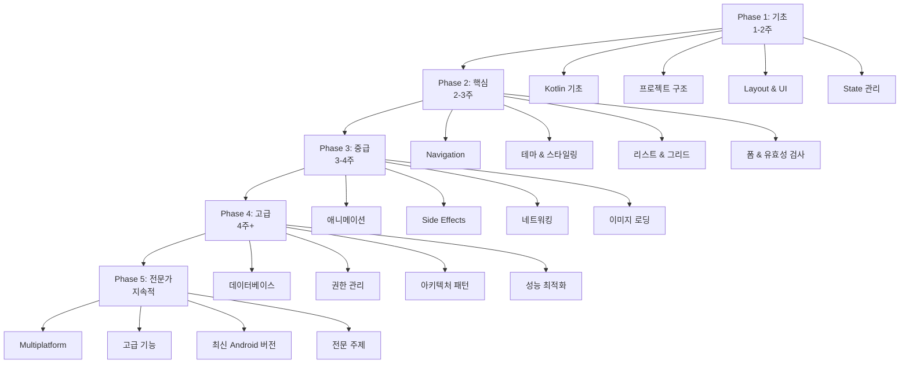

# Android Jetpack Compose 학습 로드맵

## 📚 작성 완료된 문서 (총 63개)

### 🚀 시작하기 & 기본 (1-6번)
- ✅ [00. 학습 로드맵](./00-learning-roadmap.md)
- ✅ [01-1. Kotlin의 역사와 탄생 배경](./01-1-kotlin-history.md)
- ✅ [01-2. Kotlin 기초 - Compose를 위한 필수 문법](./01-2-kotlin-basics-for-compose.md)
- ✅ [02. Android 프로젝트 구조](./02-android-project-structure.md)
- ✅ [03. Layout & UI 컴포넌트](./03-jetpack-compose-layout-guide.md)
- ✅ [04. State 관리](./04-jetpack-compose-state-guide.md)
- ✅ [05. Navigation](./05-jetpack-compose-navigation-guide.md)
- ✅ [06. 테마 & 스타일링](./06-jetpack-compose-theming-guide.md)

### 🎨 UI & 인터랙션 (7-12번)
- ✅ [07. 리스트 & 그리드](./07-jetpack-compose-lists-grids.md)
- ✅ [08. 폼 & 유효성 검사](./08-jetpack-compose-forms-validation.md)
- ✅ [09. Retrofit 네트워킹](./09-android-networking-retrofit.md)
- ✅ [10. 애니메이션](./10-jetpack-compose-animation-guide.md)
- ✅ [11. Side Effects](./11-jetpack-compose-side-effects.md)
- ✅ [12. 이미지 로딩](./12-jetpack-compose-image-loading.md)

### 💾 데이터 & 시스템 (13-20번)
- ✅ [13. Room 데이터베이스](./13-android-room-database.md)
- ✅ [14. 권한 관리](./14-android-permissions-guide.md)
- ✅ [15. 테스팅](./15-jetpack-compose-testing.md)
- ✅ [16. 디버깅](./16-android-debugging-guide.md)
- ✅ [17. 앱 배포](./17-android-app-deployment.md)
- ✅ [18. 아키텍처 가이드](./18-android-architecture-guide.md)
- ✅ [19. 고급 Compose 기법](./19-advanced-compose-techniques.md)
- ✅ [20. 완성된 앱 예제](./20-complete-app-example.md)

### ⚡ 성능 & 보안 (21-26번)
- ✅ [21. 성능 최적화](./21-android-performance-optimization.md)
- ✅ [22. 보안 가이드](./22-android-security-guide.md)
- ✅ [23. Firebase 통합](./23-firebase-integration-guide.md)
- ✅ [24. CI/CD 자동화](./24-ci-cd-automation-guide.md)
- ✅ [25. 오프라인 퍼스트 아키텍처](./25-offline-first-architecture.md)
- ✅ [26. 모니터링 & 분석](./26-app-monitoring-analytics.md)

### 📱 Android 기능 (27-38번)
- ✅ [27. 카메라 & 미디어](./27-camera-media-guide.md)
- ✅ [28. 지도 & 위치](./28-maps-location-guide.md)
- ✅ [29. 결제 & 빌링](./29-payment-billing-guide.md)
- ✅ [30. 알림 & 포그라운드 서비스](./30-notifications-foreground-service.md)
- ✅ [31. 다국어 지원](./31-localization-internationalization.md)
- ✅ [32. WorkManager](./32-background-work-workmanager.md)
- ✅ [33. 딥링크 & 앱링크](./33-deep-links-app-links.md)
- ✅ [34. 앱 위젯](./34-app-widgets-glance.md)
- ✅ [35. Wear OS](./35-wear-os-guide.md)
- ✅ [36. Material Design 3 고급](./36-material-design-3-advanced.md)
- ✅ [37. DataStore](./37-jetpack-datastore-guide.md)
- ✅ [38. Paging 3](./38-paging-3-guide.md)

### 🏗️ 아키텍처 & 패턴 (39-41번)
- ✅ [39. Hilt 의존성 주입](./39-dependency-injection-hilt-guide.md)
- ✅ [40. Coroutines & Flow](./40-kotlin-coroutines-flow-guide.md)
- ✅ [41. MVVM & MVI 패턴](./41-mvvm-mvi-architecture-guide.md)

### 🌍 Compose Multiplatform (42-48번)
- ✅ [42. 기초](./42-compose-multiplatform-basics.md)
- ✅ [43. 아키텍처](./43-compose-multiplatform-architecture.md)
- ✅ [44. UI 컴포넌트](./44-compose-multiplatform-ui-components.md)
- ✅ [45. 네비게이션](./45-compose-multiplatform-navigation.md)
- ✅ [46. 리소스 관리](./46-compose-multiplatform-resources.md)
- ✅ [47. 네트워킹](./47-compose-multiplatform-networking.md)
- ✅ [48. 고급 주제](./48-compose-multiplatform-advanced.md)

### 🆕 Android 버전별 새 기능 (49-53번)
- ✅ [49. Android 13 기능](./49-android-13-new-features.md)
- ✅ [50. Android 14 기능](./50-android-14-new-features.md)
- ✅ [51. Android 15 기능](./51-android-15-new-features.md)
- ✅ [52. Android 13/14/15 요약](./52-android-13-14-15-summary.md)
- ✅ [53. 버전별 문서 작성 보고서](./53-android-versions-documentation-report.md)

### 🎨 Canvas & Custom Drawing (54-56번)
- ✅ [54. Canvas 기본](./54-jetpack-compose-canvas-basics.md)
- ✅ [55. Canvas 고급](./55-jetpack-compose-canvas-advanced.md)
- ✅ [56. Canvas 작업 요약](./56-Jetpack-Compose-Canvas-&-Custom-Drawing-작업요약.md)

### 🌐 WebView (57-59번)
- ✅ [57. WebView 기본](./57-android-webview-basics.md)
- ✅ [58. WebView & JS Bridge](./58-android-webview-javascript-bridge.md)
- ✅ [59. WebView 작업 요약](./59-WebView-작업요약.md)

### 📡 연결성 (60-62번)
- ✅ [60. Bluetooth 가이드](./60-android-bluetooth-guide.md)
- ✅ [61. NFC 가이드](./61-android-nfc-guide.md)
- ✅ [62. Bluetooth & NFC 작업 요약](./62-Bluetooth-NFC-작업요약.md)

---

## 📊 학습 로드맵 시각화

---

## 🎯 단계별 학습 계획

### Phase 1: 기초 (1-2주)

**목표**: Android와 Compose의 기본 개념 이해

| 순서 | 문서 | 상태 | 예상 시간 |
|------|------|------|----------|
| 1-1 | Kotlin의 역사와 탄생 배경 | ✅ 완료 | 0.5일 |
| 1-2 | Kotlin 기초 - 문법 | ✅ 완료 | 3-4일 |
| 2 | Android 프로젝트 구조 | ✅ 완료 | 1-2일 |
| 3 | Layout과 UI 컴포넌트 | ✅ 완료 | 2-3일 |
| 4 | State 관리 | ✅ 완료 | 2-3일 |

**완료 기준**:
- ✅ 간단한 UI를 만들 수 있다
- ✅ State를 사용하여 동적 UI를 만들 수 있다
- ✅ Kotlin 기본 문법을 이해한다

---

### Phase 2: 핵심 (2-3주)

**목표**: 실제 앱을 만들 수 있는 핵심 기능 습득

| 순서 | 문서 | 상태 | 예상 시간 |
|------|------|------|----------|
| 5 | Navigation | ✅ 완료 | 2-3일 |
| 6 | 테마와 스타일링 | ✅ 완료 | 2-3일 |
| 7 | 리스트와 그리드 | ✅ 완료 | 2-3일 |
| 8 | 폼 입력과 유효성 검사 | ✅ 완료 | 2-3일 |

**완료 기준**:
- ✅ 여러 화면을 가진 앱을 만들 수 있다
- ✅ 일관된 디자인 시스템을 적용할 수 있다
- ✅ 리스트를 효율적으로 표시할 수 있다
- ✅ 사용자 입력을 검증할 수 있다

**프로젝트**: 간단한 Todo 앱 또는 메모 앱 완성

---

### Phase 3: 중급 (3-4주)

**목표**: 실무 수준의 앱 개발 능력

| 순서 | 문서 | 상태 | 예상 시간 |
|------|------|------|----------|
| 9 | 애니메이션 | ✅ 완료 | 3-4일 |
| 10 | Side Effects | ✅ 완료 | 3-4일 |
| 11 | 네트워킹과 API 연동 | ✅ 완료 | 4-5일 |
| 12 | 이미지 로딩 | ✅ 완료 | 2-3일 |
| 13 | Room 데이터베이스 | ✅ 완료 | 4-5일 |

**완료 기준**:
- ✅ 부드러운 애니메이션을 구현할 수 있다
- ✅ API를 호출하고 데이터를 표시할 수 있다
- ✅ 비동기 작업을 처리할 수 있다
- ✅ 로컬 데이터베이스를 사용할 수 있다

**프로젝트**: 뉴스 리더 앱 또는 날씨 앱 완성

---

### Phase 4: 고급 (4주+)

**목표**: 프로덕션 수준의 앱 개발

| 순서 | 문서 | 상태 | 예상 시간 |
|------|------|------|----------|
| 14 | 권한 관리 | ✅ 완료 | 2-3일 |
| 15 | 아키텍처 가이드 | ✅ 완료 | 3-4일 |
| 16 | MVVM/MVI 패턴 | ✅ 완료 | 4-5일 |
| 17 | Hilt 의존성 주입 | ✅ 완료 | 4-5일 |
| 18 | Coroutines & Flow | ✅ 완료 | 4-5일 |
| 19 | 성능 최적화 | ✅ 완료 | 3-4일 |
| 20 | 테스팅 | ✅ 완료 | 3-4일 |
| 21 | 앱 배포 | ✅ 완료 | 2-3일 |

**완료 기준**:
- ✅ 클린 아키텍처를 적용할 수 있다
- ✅ 의존성 주입을 사용할 수 있다
- ✅ 테스트 코드를 작성할 수 있다
- ✅ 앱을 Google Play에 배포할 수 있다

**프로젝트**: 자신만의 앱을 완성하고 배포

---

### Phase 5: 전문가 (지속적)

**목표**: 전문 개발자 수준의 역량

| 영역 | 문서 | 상태 |
|------|------|------|
| **Multiplatform** | Compose Multiplatform (42-48) | ✅ 완료 |
| **최신 Android** | Android 13/14/15 (49-53) | ✅ 완료 |
| **Custom UI** | Canvas & Drawing (54-56) | ✅ 완료 |
| **웹 통합** | WebView & JS Bridge (57-59) | ✅ 완료 |
| **연결성** | Bluetooth & NFC (60-62) | ✅ 완료 |
| **고급 기능** | 카메라, 지도, 결제 등 (27-38) | ✅ 완료 |

---

## 🎯 추천 학습 순서 (초보자용)

### 1단계: 필수 기초 (1-2주)
1. ✅ Kotlin의 역사와 탄생 배경 (01-1)
2. ✅ Kotlin 기초 - 문법 (01-2)
3. ✅ Android 프로젝트 구조 (02)
4. ✅ Layout & UI (03)
5. ✅ State 관리 (04)

### 2단계: 핵심 기능 (2-3주)
6. ✅ Navigation (05)
7. ✅ 테마 & 스타일링 (06)
8. ✅ 리스트 & 그리드 (07)
9. ✅ 폼 & 유효성 검사 (08)

### 3단계: 실전 준비 (3-4주)
10. ✅ 네트워킹 (09)
11. ✅ 애니메이션 (10)
12. ✅ Side Effects (11)
13. ✅ 이미지 로딩 (12)
14. ✅ Room 데이터베이스 (13)

### 4단계: 전문성 향상 (4주+)
15. ✅ 권한 관리 (14)
16. ✅ 아키텍처 (18, 41)
17. ✅ 의존성 주입 (39)
18. ✅ Coroutines & Flow (40)
19. ✅ 성능 최적화 (21)

### 5단계: 특화 주제 (필요 시)
- **크로스 플랫폼**: Compose Multiplatform (42-48)
- **최신 기능**: Android 13/14/15 (49-53)
- **커스텀 UI**: Canvas (54-56)
- **웹 통합**: WebView (57-59)
- **하드웨어**: Bluetooth & NFC (60-62)
- **시스템 기능**: 카메라, 지도, 결제 등 (27-38)

---

## 💡 학습 팁

### 효과적인 학습 방법

1. **이론 → 실습 → 프로젝트**
   - 문서를 읽고 (30%)
   - 예제를 직접 타이핑해보고 (40%)
   - 작은 프로젝트를 만들어본다 (30%)

2. **매일 조금씩**
   - 하루 1-2시간씩 꾸준히
   - 주말에 프로젝트 시간 확보

3. **커뮤니티 활용**
   - Stack Overflow
   - Reddit r/androiddev
   - Kotlin Slack

4. **코드 리뷰**
   - GitHub에서 오픈소스 프로젝트 분석
   - 다른 사람의 코드 읽기

### 학습 체크리스트

**Phase 1 완료 체크리스트**
- ✅ Kotlin 기본 문법을 이해했다
- ✅ 프로젝트 파일 구조를 안다
- ✅ Column, Row, Box를 사용할 수 있다
- ✅ State를 관리할 수 있다
- ✅ 간단한 카운터 앱을 만들 수 있다

**Phase 2 완료 체크리스트**
- ✅ 여러 화면 간 이동을 구현할 수 있다
- ✅ 데이터를 화면 간 전달할 수 있다
- ✅ 앱에 일관된 테마를 적용할 수 있다
- ✅ LazyColumn으로 리스트를 만들 수 있다
- ✅ 입력 폼을 만들고 검증할 수 있다

**Phase 3 완료 체크리스트**
- ✅ API를 호출하고 데이터를 표시할 수 있다
- ✅ 로딩/에러 상태를 처리할 수 있다
- ✅ 애니메이션을 구현할 수 있다
- ✅ 비동기 작업을 처리할 수 있다

**Phase 4 완료 체크리스트**
- ✅ 로컬 데이터베이스를 사용할 수 있다
- ✅ 권한을 요청하고 처리할 수 있다
- ✅ 클린 아키텍처를 적용할 수 있다
- ✅ 테스트 코드를 작성할 수 있다
- ✅ 앱을 빌드하고 배포할 수 있다

---

## 📚 참고 자료

### 공식 문서
- [Android Developers](https://developer.android.com/)
- [Jetpack Compose Documentation](https://developer.android.com/jetpack/compose)
- [Kotlin Documentation](https://kotlinlang.org/docs/home.html)

### 추천 유튜브 채널
- Android Developers
- Philipp Lackner
- Stevdza-San

### 추천 웹사이트
- [Compose Academy](https://compose.academy/)
- [Jetpack Compose Playground](https://foso.github.io/Jetpack-Compose-Playground/)

---

## 📊 문서 통계

**전체 문서 수**: 63개  
**총 용량**: 약 1.6MB  
**총 라인 수**: 약 21,000줄  
**코드 예제**: 1,000개 이상

### 카테고리별 분포
- 🚀 기초 & 핵심: 21개 (1-20, 01-1 추가)
- ⚡ 성능 & 보안: 6개 (21-26)
- 📱 Android 기능: 12개 (27-38)
- 🏗️ 아키텍처: 3개 (39-41)
- 🌍 Multiplatform: 7개 (42-48)
- 🆕 최신 Android: 5개 (49-53)
- 🎨 Canvas: 3개 (54-56)
- 🌐 WebView: 3개 (57-59)
- 📡 연결성: 3개 (60-62)

---

**마지막 업데이트**: 2024-12-01  
**작성자**: Gemini AI Assistant

**문서 상태**:
- ✅ 완료: 63개
- 📊 전체 진행률: 100% (전체 로드맵 완료)
- 🎯 커버리지: 초급 → 고급 → 전문가 수준

**최근 추가된 문서** (2024-12-01):
- ✅ 01-1. Kotlin의 역사와 탄생 배경 (NEW!)
- ✅ 54-56. Canvas & Custom Drawing
- ✅ 57-59. WebView & JavaScript Bridge
- ✅ 60-62. Bluetooth & NFC

Happy Learning! 🚀

