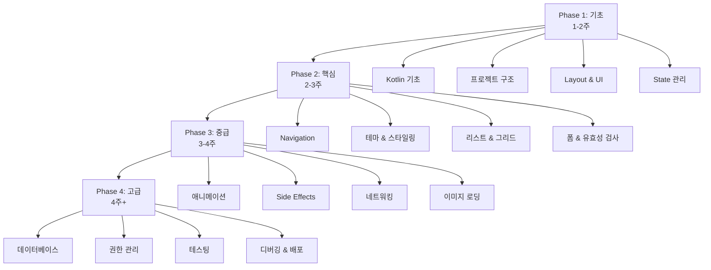

# Android Jetpack Compose 학습 로드맵

## 📚 현재 작성된 문서

1. ✅ **jetpack-compose-navigation-guide.md** - Navigation과 데이터 전달
2. ✅ **jetpack-compose-state-guide.md** - State 관리
3. ✅ **jetpack-compose-layout-guide.md** - Layout과 UI 컴포넌트

---

## 📋 추가로 필요한 학습 문서 목록

### 🔴 필수 (High Priority)

#### 1. **Kotlin 기초 가이드** ⭐⭐⭐⭐⭐
**파일명**: `kotlin-basics-for-compose.md`

**필요한 이유**: Compose는 Kotlin으로 작성되므로 Kotlin 기초가 필수

**주요 내용**:
- 변수 선언 (val, var)
- 함수 정의
- 람다 표현식
- 데이터 클래스
- 확장 함수
- Null Safety
- 고차 함수
- 컬렉션 (List, Map, Set)

**학습 우선순위**: 🥇 **가장 먼저 학습**

---

#### 2. **Android 프로젝트 구조 가이드** ⭐⭐⭐⭐⭐
**파일명**: `android-project-structure.md`

**필요한 이유**: 프로젝트 파일들의 역할과 구조 이해

**주요 내용**:
- 프로젝트 폴더 구조
- Gradle 파일 (build.gradle.kts)
- AndroidManifest.xml
- 리소스 폴더 (res/)
- 의존성 관리
- 버전 관리 (libs.versions.toml)

**학습 우선순위**: 🥇 **가장 먼저 학습**

---

#### 3. **테마와 스타일링 가이드** ⭐⭐⭐⭐
**파일명**: `jetpack-compose-theming-guide.md`

**필요한 이유**: 앱의 일관된 디자인 시스템 구축

**주요 내용**:
- Material Design 3
- Color Scheme (Light/Dark 모드)
- Typography (폰트 시스템)
- Shape (모서리 둥글기)
- 커스텀 테마 만들기
- 동적 색상 (Dynamic Color)

**학습 우선순위**: 🥈 **기초 학습 후**

---

#### 4. **리스트와 그리드 가이드** ⭐⭐⭐⭐
**파일명**: `jetpack-compose-lists-grids.md`

**필요한 이유**: 대부분의 앱에서 리스트/그리드 사용

**주요 내용**:
- LazyColumn 심화
- LazyRow 심화
- LazyVerticalGrid / LazyHorizontalGrid
- Sticky Headers
- 무한 스크롤
- Pull to Refresh
- 아이템 애니메이션

**학습 우선순위**: 🥈 **기초 학습 후**

---

### 🟡 중요 (Medium Priority)

#### 5. **애니메이션 가이드** ⭐⭐⭐
**파일명**: `jetpack-compose-animation-guide.md`

**필요한 이유**: 부드러운 UX를 위한 애니메이션

**주요 내용**:
- animate*AsState
- AnimatedVisibility
- Transition
- animateContentSize
- 커스텀 애니메이션
- 제스처 애니메이션

**학습 우선순위**: 🥉 **중급 단계**

---

#### 6. **Side Effects 가이드** ⭐⭐⭐
**파일명**: `jetpack-compose-side-effects.md`

**필요한 이유**: 비동기 작업과 생명주기 관리

**주요 내용**:
- LaunchedEffect
- DisposableEffect
- SideEffect
- rememberCoroutineScope
- rememberUpdatedState
- produceState

**학습 우선순위**: 🥉 **중급 단계**

---

#### 7. **폼 입력과 유효성 검사 가이드** ⭐⭐⭐
**파일명**: `jetpack-compose-forms-validation.md`

**필요한 이유**: 실무에서 자주 사용하는 폼 처리

**주요 내용**:
- TextField 심화
- 입력 유효성 검사
- 에러 메시지 표시
- 포커스 관리
- 키보드 제어
- 폼 제출 처리

**학습 우선순위**: 🥉 **중급 단계**

---

#### 8. **네트워킹과 API 연동 가이드** ⭐⭐⭐⭐
**파일명**: `android-networking-retrofit.md`

**필요한 이유**: 실제 앱은 서버와 통신 필요

**주요 내용**:
- Retrofit 설정
- API 호출
- JSON 파싱 (Gson/Moshi)
- 로딩 상태 관리
- 에러 처리
- Coroutines와 Flow

**학습 우선순위**: 🥉 **중급 단계**

---

### 🟢 유용함 (Nice to Have)

#### 9. **로컬 데이터베이스 가이드** ⭐⭐⭐
**파일명**: `android-room-database.md`

**필요한 이유**: 오프라인 데이터 저장

**주요 내용**:
- Room Database 설정
- Entity, DAO, Database
- CRUD 작업
- Flow와 LiveData
- Migration

**학습 우선순위**: 🏅 **고급 단계**

---

#### 10. **이미지 로딩 가이드** ⭐⭐⭐
**파일명**: `jetpack-compose-image-loading.md`

**필요한 이유**: 네트워크 이미지 효율적 로딩

**주요 내용**:
- Coil 라이브러리
- 이미지 캐싱
- 플레이스홀더
- 에러 처리
- 이미지 변환

**학습 우선순위**: 🏅 **고급 단계**

---

#### 11. **권한 관리 가이드** ⭐⭐⭐
**파일명**: `android-permissions-guide.md`

**필요한 이유**: 카메라, 위치 등 권한 필요

**주요 내용**:
- 런타임 권한
- Accompanist Permissions
- 권한 요청 플로우
- 권한 거부 처리

**학습 우선순위**: 🏅 **고급 단계**

---

#### 12. **테스팅 가이드** ⭐⭐
**파일명**: `jetpack-compose-testing.md`

**필요한 이유**: 안정적인 앱 개발

**주요 내용**:
- Unit Test
- UI Test (Compose Test)
- ViewModel Test
- Mock 사용

**학습 우선순위**: 🏅 **고급 단계**

---

#### 13. **디버깅과 문제 해결 가이드** ⭐⭐⭐
**파일명**: `android-debugging-guide.md`

**필요한 이유**: 문제 해결 능력 향상

**주요 내용**:
- Logcat 사용법
- Breakpoint 디버깅
- Layout Inspector
- 자주 발생하는 에러와 해결법
- 성능 프로파일링

**학습 우선순위**: 🏅 **고급 단계**

---

#### 14. **앱 배포 가이드** ⭐⭐
**파일명**: `android-app-deployment.md`

**필요한 이유**: 앱을 실제로 배포

**주요 내용**:
- APK/AAB 빌드
- 서명 (Signing)
- Google Play Console
- 버전 관리
- ProGuard/R8

**학습 우선순위**: 🏅 **고급 단계**

---

## 📊 학습 로드맵 시각화

---

## 🎯 단계별 학습 계획

### Phase 1: 기초 (1-2주)

**목표**: Android와 Compose의 기본 개념 이해

| 순서 | 문서 | 상태 | 예상 시간 |
|------|------|------|----------|
| 1 | Kotlin 기초 | ⬜ 예정 | 3-4일 |
| 2 | Android 프로젝트 구조 | ⬜ 예정 | 1-2일 |
| 3 | Layout과 UI 컴포넌트 | ✅ 완료 | 2-3일 |
| 4 | State 관리 | ✅ 완료 | 2-3일 |

**완료 기준**:
- [ ] 간단한 UI를 만들 수 있다
- [ ] State를 사용하여 동적 UI를 만들 수 있다
- [ ] Kotlin 기본 문법을 이해한다

---

### Phase 2: 핵심 (2-3주)

**목표**: 실제 앱을 만들 수 있는 핵심 기능 습득

| 순서 | 문서 | 상태 | 예상 시간 |
|------|------|------|----------|
| 5 | Navigation | ✅ 완료 | 2-3일 |
| 6 | 테마와 스타일링 | ⬜ 예정 | 2-3일 |
| 7 | 리스트와 그리드 | ⬜ 예정 | 2-3일 |
| 8 | 폼 입력과 유효성 검사 | ⬜ 예정 | 2-3일 |

**완료 기준**:
- [ ] 여러 화면을 가진 앱을 만들 수 있다
- [ ] 일관된 디자인 시스템을 적용할 수 있다
- [ ] 리스트를 효율적으로 표시할 수 있다
- [ ] 사용자 입력을 검증할 수 있다

**프로젝트**: 간단한 Todo 앱 또는 메모 앱 완성

---

### Phase 3: 중급 (3-4주)

**목표**: 실무 수준의 앱 개발 능력

| 순서 | 문서 | 상태 | 예상 시간 |
|------|------|------|----------|
| 9 | 애니메이션 | ⬜ 예정 | 3-4일 |
| 10 | Side Effects | ⬜ 예정 | 3-4일 |
| 11 | 네트워킹과 API 연동 | ⬜ 예정 | 4-5일 |
| 12 | 이미지 로딩 | ⬜ 예정 | 2-3일 |

**완료 기준**:
- [ ] 부드러운 애니메이션을 구현할 수 있다
- [ ] API를 호출하고 데이터를 표시할 수 있다
- [ ] 비동기 작업을 처리할 수 있다
- [ ] 네트워크 이미지를 효율적으로 로딩할 수 있다

**프로젝트**: 뉴스 리더 앱 또는 날씨 앱 완성

---

### Phase 4: 고급 (4주+)

**목표**: 프로덕션 수준의 앱 개발

| 순서 | 문서 | 상태 | 예상 시간 |
|------|------|------|----------|
| 13 | 로컬 데이터베이스 | ⬜ 예정 | 4-5일 |
| 14 | 권한 관리 | ⬜ 예정 | 2-3일 |
| 15 | 테스팅 | ⬜ 예정 | 3-4일 |
| 16 | 디버깅과 문제 해결 | ⬜ 예정 | 2-3일 |
| 17 | 앱 배포 | ⬜ 예정 | 2-3일 |

**완료 기준**:
- [ ] 오프라인에서도 동작하는 앱을 만들 수 있다
- [ ] 권한을 올바르게 처리할 수 있다
- [ ] 테스트 코드를 작성할 수 있다
- [ ] 앱을 Google Play에 배포할 수 있다

**프로젝트**: 자신만의 앱을 완성하고 배포

---

## 🎯 추천 학습 순서 (초보자용)

### 최우선 학습 (지금 바로!)

1. **Kotlin 기초** ⭐⭐⭐⭐⭐
   - Compose를 이해하기 위한 필수 선행 지식
   - 예상 시간: 3-4일

2. **Android 프로젝트 구조** ⭐⭐⭐⭐⭐
   - 파일들이 어떤 역할을 하는지 이해
   - 예상 시간: 1-2일

### 기초 완성

3. Layout과 UI 컴포넌트 (✅ 완료)
4. State 관리 (✅ 완료)
5. Navigation (✅ 완료)

### 실전 준비

6. **테마와 스타일링** ⭐⭐⭐⭐
7. **리스트와 그리드** ⭐⭐⭐⭐
8. **폼 입력과 유효성 검사** ⭐⭐⭐

### 중급으로 도약

9. **네트워킹과 API 연동** ⭐⭐⭐⭐
10. 애니메이션
11. Side Effects
12. 이미지 로딩

### 고급 및 배포

13. 나머지는 필요에 따라 학습

---

## 💡 학습 팁

### 효과적인 학습 방법

1. **이론 → 실습 → 프로젝트**
   - 문서를 읽고 (30%)
   - 예제를 직접 타이핑해보고 (40%)
   - 작은 프로젝트를 만들어본다 (30%)

2. **매일 조금씩**
   - 하루 1-2시간씩 꾸준히
   - 주말에 프로젝트 시간 확보

3. **커뮤니티 활용**
   - Stack Overflow
   - Reddit r/androiddev
   - Kotlin Slack

4. **코드 리뷰**
   - GitHub에서 오픈소스 프로젝트 분석
   - 다른 사람의 코드 읽기

### 학습 체크리스트

각 Phase 완료 후 체크:

**Phase 1 완료 체크리스트**
- [ ] Kotlin 기본 문법을 이해했다
- [ ] 프로젝트 파일 구조를 안다
- [ ] Column, Row, Box를 사용할 수 있다
- [ ] State를 관리할 수 있다
- [ ] 간단한 카운터 앱을 만들 수 있다

**Phase 2 완료 체크리스트**
- [ ] 여러 화면 간 이동을 구현할 수 있다
- [ ] 데이터를 화면 간 전달할 수 있다
- [ ] 앱에 일관된 테마를 적용할 수 있다
- [ ] LazyColumn으로 리스트를 만들 수 있다
- [ ] 입력 폼을 만들고 검증할 수 있다

**Phase 3 완료 체크리스트**
- [ ] API를 호출하고 데이터를 표시할 수 있다
- [ ] 로딩/에러 상태를 처리할 수 있다
- [ ] 애니메이션을 구현할 수 있다
- [ ] 비동기 작업을 처리할 수 있다

**Phase 4 완료 체크리스트**
- [ ] 로컬 데이터베이스를 사용할 수 있다
- [ ] 권한을 요청하고 처리할 수 있다
- [ ] 테스트 코드를 작성할 수 있다
- [ ] 앱을 빌드하고 배포할 수 있다

---

## 📚 참고 자료

### 공식 문서
- [Android Developers](https://developer.android.com/)
- [Jetpack Compose Documentation](https://developer.android.com/jetpack/compose)
- [Kotlin Documentation](https://kotlinlang.org/docs/home.html)

### 추천 유튜브 채널
- Android Developers
- Philipp Lackner
- Stevdza-San

### 추천 웹사이트
- [Compose Academy](https://compose.academy/)
- [Jetpack Compose Playground](https://foso.github.io/Jetpack-Compose-Playground/)

---

## 🎯 다음 단계

### 즉시 작성이 필요한 문서 (우선순위 순)

1. **Kotlin 기초 가이드** - 가장 시급
2. **Android 프로젝트 구조 가이드** - 가장 시급
3. **테마와 스타일링 가이드** - 중요
4. **리스트와 그리드 가이드** - 중요

### 장기 계획

- 매주 1-2개의 가이드 문서 작성
- 각 문서마다 실습 프로젝트 포함
- 커뮤니티 피드백 반영

---

**마지막 업데이트**: 2025-12-01  
**작성자**: Antigravity AI Assistant

**문서 상태**:
- ✅ 완료: 41개
- 📊 전체 진행률: 100% (기본 로드맵 완료)
- 🎯 추가 고급 주제: 15개 추천

**최근 추가된 문서** (2025-12-01):
- ✅ 39. Dependency Injection (Hilt) 가이드
- ✅ 40. Kotlin Coroutines & Flow 가이드
- ✅ 41. MVVM/MVI 아키텍처 패턴 가이드

Happy Learning! 🚀
