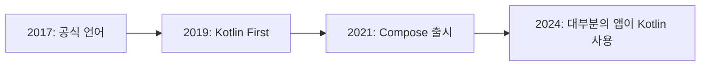

# Kotlin의 역사와 탄생 배경

## 📚 목차
1. [Kotlin의 탄생](#kotlin의-탄생)
2. [왜 Kotlin이 만들어졌나?](#왜-kotlin이-만들어졌나)
3. [Kotlin의 발전 과정](#kotlin의-발전-과정)
4. [Android와 Kotlin](#android와-kotlin)
5. [Kotlin의 철학](#kotlin의-철학)
6. [Kotlin의 영향력](#kotlin의-영향력)

---

## Kotlin의 탄생

### 🏢 JetBrains의 고민

**2010년**, 체코 프라하에 본사를 둔 소프트웨어 개발 도구 회사 **JetBrains**는 중요한 결정을 내려야 했습니다.

#### JetBrains는 누구인가?

| 제품 | 설명 |
|------|------|
| **IntelliJ IDEA** | 가장 인기 있는 Java IDE |
| **PyCharm** | Python 개발 도구 |
| **WebStorm** | JavaScript 개발 도구 |
| **Android Studio** | Google의 공식 Android IDE (IntelliJ 기반) |

> [!NOTE]
> JetBrains는 개발자 도구를 만드는 회사입니다. 그들의 제품은 수백만 명의 개발자가 사용하고 있으며, 특히 IntelliJ IDEA는 Java 개발의 표준 도구로 자리잡았습니다.

### 🤔 문제의 발견

JetBrains의 개발팀은 자사 제품을 주로 **Java**로 개발하고 있었습니다. 하지만 점점 더 많은 문제를 느끼기 시작했습니다:

```java
// Java의 장황한 코드
public class User {
    private final String name;
    private final int age;
    
    public User(String name, int age) {
        this.name = name;
        this.age = age;
    }
    
    public String getName() {
        return name;
    }
    
    public int getAge() {
        return age;
    }
    
    @Override
    public boolean equals(Object o) {
        if (this == o) return true;
        if (o == null || getClass() != o.getClass()) return false;
        User user = (User) o;
        return age == user.age && Objects.equals(name, user.name);
    }
    
    @Override
    public int hashCode() {
        return Objects.hash(name, age);
    }
    
    @Override
    public String toString() {
        return "User{name='" + name + "', age=" + age + '}';
    }
}
```

**30줄 이상**의 코드가 필요했습니다! 😱

#### Java의 주요 문제점

| 문제 | 설명 | 영향 |
|------|------|------|
| **장황함** | 간단한 것도 많은 코드 필요 | 생산성 저하 |
| **Null 안전성 부족** | NullPointerException 빈번 | 런타임 에러 증가 |
| **느린 발전** | 새 기능 추가가 매우 느림 | 현대적 기능 부족 |
| **하위 호환성 부담** | 오래된 설계 결정에 묶임 | 혁신적 변화 어려움 |

### 💡 대안 검토

JetBrains는 다른 JVM 언어들을 검토했습니다:

#### Scala
```scala
// Scala - 강력하지만 복잡함
class User(val name: String, val age: Int)

// 하지만 컴파일이 매우 느림
// 학습 곡선이 가파름
// 복잡한 타입 시스템
```

**문제점**:
- ❌ 컴파일 속도가 Java보다 훨씬 느림
- ❌ 학습하기 어려움
- ❌ 기존 Java 개발자가 적응하기 힘듦

#### Groovy
```groovy
// Groovy - 간결하지만 느림
class User {
    String name
    int age
}

// 하지만 동적 타입으로 인한 성능 문제
```

**문제점**:
- ❌ 동적 타입으로 인한 성능 저하
- ❌ IDE 지원이 약함
- ❌ 타입 안전성 부족

### 🎯 결정: 새로운 언어를 만들자!

2010년 7월, JetBrains는 중대한 결정을 내렸습니다:

> **"우리가 직접 새로운 언어를 만들자!"**

#### 프로젝트 리더

**Andrey Breslav** (안드레이 브레슬라브)가 프로젝트를 이끌게 되었습니다.


> [!IMPORTANT]
> **왜 'Kotlin'이라는 이름인가?**
> 
> Kotlin은 러시아 상트페테르부르크 근처의 **코틀린 섬(Kotlin Island)**에서 따온 이름입니다. JetBrains의 러시아 사무실이 상트페테르부르크에 있었기 때문입니다.
> 
> 재미있게도, Java도 인도네시아의 자바 섬(Java Island)에서 이름을 따왔습니다! ☕

---

## 왜 Kotlin이 만들어졌나?

### 🎯 JetBrains의 목표

JetBrains는 다음과 같은 명확한 목표를 가지고 Kotlin을 설계했습니다:

#### 1. **생산성 향상**

```kotlin
// Kotlin - 단 1줄!
data class User(val name: String, val age: Int)

// Java에서 30줄 이상 필요했던 것이 1줄로!
```

**목표**: 개발자가 더 적은 코드로 더 많은 것을 할 수 있게 하자.

#### 2. **안전성 강화**

```kotlin
// Null 안전성이 언어에 내장됨
var name: String = "홍길동"
name = null  // ❌ 컴파일 에러!

var nullableName: String? = "홍길동"
nullableName = null  // ✅ 명시적으로 허용
```

**목표**: NullPointerException 같은 흔한 에러를 컴파일 타임에 잡자.

#### 3. **Java와의 완벽한 호환성**

```kotlin
// Kotlin에서 Java 라이브러리 사용
val list = ArrayList<String>()  // Java의 ArrayList
list.add("Hello")

// Java에서 Kotlin 코드 사용
// 아무 문제 없이 호환됨!
```

**목표**: 기존 Java 생태계를 그대로 활용하자.

#### 4. **빠른 컴파일**

**목표**: Scala처럼 느리지 않고, Java만큼 빠르게 컴파일되어야 한다.

#### 5. **실용성**

**목표**: 학문적 실험이 아닌, 실제 프로덕션에서 사용할 수 있는 언어를 만들자.

### 💼 비즈니스 동기

JetBrains에게는 비즈니스적 이유도 있었습니다:

| 동기 | 설명 |
|------|------|
| **생산성** | 자사 제품 개발 속도 향상 |
| **인재 채용** | 더 나은 언어로 더 좋은 개발자 유치 |
| **경쟁력** | 혁신적인 도구로 시장 선도 |
| **장기 투자** | Java의 한계를 극복한 미래 대비 |

> [!TIP]
> **실용주의 철학**
> 
> Kotlin은 처음부터 "실제 문제를 해결하는 실용적인 언어"를 목표로 했습니다. 이론적으로 완벽하기보다는, 개발자가 매일 겪는 실제 문제를 해결하는 데 집중했습니다.

---

## Kotlin의 발전 과정

### 📅 주요 마일스톤

#### 2010년 7월 - 프로젝트 시작
- JetBrains 내부에서 프로젝트 시작
- Andrey Breslav가 프로젝트 리드

#### 2011년 7월 - 공개 발표
- JVM Language Summit에서 Kotlin 공개
- 개발자 커뮤니티의 큰 관심

#### 2012년 2월 - 오픈소스화
- Apache 2.0 라이선스로 오픈소스 공개
- GitHub에서 누구나 기여 가능

```kotlin
// 초기 Kotlin 코드 예시 (2012년)
fun main(args: Array<String>) {
    println("Hello, Kotlin!")
}
```

#### 2016년 2월 15일 - Kotlin 1.0 출시 🎉

**역사적인 순간!** 6년간의 개발 끝에 정식 버전 출시.

```kotlin
// Kotlin 1.0의 주요 기능
data class User(val name: String, val age: Int)

fun greet(name: String?) {
    println("Hello, ${name ?: "Guest"}!")
}

val numbers = listOf(1, 2, 3, 4, 5)
val doubled = numbers.map { it * 2 }
```

**1.0의 의미**:
- ✅ Production-ready (프로덕션 사용 가능)
- ✅ API 안정성 보장
- ✅ 하위 호환성 약속

#### 2017년 5월 17일 - Google I/O: 게임 체인저 🚀

**Google이 Kotlin을 Android 공식 언어로 채택!**

이는 Kotlin 역사상 가장 중요한 순간이었습니다.

```kotlin
// Android에서 Kotlin 사용
class MainActivity : AppCompatActivity() {
    override fun onCreate(savedInstanceState: Bundle?) {
        super.onCreate(savedInstanceState)
        setContentView(R.layout.activity_main)
        
        // 간결하고 안전한 코드
        findViewById<Button>(R.id.button)?.setOnClickListener {
            Toast.makeText(this, "Hello Kotlin!", Toast.LENGTH_SHORT).show()
        }
    }
}
```

**영향**:
- 📈 Kotlin 사용자 급증
- 🌍 글로벌 인지도 상승
- 💼 기업들의 Kotlin 도입 가속화

#### 2019년 5월 - Kotlin First

Google이 "**Android 개발은 Kotlin First**"를 선언!

> [!IMPORTANT]
> **Kotlin First의 의미**
> 
> - 새로운 Android API와 문서는 Kotlin 우선으로 작성
> - Jetpack 라이브러리는 Kotlin에 최적화
> - Android 샘플 코드는 Kotlin으로 제공

#### 2021년 - Jetpack Compose 정식 출시

**Kotlin 전용** UI 프레임워크 Compose 출시!

```kotlin
// Compose - Kotlin의 힘을 100% 활용
@Composable
fun Greeting(name: String) {
    Text(text = "Hello, $name!")
}
```

#### 2024년 - Kotlin 2.0 출시

새로운 K2 컴파일러로 성능 대폭 향상!

### 📊 성장 지표

| 연도 | 주요 지표 |
|------|----------|
| **2016** | 1.0 출시, 초기 사용자 |
| **2017** | Android 공식 언어, 사용자 10배 증가 |
| **2018** | Stack Overflow 설문: 2번째로 사랑받는 언어 |
| **2019** | GitHub에서 15번째로 인기 있는 언어 |
| **2020** | 500만+ 개발자 사용 |
| **2024** | 전 세계 수천만 개발자 사용 |

---

## Android와 Kotlin

### 🤝 완벽한 만남

Android와 Kotlin의 만남은 양쪽 모두에게 큰 전환점이었습니다.

#### Google이 Kotlin을 선택한 이유

##### 1. **개발자 경험 개선**

```java
// Java - findViewById 지옥
TextView textView = (TextView) findViewById(R.id.text_view);
Button button = (Button) findViewById(R.id.button);
ImageView imageView = (ImageView) findViewById(R.id.image_view);

button.setOnClickListener(new View.OnClickListener() {
    @Override
    public void onClick(View v) {
        textView.setText("Clicked!");
    }
});
```

```kotlin
// Kotlin - 간결하고 안전함
val textView = findViewById<TextView>(R.id.text_view)
val button = findViewById<Button>(R.id.button)

button.setOnClickListener {
    textView.text = "Clicked!"
}
```

##### 2. **Null 안전성**

Android 개발에서 가장 흔한 크래시 원인이 **NullPointerException**이었습니다.

```kotlin
// Kotlin은 컴파일 타임에 null 체크
val user: User? = getUser()
user?.name  // Safe call
user?.email ?: "no-email"  // Elvis operator
```

##### 3. **코루틴으로 비동기 처리**

```kotlin
// 코루틴 - 비동기 코드를 동기처럼 작성
lifecycleScope.launch {
    val user = userRepository.getUser()  // 네트워크 호출
    val posts = postRepository.getPosts(user.id)  // 또 다른 호출
    updateUI(posts)  // UI 업데이트
}
```

##### 4. **커뮤니티의 요구**

2017년 이전부터 Android 개발자들은 이미 Kotlin을 사용하고 있었습니다. Google은 커뮤니티의 목소리를 들었습니다.

### 📈 Android에서의 성장



#### 채택률

| 연도 | 채택률 | 비고 |
|------|--------|------|
| **2017** | ~20% | 공식 언어 발표 |
| **2018** | ~35% | 빠른 성장 |
| **2019** | ~50% | Kotlin First 선언 |
| **2020** | ~60% | 신규 프로젝트 대부분 Kotlin |
| **2024** | ~80%+ | 사실상 표준 |

> [!NOTE]
> **Google의 통계 (2023년)**
> 
> - Google Play 상위 1000개 앱의 **95%**가 Kotlin 사용
> - 새로운 Android 프로젝트의 **99%**가 Kotlin 사용
> - Android 개발자의 **80%** 이상이 Kotlin 선호

### 🎨 Jetpack Compose의 등장

2021년, Google은 **Jetpack Compose**를 정식 출시했습니다.

#### Compose가 특별한 이유

**Kotlin 전용 설계!** Java로는 사용할 수 없습니다.

```kotlin
// Compose는 Kotlin의 기능을 적극 활용
@Composable
fun ProfileCard(user: User) {
    Card(
        modifier = Modifier
            .fillMaxWidth()
            .padding(16.dp)
    ) {
        Column {
            Text(
                text = user.name,
                style = MaterialTheme.typography.headlineMedium
            )
            Text(
                text = user.email,
                style = MaterialTheme.typography.bodyMedium
            )
        }
    }
}
```

**Compose가 Kotlin을 필요로 하는 이유**:
- 🎯 람다와 고차 함수
- 🎯 확장 함수
- 🎯 Trailing lambda 문법
- 🎯 기본 매개변수
- 🎯 명명된 인자
- 🎯 데이터 클래스

---

## Kotlin의 철학

### 🎯 핵심 원칙

Kotlin 설계 팀이 지킨 핵심 원칙들:

#### 1. **실용성 (Pragmatic)**

> "이론적 완벽함보다 실제 문제 해결"

```kotlin
// 실용적인 예: 타입 추론
val name = "홍길동"  // String으로 자동 추론
val age = 25        // Int로 자동 추론

// 명시적으로 쓸 수도 있지만, 대부분 불필요
val name: String = "홍길동"
```

#### 2. **간결성 (Concise)**

> "더 적은 코드로 더 많은 것을"

```kotlin
// Java: 30줄
// Kotlin: 1줄
data class User(val name: String, val age: Int)
```

#### 3. **안전성 (Safe)**

> "런타임 에러를 컴파일 타임에"

```kotlin
// Null 안전성
var name: String = "홍길동"
name = null  // ❌ 컴파일 에러

// 타입 안전성
val numbers: List<Int> = listOf(1, 2, 3)
numbers.add("text")  // ❌ 컴파일 에러
```

#### 4. **상호운용성 (Interoperable)**

> "Java와 100% 호환"

```kotlin
// Kotlin에서 Java 사용
val list = ArrayList<String>()  // Java 클래스
val map = HashMap<String, Int>()  // Java 클래스

// Java에서 Kotlin 사용도 완벽하게 동작
```

#### 5. **도구 친화적 (Tool-friendly)**

> "IDE 지원이 최우선"

JetBrains가 만든 언어답게, IDE 지원이 환상적입니다:
- ✅ 강력한 자동완성
- ✅ 즉각적인 에러 표시
- ✅ 리팩토링 도구
- ✅ 디버깅 지원

### 💭 설계 철학

#### "Better Java"가 아닌 "Modern Language"

Kotlin은 단순히 "더 나은 Java"를 목표로 하지 않았습니다.

**영향을 받은 언어들**:

| 언어 | 영향 받은 기능 |
|------|---------------|
| **Scala** | 함수형 프로그래밍, 타입 추론 |
| **C#** | 확장 함수, LINQ 스타일 컬렉션 |
| **Groovy** | 간결한 문법, 빌더 패턴 |
| **Swift** | Null 안전성, 옵셔널 |
| **Python** | 가독성, 간결함 |

#### 점진적 학습 곡선

```kotlin
// 1단계: Java 스타일로 시작 가능
fun add(a: Int, b: Int): Int {
    return a + b
}

// 2단계: 더 간결하게
fun add(a: Int, b: Int) = a + b

// 3단계: 함수형 스타일
val add: (Int, Int) -> Int = { a, b -> a + b }
```

---

## Kotlin의 영향력

### 🌍 멀티플랫폼으로의 확장

Kotlin은 Android를 넘어 확장되고 있습니다.

#### Kotlin Multiplatform (KMP)

**하나의 코드로 여러 플랫폼에서 실행!**

```kotlin
// 공통 코드 (Common)
expect fun getPlatformName(): String

fun greet(): String {
    return "Hello from ${getPlatformName()}!"
}

// Android 구현
actual fun getPlatformName(): String = "Android"

// iOS 구현
actual fun getPlatformName(): String = "iOS"

// 웹 구현
actual fun getPlatformName(): String = "Web"
```

**지원 플랫폼**:
- 📱 Android
- 🍎 iOS
- 💻 Desktop (JVM)
- 🌐 Web (JavaScript/Wasm)
- 🖥️ Native (Linux, Windows, macOS)

#### Kotlin/JS

```kotlin
// Kotlin으로 웹 개발
fun main() {
    document.getElementById("button")?.addEventListener("click", {
        console.log("Button clicked!")
    })
}
```

#### Kotlin/Native

```kotlin
// 네이티브 애플리케이션 개발
fun main() {
    println("Running natively!")
}
```

### 📚 교육과 학습

#### 대학 교육

많은 대학에서 Kotlin을 교육 과정에 포함:
- 🎓 Stanford University
- 🎓 MIT
- 🎓 국내 주요 대학들

#### 온라인 교육

- [Kotlin Koans](https://play.kotlinlang.org/koans) - 공식 대화형 학습
- [Kotlin by Example](https://play.kotlinlang.org/byExample)
- Coursera, Udemy 등 다양한 강좌

### 🏢 기업 채택

#### 주요 기업들의 Kotlin 사용

| 기업 | 사용 사례 |
|------|----------|
| **Google** | Android, 내부 서비스 |
| **Netflix** | Android 앱 |
| **Uber** | 모바일 앱 |
| **Pinterest** | Android 앱 |
| **Trello** | Android 앱 |
| **Coursera** | Android 앱 |
| **Evernote** | Android 앱 |
| **Square** | Android 앱, 백엔드 |

#### 서버 사이드

```kotlin
// Spring Boot + Kotlin
@RestController
class UserController(private val userService: UserService) {
    
    @GetMapping("/users/{id}")
    fun getUser(@PathVariable id: Long): User {
        return userService.findById(id)
    }
    
    @PostMapping("/users")
    fun createUser(@RequestBody user: User): User {
        return userService.save(user)
    }
}
```

**백엔드 프레임워크**:
- ✅ Spring Boot
- ✅ Ktor (Kotlin 전용)
- ✅ Micronaut
- ✅ Quarkus

### 📊 통계와 인기도

#### Stack Overflow 설문 (2023)

| 순위 | 카테고리 | 결과 |
|------|----------|------|
| **4위** | 가장 사랑받는 언어 | 84.1% 만족도 |
| **12위** | 가장 많이 사용되는 언어 | 9.06% |
| **상위권** | 가장 배우고 싶은 언어 | - |

#### GitHub 통계 (2024)

- 🌟 Star 수: 48,000+
- 🔀 Fork 수: 5,700+
- 👥 Contributors: 400+

### 🎯 미래 전망

#### 계속되는 혁신

```kotlin
// Kotlin 2.0의 K2 컴파일러
// - 컴파일 속도 2배 향상
// - 더 나은 타입 추론
// - 향상된 IDE 성능
```

#### 확장되는 생태계

- 🚀 Kotlin Multiplatform의 성장
- 🌐 웹 개발 지원 강화
- 🤖 AI/ML 라이브러리 증가
- ☁️ 클라우드 네이티브 지원

---

## 마치며

### 🎉 Kotlin의 성공 요인

1. **실용적 설계**: 이론보다 실제 문제 해결
2. **Java 호환성**: 기존 생태계 활용
3. **Google의 지원**: Android 공식 언어
4. **커뮤니티**: 열정적인 개발자들
5. **지속적 발전**: 끊임없는 개선

### 💡 배운 점

Kotlin의 역사에서 우리가 배울 수 있는 것:

> [!TIP]
> **좋은 도구는 사용자의 문제를 해결한다**
> 
> Kotlin은 개발자들이 매일 겪는 실제 문제(장황한 코드, null 에러, 느린 개발)를 해결하기 위해 만들어졌습니다. 그래서 성공했습니다.

### 🚀 다음 단계

이제 Kotlin의 역사와 배경을 알았으니, 실제 문법을 배워볼 차례입니다!

➡️ **다음 문서**: [01-2-kotlin-basics-for-compose.md](./01-2-kotlin-basics-for-compose.md)

---

## 참고 자료

### 공식 자료
- [Kotlin 공식 웹사이트](https://kotlinlang.org/)
- [Kotlin 블로그](https://blog.jetbrains.com/kotlin/)
- [Kotlin GitHub](https://github.com/JetBrains/kotlin)

### 역사 관련
- [Kotlin: The Story Behind the Name](https://blog.jetbrains.com/kotlin/2016/02/kotlin-1-0-released-pragmatic-language-for-jvm-and-android/)
- [Google I/O 2017 Keynote](https://www.youtube.com/watch?v=Y2VF8tmLFHw)
- [Kotlin 1.0 Release Announcement](https://blog.jetbrains.com/kotlin/2016/02/kotlin-1-0-released-pragmatic-language-for-jvm-and-android/)

### 인터뷰와 강연
- [Andrey Breslav on Kotlin](https://www.youtube.com/watch?v=3FL6_eQmvVc)
- [The Road to Kotlin](https://www.youtube.com/watch?v=0FF19HJDqMo)

---

**작성일**: 2025-12-01  
**작성자**: Antigravity AI Assistant

**읽기 시간**: 15-20분  
**난이도**: ⭐

Kotlin의 탄생 스토리를 알고 나니, 더 흥미롭지 않나요? 🚀
