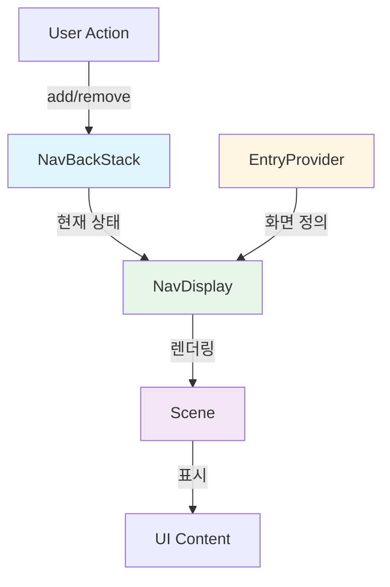

# Jetpack Compose Navigation 3 완벽 가이드

> 📖 **Navigation 가이드 시리즈**
> - **05**: [Navigation 기초](./05-jetpack-compose-navigation-guide.md) - 기본 개념, 데이터 전달
> - **05-1**: [Navigation 심화](./05-1-jetpack-compose-navigation-advanced.md) - Type Safe, 중첩 그래프, BottomNav, DeepLink
> - **05-2**: Navigation 3 (현재 문서) - 차세대 Navigation, 백스택 직접 제어, 적응형 레이아웃

---

## 📚 목차
1. [Navigation 3란?](#navigation-3란)
2. [핵심 개념](#핵심-개념)
3. [시작하기](#시작하기)
4. [기본 사용법](#기본-사용법)
5. [적응형 레이아웃 (Adaptive Layout)](#적응형-레이아웃-adaptive-layout)
6. [ViewModel 스코핑](#viewmodel-스코핑)
7. [Navigation 2에서 마이그레이션](#navigation-2에서-마이그레이션)
8. [Best Practices](#best-practices)

---

## Navigation 3란?

**Navigation 3**는 Jetpack Compose를 위해 완전히 새롭게 설계된 차세대 네비게이션 라이브러리입니다. 기존 Navigation 2의 한계를 극복하고, 현대적인 앱 개발 패턴을 지원합니다.

### 🎯 왜 Navigation 3가 필요한가?

#### Navigation 2의 한계

```kotlin
// Navigation 2: 백스택을 직접 제어할 수 없음
navController.navigate("detail/123") {
    popUpTo("home") { inclusive = false }
    launchSingleTop = true
}
// 백스택이 어떻게 변했는지 명확하지 않음
```

#### Navigation 3의 접근 방식

```kotlin
// Navigation 3: 백스택은 단순한 리스트!
val backStack = rememberNavBackStack(HomeRoute)

// 화면 추가
backStack.add(DetailRoute(id = "123"))

// 화면 제거
backStack.removeLastOrNull()

// 백스택 상태가 명확하고 예측 가능함
```

### ✨ Navigation 3의 핵심 장점

| 특징 | Navigation 2 | Navigation 3 |
|------|--------------|--------------|
| **백스택 제어** | 간접적 (navigate, popUpTo) | 직접적 (add, remove) |
| **타입 안전성** | 선택적 (2.8.0+) | 기본 내장 |
| **적응형 레이아웃** | 수동 구현 필요 | 내장 지원 (List-Detail 등) |
| **상태 관리** | SavedStateHandle | NavEntry 스코프 |
| **복잡도** | 높음 (NavHost, NavGraph) | 낮음 (BackStack + EntryProvider) |

> [!IMPORTANT]
> **Navigation 3는 Compose 전용입니다**
> - Fragment나 View 기반 UI는 지원하지 않습니다
> - `compileSdk 36` 이상 필요
> - Kotlin Serialization 사용 권장

---

## 핵심 개념

Navigation 3는 세 가지 핵심 요소로 구성됩니다.

### 1. NavBackStack - 백스택 관리

백스택은 사용자가 탐색한 화면들의 **리스트**입니다.

```kotlin
// 백스택 생성
val backStack = rememberNavBackStack(startRoute = HomeRoute)

// 화면 추가 (앞으로 이동)
backStack.add(ProfileRoute(userId = "123"))

// 화면 제거 (뒤로 이동)
backStack.removeLastOrNull()

// 특정 화면까지 제거
backStack.removeUpTo(HomeRoute)

// 현재 백스택 상태 확인
val currentEntries = backStack.entries
```

> [!TIP]
> **백스택은 불변(Immutable) 리스트처럼 동작합니다**
> - `add()`, `remove()` 등의 메서드는 새로운 백스택을 생성합니다
> - Compose의 상태 관리와 자연스럽게 통합됩니다

### 2. EntryProvider - 화면 정의

각 Route에 대응하는 UI를 정의하는 **팩토리**입니다.

```kotlin
val entryProvider = entryProvider {
    // Route 타입에 따라 UI 제공
    entry<HomeRoute> { 
        HomeScreen() 
    }
    
    entry<ProfileRoute> { route ->
        // Route 객체에서 파라미터 추출
        ProfileScreen(userId = route.userId)
    }
    
    // 메타데이터 추가 (적응형 레이아웃용)
    entry<DetailRoute>(
        metadata = ListDetailSceneStrategy.detailPane()
    ) { route ->
        DetailScreen(itemId = route.itemId)
    }
}
```

### 3. NavDisplay - UI 렌더링

백스택의 현재 상태를 화면에 표시합니다.

```kotlin
NavDisplay(
    backStack = backStack,
    onBack = { backStack.removeLastOrNull() },
    entryProvider = entryProvider
)
```

### 전체 구조 다이어그램



---

## 시작하기

### 1. 의존성 추가

#### `gradle/libs.versions.toml`

```toml
[versions]
nav3Core = "1.0.0"
lifecycleViewmodelNav3 = "2.10.0"
kotlinSerialization = "2.1.21"
kotlinxSerializationCore = "1.8.1"
material3AdaptiveNav3 = "1.3.0-alpha04"
compileSdk = "36"

[libraries]
# 필수: Navigation 3 핵심 라이브러리
androidx-navigation3-runtime = { module = "androidx.navigation3:navigation3-runtime", version.ref = "nav3Core" }
androidx-navigation3-ui = { module = "androidx.navigation3:navigation3-ui", version.ref = "nav3Core" }

# 선택: ViewModel 통합
androidx-lifecycle-viewmodel-navigation3 = { module = "androidx.lifecycle:lifecycle-viewmodel-navigation3", version.ref = "lifecycleViewmodelNav3" }

# 선택: 타입 안전 Route 정의
kotlinx-serialization-core = { module = "org.jetbrains.kotlinx:kotlinx-serialization-core", version.ref = "kotlinxSerializationCore" }

# 선택: 적응형 레이아웃 (List-Detail 등)
androidx-material3-adaptive-navigation3 = { group = "androidx.compose.material3.adaptive", name = "adaptive-navigation3", version.ref = "material3AdaptiveNav3" }

[plugins]
jetbrains-kotlin-serialization = { id = "org.jetbrains.kotlin.plugin.serialization", version.ref = "kotlinSerialization" }
```

#### `app/build.gradle.kts`

```kotlin
plugins {
    alias(libs.plugins.android.application)
    alias(libs.plugins.kotlin.android)
    // Serialization 플러그인 추가
    alias(libs.plugins.jetbrains.kotlin.serialization)
}

android {
    compileSdk = 36 // 필수!
    // ...
}

dependencies {
    // Navigation 3 핵심
    implementation(libs.androidx.navigation3.ui)
    implementation(libs.androidx.navigation3.runtime)
    
    // 선택적 의존성
    implementation(libs.androidx.lifecycle.viewmodel.navigation3)
    implementation(libs.androidx.material3.adaptive.navigation3)
    implementation(libs.kotlinx.serialization.core)
}
```

### 2. Route 정의

```kotlin
import androidx.navigation3.runtime.NavKey
import kotlinx.serialization.Serializable

/**
 * NavKey를 구현하여 Route 정의
 * @Serializable: 직렬화 지원 (타입 안전성)
 */
@Serializable
data object HomeRoute : NavKey

@Serializable
data class ProfileRoute(val userId: String) : NavKey

@Serializable
data class DetailRoute(val itemId: String, val showComments: Boolean = false) : NavKey
```

> [!NOTE]
> **NavKey vs Navigation 2의 Route**
> - Navigation 2: `"home"`, `"profile/{userId}"` (문자열)
> - Navigation 3: `HomeRoute`, `ProfileRoute(userId = "123")` (객체)
> - 컴파일 타임에 오류 검출 가능!

---

## 기본 사용법

### 최소 구현 예제

```kotlin
import androidx.activity.ComponentActivity
import androidx.activity.compose.setContent
import androidx.compose.foundation.layout.*
import androidx.compose.material3.*
import androidx.compose.runtime.*
import androidx.navigation3.runtime.*
import androidx.navigation3.scene.*
import kotlinx.serialization.Serializable

// 1. Route 정의
@Serializable data object Home : NavKey
@Serializable data class Detail(val id: String) : NavKey

class MainActivity : ComponentActivity() {
    override fun onCreate(savedInstanceState: Bundle?) {
        super.onCreate(savedInstanceState)
        setContent {
            MyApp()
        }
    }
}

@Composable
fun MyApp() {
    // 2. 백스택 생성 (시작 화면: Home)
    val backStack = rememberNavBackStack(Home)
    
    // 3. EntryProvider 정의
    val entryProvider = entryProvider {
        entry<Home> {
            HomeScreen(
                onNavigateToDetail = { id ->
                    backStack.add(Detail(id = id))
                }
            )
        }
        
        entry<Detail> { route ->
            DetailScreen(
                itemId = route.id,
                onBack = { backStack.removeLastOrNull() }
            )
        }
    }
    
    // 4. NavDisplay로 렌더링
    NavDisplay(
        backStack = backStack,
        onBack = { backStack.removeLastOrNull() },
        entryProvider = entryProvider
    )
}

@Composable
fun HomeScreen(onNavigateToDetail: (String) -> Unit) {
    Column(
        modifier = Modifier.fillMaxSize(),
        horizontalAlignment = Alignment.CenterHorizontally,
        verticalArrangement = Arrangement.Center
    ) {
        Text("Home Screen", style = MaterialTheme.typography.headlineMedium)
        Spacer(modifier = Modifier.height(16.dp))
        Button(onClick = { onNavigateToDetail("item-123") }) {
            Text("Go to Detail")
        }
    }
}

@Composable
fun DetailScreen(itemId: String, onBack: () -> Unit) {
    Column(
        modifier = Modifier.fillMaxSize(),
        horizontalAlignment = Alignment.CenterHorizontally,
        verticalArrangement = Arrangement.Center
    ) {
        Text("Detail Screen", style = MaterialTheme.typography.headlineMedium)
        Text("Item ID: $itemId")
        Spacer(modifier = Modifier.height(16.dp))
        Button(onClick = onBack) {
            Text("Go Back")
        }
    }
}
```

### 백스택 고급 제어

```kotlin
// 특정 화면까지 제거 (popUpTo와 유사)
backStack.removeUpTo(HomeRoute)

// 조건부 제거
backStack.removeIf { entry -> 
    entry.key is DetailRoute 
}

// 백스택 교체 (로그인 후 홈으로 이동)
backStack.clear()
backStack.add(HomeRoute)

// 또는
backStack.replaceAll(listOf(HomeRoute))
```

---

## 적응형 레이아웃 (Adaptive Layout)

Navigation 3의 가장 강력한 기능 중 하나는 **적응형 레이아웃**입니다. 화면 크기에 따라 자동으로 레이아웃을 변경할 수 있습니다.

### List-Detail 패턴

태블릿이나 폴더블 기기에서 리스트와 상세 화면을 나란히 표시하는 패턴입니다.

```
┌─────────────────────────────────────┐
│ 스마트폰 (좁은 화면)                    │
├─────────────────────────────────────┤
│                                     │
│  [Item 1]                           │
│  [Item 2]  ← 리스트만 표시            │
│  [Item 3]                           │
│                                     │
└─────────────────────────────────────┘

┌─────────────────────────────────────────────────────────┐
│ 태블릿 (넓은 화면)                                         │
├─────────────────────────────────────────────────────────┤
│              │                                          │
│  [Item 1]    │  Item 2 Details                         │
│  [Item 2] ←  │  ─────────────────                      │
│  [Item 3]    │  Description...                         │
│              │  Price: $99                             │
│   리스트      │        상세 화면                          │
│              │                                          │
└─────────────────────────────────────────────────────────┘
```

### 구현 예제

```kotlin
import androidx.compose.material3.adaptive.ExperimentalMaterial3AdaptiveApi
import androidx.compose.material3.adaptive.navigation.*
import androidx.compose.material3.adaptive.currentWindowAdaptiveInfo

// 1. Route 정의
@Serializable data object ProductList : NavKey
@Serializable data class ProductDetail(val productId: String) : NavKey

@OptIn(ExperimentalMaterial3AdaptiveApi::class)
@Composable
fun AdaptiveProductApp() {
    // 백스택 생성
    val backStack = rememberNavBackStack(ProductList)
    
    // List-Detail 전략 생성 (화면 크기 감지)
    val listDetailStrategy = rememberListDetailSceneStrategy<NavKey>()
    
    NavDisplay(
        backStack = backStack,
        onBack = { backStack.removeLastOrNull() },
        sceneStrategy = listDetailStrategy, // 적응형 전략 적용
        entryProvider = entryProvider {
            // 리스트 화면 (메타데이터로 "리스트 패널"임을 명시)
            entry<ProductList>(
                metadata = ListDetailSceneStrategy.listPane()
            ) {
                ProductListScreen(
                    onProductClick = { productId ->
                        // 상세 화면 추가
                        backStack.add(ProductDetail(productId = productId))
                    }
                )
            }
            
            // 상세 화면 (메타데이터로 "상세 패널"임을 명시)
            entry<ProductDetail>(
                metadata = ListDetailSceneStrategy.detailPane()
            ) { route ->
                ProductDetailScreen(productId = route.productId)
            }
        }
    )
}

@Composable
fun ProductListScreen(onProductClick: (String) -> Unit) {
    Column(modifier = Modifier.fillMaxSize()) {
        Text("Product List", style = MaterialTheme.typography.headlineMedium)
        
        // 상품 목록
        listOf("P001", "P002", "P003").forEach { productId ->
            Button(
                onClick = { onProductClick(productId) },
                modifier = Modifier
                    .fillMaxWidth()
                    .padding(8.dp)
            ) {
                Text("Product $productId")
            }
        }
    }
}

@Composable
fun ProductDetailScreen(productId: String) {
    Column(
        modifier = Modifier
            .fillMaxSize()
            .padding(16.dp)
    ) {
        Text("Product Detail", style = MaterialTheme.typography.headlineMedium)
        Spacer(modifier = Modifier.height(16.dp))
        Text("Product ID: $productId")
        Text("Price: $99.99")
        Text("Description: Lorem ipsum...")
    }
}
```

### 동작 원리

1. **좁은 화면 (스마트폰)**
   - `ListDetailSceneStrategy`가 화면 크기를 감지
   - 리스트와 상세 화면을 **순차적으로** 표시 (기존 Navigation과 동일)

2. **넓은 화면 (태블릿, 폴더블)**
   - 백스택에 `ProductList`와 `ProductDetail`이 모두 있으면
   - 자동으로 **나란히** 표시 (40% 리스트, 60% 상세)

> [!TIP]
> **메타데이터의 역할**
> - `listPane()`: "이 화면은 리스트 영역에 표시해야 함"
> - `detailPane()`: "이 화면은 상세 영역에 표시해야 함"
> - `SceneStrategy`가 이 정보를 읽고 레이아웃을 결정합니다

### 커스텀 SceneStrategy

직접 적응형 로직을 구현할 수도 있습니다.

```kotlin
class CustomSceneStrategy : SceneStrategy<NavKey> {
    override fun SceneStrategyScope<NavKey>.calculateScene(
        entries: List<NavEntry<NavKey>>
    ): Scene<NavKey>? {
        // 커스텀 로직
        // 예: 3개 이상의 화면을 동시에 표시
        if (entries.size >= 3) {
            return CustomTripleScene(
                entries[entries.size - 3],
                entries[entries.size - 2],
                entries[entries.size - 1]
            )
        }
        return null
    }
}
```

---

## ViewModel 스코핑

Navigation 3에서는 ViewModel을 **NavEntry**에 스코핑할 수 있습니다.

### 설정 방법

```kotlin
NavDisplay(
    backStack = backStack,
    onBack = { backStack.removeLastOrNull() },
    entryProvider = entryProvider,
    // ViewModel 데코레이터 추가
    entryDecorators = listOf(
        rememberSaveableStateHolderNavEntryDecorator(), // 상태 저장
        rememberViewModelStoreNavEntryDecorator()       // ViewModel 스코핑
    )
)
```

### 사용 예제

```kotlin
import androidx.lifecycle.ViewModel
import androidx.lifecycle.viewmodel.compose.viewModel

class ProductDetailViewModel(
    private val productId: String
) : ViewModel() {
    // ViewModel 로직
    val productData = mutableStateOf<Product?>(null)
    
    init {
        loadProduct(productId)
    }
    
    private fun loadProduct(id: String) {
        // 데이터 로드
    }
}

// EntryProvider에서 사용
entry<ProductDetail> { route ->
    // NavEntry에 스코핑된 ViewModel 생성
    val viewModel: ProductDetailViewModel = viewModel {
        ProductDetailViewModel(productId = route.productId)
    }
    
    ProductDetailScreen(viewModel = viewModel)
}
```

> [!IMPORTANT]
> **ViewModel 생명주기**
> - NavEntry가 백스택에 있는 동안 유지됨
> - NavEntry가 백스택에서 제거되면 `onCleared()` 호출
> - 화면 회전이나 구성 변경 시에도 유지됨

---

## Navigation 2에서 마이그레이션

### 마이그레이션 전제 조건

- [ ] `compileSdk 36` 이상
- [ ] 문자열 기반 Route를 Type Safe Route로 변경 완료
- [ ] Compose 기반 UI (Fragment/View 사용 시 마이그레이션 불가)
- [ ] 테스트 코드 작성 권장

### 단계별 마이그레이션

#### 1. NavHost → EntryProvider

**Before (Navigation 2)**
```kotlin
NavHost(navController = navController, startDestination = "home") {
    composable("home") { 
        HomeScreen() 
    }
    composable(
        route = "profile/{userId}",
        arguments = listOf(navArgument("userId") { type = NavType.StringType })
    ) { backStackEntry ->
        val userId = backStackEntry.arguments?.getString("userId") ?: ""
        ProfileScreen(userId = userId)
    }
}
```

**After (Navigation 3)**
```kotlin
@Serializable data object Home : NavKey
@Serializable data class Profile(val userId: String) : NavKey

val entryProvider = entryProvider {
    entry<Home> { 
        HomeScreen() 
    }
    entry<Profile> { route ->
        ProfileScreen(userId = route.userId)
    }
}
```

#### 2. NavController → NavBackStack

**Before (Navigation 2)**
```kotlin
// 화면 이동
navController.navigate("profile/$userId")

// 뒤로가기
navController.popBackStack()

// 특정 화면까지 제거
navController.navigate("home") {
    popUpTo("login") { inclusive = true }
}
```

**After (Navigation 3)**
```kotlin
// 화면 이동
backStack.add(Profile(userId = userId))

// 뒤로가기
backStack.removeLastOrNull()

// 특정 화면까지 제거
backStack.removeUpTo(Login)
```

#### 3. Nested Navigation

**Before (Navigation 2)**
```kotlin
NavHost(...) {
    navigation(startDestination = "login", route = "auth") {
        composable("login") { LoginScreen() }
        composable("signup") { SignUpScreen() }
    }
}
```

**After (Navigation 3)**
```kotlin
// EntryProviderScope 확장 함수로 분리
fun EntryProviderScope<NavKey>.authSection() {
    entry<Login> { LoginScreen() }
    entry<SignUp> { SignUpScreen() }
}

val entryProvider = entryProvider {
    authSection()
    mainSection()
}
```

---

## Best Practices

### 1. Route는 불변(Immutable) 객체로

```kotlin
// ✅ 좋은 예: data class (불변)
@Serializable
data class ProductDetail(val productId: String) : NavKey

// ❌ 나쁜 예: var 사용
@Serializable
data class ProductDetail(var productId: String) : NavKey
```

### 2. 백스택 조작은 명확하게

```kotlin
// ✅ 좋은 예: 의도가 명확함
backStack.removeUpTo(HomeRoute)
backStack.add(DetailRoute(id = "123"))

// ❌ 나쁜 예: 여러 단계를 한 번에
backStack.apply {
    removeLastOrNull()
    removeLastOrNull()
    add(SomeRoute)
}
```

### 3. EntryProvider는 재사용 가능하게

```kotlin
// 기능별로 분리
fun EntryProviderScope<NavKey>.productSection() {
    entry<ProductList> { ProductListScreen() }
    entry<ProductDetail> { route -> ProductDetailScreen(route.productId) }
}

fun EntryProviderScope<NavKey>.profileSection() {
    entry<Profile> { ProfileScreen() }
    entry<Settings> { SettingsScreen() }
}

// 조합
val entryProvider = entryProvider {
    productSection()
    profileSection()
}
```

### 4. 메타데이터 활용

```kotlin
// 커스텀 메타데이터 정의
object MyMetadata {
    fun requiresAuth() = mapOf("requiresAuth" to true)
    fun analyticsScreen(name: String) = mapOf("screenName" to name)
}

entry<SecureRoute>(
    metadata = MyMetadata.requiresAuth() + MyMetadata.analyticsScreen("Secure")
) {
    SecureScreen()
}
```

### 5. 백스택 상태 관찰

```kotlin
@Composable
fun MyApp() {
    val backStack = rememberNavBackStack(HomeRoute)
    
    // 백스택 변경 감지
    LaunchedEffect(backStack.entries) {
        println("Current stack size: ${backStack.entries.size}")
        println("Current route: ${backStack.entries.lastOrNull()?.key}")
    }
    
    // ...
}
```

---

## 학습 체크리스트

완료한 항목에 체크하세요:

- [ ] Navigation 3의 핵심 개념(NavBackStack, EntryProvider, NavDisplay)을 이해했다
- [ ] 기본적인 화면 이동을 구현할 수 있다
- [ ] NavKey를 사용하여 타입 안전한 Route를 정의할 수 있다
- [ ] 백스택을 직접 조작할 수 있다 (add, remove, removeUpTo)
- [ ] List-Detail 적응형 레이아웃을 구현할 수 있다
- [ ] ViewModel을 NavEntry에 스코핑할 수 있다
- [ ] Navigation 2와 Navigation 3의 차이점을 이해했다
- [ ] 커스텀 SceneStrategy를 작성할 수 있다

---

## 추가 학습 자료

### 공식 문서
- [Navigation 3 공식 가이드](https://developer.android.com/guide/navigation/navigation-3)
- [Adaptive Layout 가이드](https://developer.android.com/guide/navigation/navigation-3/custom-layouts)
- [마이그레이션 가이드](https://developer.android.com/guide/navigation/navigation-3/migration-guide)

### 관련 문서
- [Navigation 기초](./05-jetpack-compose-navigation-guide.md)
- [Navigation 심화](./05-1-jetpack-compose-navigation-advanced.md)

---

## 문제 해결 (Troubleshooting)

### Q1: `compileSdk 36`을 사용할 수 없습니다

```kotlin
// 해결: Navigation 3는 compileSdk 36 이상 필수
android {
    compileSdk = 36
}
```

### Q2: 적응형 레이아웃이 작동하지 않습니다

```kotlin
// 원인: 메타데이터 누락
// 해결: listPane(), detailPane() 메타데이터 추가
entry<ListRoute>(
    metadata = ListDetailSceneStrategy.listPane()
) { ... }

entry<DetailRoute>(
    metadata = ListDetailSceneStrategy.detailPane()
) { ... }
```

### Q3: ViewModel이 화면 전환 시 초기화됩니다

```kotlin
// 원인: entryDecorators 누락
// 해결: rememberViewModelStoreNavEntryDecorator() 추가
NavDisplay(
    entryDecorators = listOf(
        rememberSaveableStateHolderNavEntryDecorator(),
        rememberViewModelStoreNavEntryDecorator()
    ),
    // ...
)
```

### Q4: Navigation 2 코드와 함께 사용할 수 있나요?

> [!WARNING]
> **Navigation 2와 Navigation 3는 함께 사용할 수 없습니다**
> - 마이그레이션은 한 번에 완료해야 합니다
> - 점진적 마이그레이션은 지원하지 않습니다

---

## 마치며

Navigation 3는 Jetpack Compose의 선언적 특성에 완벽하게 맞춘 차세대 네비게이션 라이브러리입니다. 백스택을 직접 제어하고, 적응형 레이아웃을 쉽게 구현하며, 타입 안전성을 기본으로 제공합니다.

**핵심 원칙**
1. 백스택은 단순한 리스트 - 직접 조작하세요
2. Route는 타입 안전한 객체 - NavKey를 구현하세요
3. 적응형 레이아웃은 메타데이터로 - SceneStrategy를 활용하세요
4. ViewModel은 NavEntry에 스코핑 - 생명주기를 명확하게 하세요

**Navigation 진화 과정**
- **Navigation 1.x**: Fragment 기반, XML 정의
- **Navigation 2.x**: Compose 지원, Type Safe 추가
- **Navigation 3.x**: Compose 전용, 백스택 직접 제어, 적응형 레이아웃

Happy Navigating with Navigation 3! 🚀
