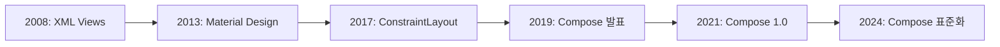

# Jetpack Compose의 역사와 탄생 배경

## 📚 목차
1. [Android UI의 진화](#android-ui의-진화)
2. [XML View의 한계](#xml-view의-한계)
3. [Compose의 탄생](#compose의-탄생)
4. [선언형 UI 혁명](#선언형-ui-혁명)
5. [Compose의 철학](#compose의-철학)
6. [Compose의 영향력](#compose의-영향력)

---

## Android UI의 진화

### 📱 Android UI의 역사 (2008-2024)



#### 2008년: Android 탄생 - XML Views

**Android 1.0**이 출시되면서 UI는 **XML**로 정의되었습니다.

```xml
<!-- 2008년부터 2021년까지 사용된 방식 -->
<LinearLayout
    android:layout_width="match_parent"
    android:layout_height="wrap_content"
    android:orientation="vertical">
    
    <TextView
        android:id="@+id/textView"
        android:layout_width="wrap_content"
        android:layout_height="wrap_content"
        android:text="Hello World" />
    
    <Button
        android:id="@+id/button"
        android:layout_width="wrap_content"
        android:layout_height="wrap_content"
        android:text="Click Me" />
</LinearLayout>
```

```kotlin
// Activity에서 View 조작
class MainActivity : AppCompatActivity() {
    override fun onCreate(savedInstanceState: Bundle?) {
        super.onCreate(savedInstanceState)
        setContentView(R.layout.activity_main)
        
        val textView = findViewById<TextView>(R.id.textView)
        val button = findViewById<Button>(R.id.button)
        
        button.setOnClickListener {
            textView.text = "Button Clicked!"
        }
    }
}
```

**특징**:
- ✅ 익숙한 XML 문법
- ✅ 디자이너 친화적 (Android Studio Layout Editor)
- ❌ 장황한 코드
- ❌ findViewById() 지옥
- ❌ UI와 로직 분리로 인한 복잡성

#### 2013년: Material Design

Google이 **Material Design** 디자인 언어를 발표했습니다.

```xml
<!-- Material Design 컴포넌트 -->
<com.google.android.material.button.MaterialButton
    android:layout_width="wrap_content"
    android:layout_height="wrap_content"
    android:text="Material Button"
    app:cornerRadius="8dp"
    app:icon="@drawable/ic_add" />
```

**개선점**:
- ✅ 일관된 디자인 가이드라인
- ✅ 아름다운 UI 컴포넌트
- ❌ 여전히 XML 기반
- ❌ 복잡한 커스터마이징

#### 2015년: Data Binding

**Data Binding Library**로 XML과 데이터를 연결했습니다.

```xml
<layout>
    <data>
        <variable
            name="user"
            type="com.example.User" />
    </data>
    
    <TextView
        android:text="@{user.name}" />
</layout>
```

**개선점**:
- ✅ findViewById() 제거
- ✅ 양방향 데이터 바인딩
- ❌ 복잡한 설정
- ❌ 디버깅 어려움
- ❌ 컴파일 시간 증가

#### 2017년: ConstraintLayout

**ConstraintLayout**으로 복잡한 레이아웃을 평평하게 만들었습니다.

```xml
<androidx.constraintlayout.widget.ConstraintLayout>
    <TextView
        android:id="@+id/title"
        app:layout_constraintTop_toTopOf="parent"
        app:layout_constraintStart_toStartOf="parent" />
    
    <Button
        android:id="@+id/button"
        app:layout_constraintTop_toBottomOf="@id/title"
        app:layout_constraintStart_toStartOf="parent" />
</androidx.constraintlayout.widget.ConstraintLayout>
```

**개선점**:
- ✅ 평평한 뷰 계층 (성능 향상)
- ✅ 유연한 레이아웃
- ❌ 학습 곡선이 가파름
- ❌ XML 복잡도 증가

---

## XML View의 한계

### 🚨 Google이 직면한 문제들

2018년경, Google Android 팀은 심각한 문제들을 인식했습니다.

#### 1. **장황한 코드**

```xml
<!-- XML: 간단한 버튼 하나에 10줄 -->
<Button
    android:id="@+id/submitButton"
    android:layout_width="match_parent"
    android:layout_height="wrap_content"
    android:text="Submit"
    android:textColor="@color/white"
    android:background="@drawable/button_background"
    android:padding="16dp"
    android:layout_margin="8dp"
    android:onClick="onSubmitClick" />
```

```kotlin
// Kotlin: View 조작 코드
val submitButton = findViewById<Button>(R.id.submitButton)
submitButton.setOnClickListener {
    // 클릭 처리
}
```

**문제점**:
- XML과 Kotlin 코드가 분리됨
- findViewById()로 View 찾기
- 타입 안전성 부족
- 코드 중복

#### 2. **상태 관리의 어려움**

```kotlin
// 상태가 변경될 때마다 수동으로 UI 업데이트
class MainActivity : AppCompatActivity() {
    private var count = 0
    
    override fun onCreate(savedInstanceState: Bundle?) {
        super.onCreate(savedInstanceState)
        setContentView(R.layout.activity_main)
        
        val textView = findViewById<TextView>(R.id.countText)
        val button = findViewById<Button>(R.id.incrementButton)
        
        // 초기 상태 설정
        updateUI(textView)
        
        button.setOnClickListener {
            count++
            updateUI(textView) // 수동으로 UI 업데이트!
        }
    }
    
    private fun updateUI(textView: TextView) {
        textView.text = "Count: $count"
        
        // 여러 곳에서 상태를 업데이트하면?
        // 어디선가 updateUI()를 깜빡하면?
        // → 버그 발생!
    }
}
```

**문제점**:
- 상태와 UI가 동기화되지 않을 위험
- 수동으로 UI 업데이트 필요
- 복잡한 상태 관리
- 버그 발생 가능성 높음

#### 3. **View 재사용의 어려움**

```xml
<!-- custom_card.xml -->
<androidx.cardview.widget.CardView>
    <LinearLayout>
        <ImageView android:id="@+id/image" />
        <TextView android:id="@+id/title" />
        <TextView android:id="@+id/description" />
    </LinearLayout>
</androidx.cardview.widget.CardView>
```

```kotlin
// CustomCard.kt - 커스텀 View 만들기
class CustomCard @JvmOverloads constructor(
    context: Context,
    attrs: AttributeSet? = null,
    defStyleAttr: Int = 0
) : CardView(context, attrs, defStyleAttr) {
    
    private val image: ImageView
    private val title: TextView
    private val description: TextView
    
    init {
        inflate(context, R.layout.custom_card, this)
        image = findViewById(R.id.image)
        title = findViewById(R.id.title)
        description = findViewById(R.id.description)
    }
    
    fun setData(imageRes: Int, titleText: String, descText: String) {
        image.setImageResource(imageRes)
        title.text = titleText
        description.text = descText
    }
}
```

**문제점**:
- 복잡한 커스텀 View 생성 과정
- 생명주기 관리 어려움
- 재사용성 낮음
- 많은 보일러플레이트 코드

#### 4. **성능 문제**

```kotlin
// RecyclerView Adapter - 복잡함
class UserAdapter : RecyclerView.Adapter<UserAdapter.ViewHolder>() {
    
    class ViewHolder(view: View) : RecyclerView.ViewHolder(view) {
        val nameText: TextView = view.findViewById(R.id.nameText)
        val emailText: TextView = view.findViewById(R.id.emailText)
        val avatarImage: ImageView = view.findViewById(R.id.avatarImage)
    }
    
    override fun onCreateViewHolder(parent: ViewGroup, viewType: Int): ViewHolder {
        val view = LayoutInflater.from(parent.context)
            .inflate(R.layout.item_user, parent, false)
        return ViewHolder(view)
    }
    
    override fun onBindViewHolder(holder: ViewHolder, position: Int) {
        val user = users[position]
        holder.nameText.text = user.name
        holder.emailText.text = user.email
        // ...
    }
    
    override fun getItemCount() = users.size
}
```

**문제점**:
- RecyclerView 설정이 복잡함
- ViewHolder 패턴 필수
- 많은 보일러플레이트 코드
- 실수하기 쉬움

---

## Compose의 탄생

### 💡 Google의 고민 (2018-2019)

2018년, Google Android 팀은 중요한 결정을 내려야 했습니다.

#### 다른 플랫폼의 성공 사례

##### 1. **React (Facebook, 2013)**

```javascript
// React - 선언형 UI
function Counter() {
  const [count, setCount] = useState(0);
  
  return (
    <div>
      <p>Count: {count}</p>
      <button onClick={() => setCount(count + 1)}>
        Increment
      </button>
    </div>
  );
}
```

**특징**:
- ✅ 선언형 UI
- ✅ 컴포넌트 기반
- ✅ 상태 관리 간단
- ✅ 재사용성 높음

##### 2. **Flutter (Google, 2017)**

```dart
// Flutter - Dart 언어
class Counter extends StatefulWidget {
  @override
  _CounterState createState() => _CounterState();
}

class _CounterState extends State<Counter> {
  int count = 0;
  
  @override
  Widget build(BuildContext context) {
    return Column(
      children: [
        Text('Count: $count'),
        ElevatedButton(
          onPressed: () => setState(() => count++),
          child: Text('Increment'),
        ),
      ],
    );
  }
}
```

**특징**:
- ✅ 선언형 UI
- ✅ 크로스 플랫폼 (iOS + Android)
- ✅ 빠른 개발 속도
- ❌ Dart 언어 (새로 배워야 함)

##### 3. **SwiftUI (Apple, 2019)**

```swift
// SwiftUI - Swift 언어
struct CounterView: View {
    @State private var count = 0
    
    var body: some View {
        VStack {
            Text("Count: \(count)")
            Button("Increment") {
                count += 1
            }
        }
    }
}
```

**특징**:
- ✅ 선언형 UI
- ✅ Swift 언어 활용
- ✅ iOS 네이티브
- ✅ 간결한 코드

### 🎯 Google의 결정

**"Android에도 선언형 UI가 필요하다!"**

#### 목표 설정

1. **Kotlin 기반**: 새로운 언어가 아닌 Kotlin 활용
2. **선언형 UI**: React/Flutter/SwiftUI의 장점 흡수
3. **100% Kotlin**: XML 없이 순수 Kotlin으로
4. **상호운용성**: 기존 View 시스템과 호환
5. **성능**: 네이티브 성능 유지

### 📅 개발 과정

#### 2019년 5월: Google I/O에서 발표

**Jetpack Compose**가 처음 공개되었습니다!

```kotlin
// 첫 공개된 Compose 코드 (2019)
@Composable
fun Greeting(name: String) {
    Text(text = "Hello, $name!")
}
```

**반응**:
- 🎉 개발자들의 열광
- 🤔 "정말 XML 없이 가능한가?"
- 💭 "기존 앱은 어떻게 하나?"

#### 2019-2020: Alpha/Beta 단계

개발자들이 피드백을 주며 함께 발전했습니다.

```kotlin
// 초기 Compose (많이 변경됨)
@Composable
fun Counter() {
    val count = state { 0 } // 초기 API
    
    Column {
        Text("Count: ${count.value}")
        Button(onClick = { count.value++ }) {
            Text("Increment")
        }
    }
}
```

**주요 변경사항**:
- State API 개선
- Modifier 시스템 도입
- LazyColumn/LazyRow 추가
- Material Design 3 지원

#### 2021년 7월 28일: Compose 1.0 출시 🎉

**Production-ready!** 드디어 프로덕션에서 사용 가능!

```kotlin
// Compose 1.0 (안정화된 API)
@Composable
fun Counter() {
    var count by remember { mutableStateOf(0) }
    
    Column {
        Text("Count: $count")
        Button(onClick = { count++ }) {
            Text("Increment")
        }
    }
}
```

**의미**:
- ✅ API 안정성 보장
- ✅ 하위 호환성 약속
- ✅ 프로덕션 사용 권장

---

## 선언형 UI 혁명

### 🔄 명령형 vs 선언형

#### 명령형 UI (Imperative)

**"어떻게(How) 그릴지 명령"**

```kotlin
// XML + Kotlin (명령형)
class CounterActivity : AppCompatActivity() {
    private var count = 0
    private lateinit var countText: TextView
    private lateinit var button: Button
    
    override fun onCreate(savedInstanceState: Bundle?) {
        super.onCreate(savedInstanceState)
        setContentView(R.layout.activity_counter)
        
        // 1. View 찾기
        countText = findViewById(R.id.countText)
        button = findViewById(R.id.button)
        
        // 2. 초기 상태 설정
        updateUI()
        
        // 3. 이벤트 리스너 등록
        button.setOnClickListener {
            count++
            updateUI() // 수동으로 UI 업데이트!
        }
    }
    
    // 4. UI 업데이트 함수
    private fun updateUI() {
        countText.text = "Count: $count"
        button.isEnabled = count < 10
        
        if (count >= 10) {
            countText.setTextColor(Color.RED)
        }
    }
}
```

**문제점**:
- ❌ View 찾기 (findViewById)
- ❌ 수동 UI 업데이트
- ❌ 상태 동기화 실수 가능
- ❌ 코드가 분산됨

#### 선언형 UI (Declarative)

**"무엇을(What) 그릴지 선언"**

```kotlin
// Compose (선언형)
@Composable
fun Counter() {
    var count by remember { mutableStateOf(0) }
    
    Column {
        Text(
            text = "Count: $count",
            color = if (count >= 10) Color.Red else Color.Black
        )
        Button(
            onClick = { count++ },
            enabled = count < 10
        ) {
            Text("Increment")
        }
    }
}
```

**장점**:
- ✅ 상태만 변경하면 UI 자동 업데이트
- ✅ 코드가 한 곳에 모임
- ✅ 버그 가능성 낮음
- ✅ 읽기 쉬움

### 🎨 Compose의 핵심 개념

#### 1. **Recomposition (재구성)**

```kotlin
@Composable
fun DynamicUI() {
    var name by remember { mutableStateOf("") }
    
    Column {
        TextField(
            value = name,
            onValueChange = { name = it } // 상태 변경
        )
        
        // name이 변경되면 이 부분만 자동으로 다시 그려짐!
        Text("Hello, $name!")
    }
}
```

**Recomposition**:
- 상태가 변경되면 영향받는 부분만 다시 실행
- 자동으로 UI 업데이트
- 효율적인 성능

#### 2. **Single Source of Truth (단일 진실 공급원)**

```kotlin
@Composable
fun TodoList() {
    // 상태는 한 곳에만 존재
    var todos by remember { mutableStateOf(listOf<String>()) }
    
    Column {
        // UI는 상태를 읽기만 함
        todos.forEach { todo ->
            Text(todo)
        }
        
        Button(onClick = {
            // 상태만 변경하면 UI는 자동으로 업데이트
            todos = todos + "New Todo"
        }) {
            Text("Add Todo")
        }
    }
}
```

#### 3. **Unidirectional Data Flow (단방향 데이터 흐름)**

```
State (상태)
    ↓
UI (화면)
    ↓
Event (이벤트)
    ↓
State Update (상태 업데이트)
    ↓
(반복)
```

```kotlin
@Composable
fun LoginScreen(viewModel: LoginViewModel) {
    val uiState by viewModel.uiState.collectAsState()
    
    Column {
        // State → UI
        TextField(
            value = uiState.username,
            onValueChange = { viewModel.onUsernameChange(it) } // Event
        )
        
        Button(onClick = { viewModel.login() }) { // Event
            Text("Login")
        }
        
        if (uiState.isLoading) {
            CircularProgressIndicator()
        }
    }
}
```

---

## Compose의 철학

### 🎯 핵심 원칙

#### 1. **Kotlin First**

**"Kotlin의 모든 기능을 활용하자"**

```kotlin
// Kotlin의 기능을 100% 활용
@Composable
fun UserList(users: List<User>) {
    LazyColumn {
        // 람다, 고차 함수
        items(users) { user ->
            // 확장 함수
            UserCard(
                user = user,
                // 기본 매개변수
                modifier = Modifier.fillMaxWidth()
            )
        }
    }
}
```

#### 2. **Composable Functions**

**"UI는 함수다"**

```kotlin
// UI 컴포넌트 = 함수
@Composable
fun Greeting(name: String) {
    Text("Hello, $name!")
}

// 함수 조합으로 복잡한 UI 생성
@Composable
fun WelcomeScreen() {
    Column {
        Greeting("Alice")
        Greeting("Bob")
        Greeting("Charlie")
    }
}
```

#### 3. **Composition over Inheritance**

**"상속보다 조합"**

```kotlin
// ❌ XML/View: 상속 기반
class CustomButton : Button {
    // 복잡한 상속 구조
}

// ✅ Compose: 조합 기반
@Composable
fun CustomButton(
    text: String,
    icon: ImageVector,
    onClick: () -> Unit
) {
    Button(onClick = onClick) {
        Row {
            Icon(icon, contentDescription = null)
            Spacer(Modifier.width(8.dp))
            Text(text)
        }
    }
}
```

#### 4. **Immutability (불변성)**

**"상태는 불변으로"**

```kotlin
// ✅ 불변 상태
data class UiState(
    val username: String = "",
    val isLoading: Boolean = false,
    val error: String? = null
)

@Composable
fun LoginScreen(uiState: UiState) {
    // uiState는 읽기만 함
    // 변경은 ViewModel에서
}
```

---

## Compose의 영향력

### 📊 채택률

| 연도 | 채택률 | 주요 이벤트 |
|------|--------|------------|
| **2021** | ~5% | 1.0 출시 |
| **2022** | ~20% | 빠른 성장 |
| **2023** | ~40% | 주류 진입 |
| **2024** | ~60%+ | 사실상 표준 |

### 🏢 주요 기업 채택

- **Google**: Google Play, Google Photos 등
- **Twitter**: Android 앱 전환
- **Airbnb**: 새로운 기능에 Compose 사용
- **Square**: Cash App에 Compose 도입
- **많은 스타트업**: Compose First

### 🌍 생태계 확장

#### Compose Multiplatform

**하나의 코드로 여러 플랫폼에서 실행!**

```kotlin
// 공통 Compose 코드
@Composable
fun App() {
    MaterialTheme {
        Column {
            Text("Hello from Compose!")
            Button(onClick = { /* ... */ }) {
                Text("Click Me")
            }
        }
    }
}

// Android, iOS, Desktop, Web 모두에서 동작!
```

**지원 플랫폼**:
- 📱 Android
- 🍎 iOS
- 💻 Desktop (Windows, macOS, Linux)
- 🌐 Web (Wasm)

### 📚 교육과 학습

#### Google의 공식 지원

- [Compose 공식 문서](https://developer.android.com/jetpack/compose)
- [Compose 샘플](https://github.com/android/compose-samples)
- [Compose 코스](https://developer.android.com/courses/jetpack-compose/course)
- [Compose Pathways](https://developer.android.com/courses/pathways/compose)

#### 커뮤니티

- Kotlin Slack #compose 채널
- Reddit r/androiddev
- Stack Overflow
- 수많은 블로그와 튜토리얼

---

## 마치며

### 🎉 Compose의 성공 요인

1. **Kotlin 활용**: 새로운 언어가 아닌 Kotlin 기반
2. **선언형 UI**: 현대적인 UI 패러다임
3. **Google 지원**: 공식 권장 및 지속적 개발
4. **커뮤니티**: 열정적인 개발자들
5. **실용성**: 실제 문제 해결

### 💡 배운 점

> [!TIP]
> **좋은 기술은 개발자의 문제를 해결한다**
> 
> Compose는 Android 개발자들이 매일 겪는 실제 문제(장황한 XML, 복잡한 상태 관리, 낮은 재사용성)를 해결하기 위해 만들어졌습니다. 그래서 성공했습니다.

### 🚀 다음 단계

이제 Compose의 역사와 배경을 알았으니, 실제 사용법을 배워볼 차례입니다!

➡️ **다음 문서**: [03-2-jetpack-compose-layout-guide.md](./03-2-jetpack-compose-layout-guide.md)

---

## 참고 자료

### 공식 자료
- [Jetpack Compose 공식 사이트](https://developer.android.com/jetpack/compose)
- [Compose 발표 (Google I/O 2019)](https://www.youtube.com/watch?v=VsStyq4Lzxo)
- [Compose 1.0 발표](https://android-developers.googleblog.com/2021/07/jetpack-compose-announcement.html)

### 역사 관련
- [Why Jetpack Compose](https://developer.android.com/jetpack/compose/why-compose)
- [Thinking in Compose](https://developer.android.com/jetpack/compose/mental-model)
- [Compose 디자인 철학](https://developer.android.com/jetpack/compose/philosophy)

### 비교 자료
- [React vs Compose](https://developer.android.com/jetpack/compose/mental-model#react)
- [Flutter vs Compose](https://medium.com/@myofficework000/flutter-vs-jetpack-compose-a-comprehensive-comparison-for-mobile-app-development-8c5e7e7e7e7e)

---

**작성일**: 2024-12-02  
**작성자**: Antigravity AI Assistant

**읽기 시간**: 20-25분  
**난이도**: ⭐⭐

Compose의 탄생 스토리를 알고 나니, 왜 이렇게 설계되었는지 이해가 되시나요? 🚀
