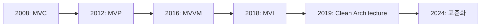

# Android Architecture의 진화

## 📚 목차
1. [Architecture 패턴의 역사](#architecture-패턴의-역사)
2. [MVC 시대](#mvc-시대)
3. [MVP의 등장](#mvp의-등장)
4. [MVVM 혁명](#mvvm-혁명)
5. [MVI와 현대 아키텍처](#mvi와-현대-아키텍처)
6. [Clean Architecture](#clean-architecture)

---

## Architecture 패턴의 역사

### 🕰️ Android Architecture의 진화



### 왜 Architecture가 필요한가?

#### 초기 Android (2008-2010)

```kotlin
// 😱 모든 코드가 Activity에!
class MainActivity : Activity() {
    override fun onCreate(savedInstanceState: Bundle?) {
        super.onCreate(savedInstanceState)
        setContentView(R.layout.activity_main)
        
        // UI 코드
        val button = findViewById<Button>(R.id.button)
        val textView = findViewById<TextView>(R.id.textView)
        
        // 비즈니스 로직
        button.setOnClickListener {
            val url = "https://api.example.com/data"
            
            // 네트워크 코드 (메인 스레드에서!)
            val data = URL(url).readText()  // ❌ NetworkOnMainThreadException!
            
            // 데이터 처리
            val result = processData(data)
            
            // UI 업데이트
            textView.text = result
        }
    }
    
    private fun processData(data: String): String {
        // 복잡한 로직...
        return data
    }
}
```

**문제점**:
- ❌ 모든 코드가 Activity에 집중
- ❌ 테스트 불가능
- ❌ 재사용 불가능
- ❌ 유지보수 지옥

---

## MVC 시대

### 📱 MVC (Model-View-Controller) 2008-2012

```
View (XML) ← → Controller (Activity) ← → Model (Data)
```

#### MVC 구조

```kotlin
// Model
data class User(val id: Int, val name: String)

class UserModel {
    fun getUser(id: Int): User {
        // 데이터 로직
        return User(id, "John")
    }
}

// Controller (Activity)
class MainActivity : Activity() {
    private val userModel = UserModel()
    
    override fun onCreate(savedInstanceState: Bundle?) {
        super.onCreate(savedInstanceState)
        setContentView(R.layout.activity_main)  // View
        
        // Controller 로직
        val user = userModel.getUser(1)
        findViewById<TextView>(R.id.nameText).text = user.name
    }
}
```

**장점**:
- ✅ 코드 분리 시작
- ✅ Model 재사용 가능

**문제점**:
- ❌ Activity가 여전히 비대함
- ❌ View와 Controller가 강하게 결합
- ❌ 테스트 어려움
- ❌ 화면 회전 시 데이터 손실

---

## MVP의 등장

### 🎯 MVP (Model-View-Presenter) 2012-2016

```
View (Activity) ← → Presenter ← → Model
```

#### MVP 구조

```kotlin
// View Interface
interface UserView {
    fun showUser(user: User)
    fun showError(message: String)
    fun showLoading()
    fun hideLoading()
}

// Presenter
class UserPresenter(private val view: UserView, private val model: UserModel) {
    fun loadUser(userId: Int) {
        view.showLoading()
        
        // 비동기 작업
        Thread {
            try {
                val user = model.getUser(userId)
                runOnUiThread {
                    view.hideLoading()
                    view.showUser(user)
                }
            } catch (e: Exception) {
                runOnUiThread {
                    view.hideLoading()
                    view.showError(e.message ?: "Error")
                }
            }
        }.start()
    }
}

// View (Activity)
class MainActivity : AppCompatActivity(), UserView {
    private lateinit var presenter: UserPresenter
    
    override fun onCreate(savedInstanceState: Bundle?) {
        super.onCreate(savedInstanceState)
        setContentView(R.layout.activity_main)
        
        presenter = UserPresenter(this, UserModel())
        presenter.loadUser(1)
    }
    
    override fun showUser(user: User) {
        nameText.text = user.name
    }
    
    override fun showError(message: String) {
        Toast.makeText(this, message, Toast.LENGTH_SHORT).show()
    }
    
    override fun showLoading() {
        progressBar.visibility = View.VISIBLE
    }
    
    override fun hideLoading() {
        progressBar.visibility = View.GONE
    }
}
```

**개선점**:
- ✅ View와 로직 분리
- ✅ 테스트 가능 (Presenter 단위 테스트)
- ✅ 재사용성 향상

**문제점**:
- ❌ 보일러플레이트 코드 많음
- ❌ View Interface 관리 복잡
- ❌ 생명주기 관리 어려움
- ❌ 메모리 누수 위험 (View 참조)

---

## MVVM 혁명

### 🚀 MVVM (Model-View-ViewModel) 2016-현재

```
View (Activity/Compose) ← → ViewModel ← → Model
```

#### 2016년: Architecture Components 발표

**Google I/O 2017**에서 Android Architecture Components 발표!

```kotlin
// ViewModel (2017년 도입)
class UserViewModel : ViewModel() {
    private val _user = MutableLiveData<User>()
    val user: LiveData<User> = _user
    
    private val _loading = MutableLiveData<Boolean>()
    val loading: LiveData<Boolean> = _loading
    
    fun loadUser(userId: Int) {
        _loading.value = true
        
        // 비동기 작업
        viewModelScope.launch {
            try {
                val user = userRepository.getUser(userId)
                _user.value = user
            } catch (e: Exception) {
                // 에러 처리
            } finally {
                _loading.value = false
            }
        }
    }
}

// View (Activity)
class MainActivity : AppCompatActivity() {
    private val viewModel: UserViewModel by viewModels()
    
    override fun onCreate(savedInstanceState: Bundle?) {
        super.onCreate(savedInstanceState)
        setContentView(R.layout.activity_main)
        
        // 관찰 (Observer 패턴)
        viewModel.user.observe(this) { user ->
            nameText.text = user.name
        }
        
        viewModel.loading.observe(this) { isLoading ->
            progressBar.visibility = if (isLoading) View.VISIBLE else View.GONE
        }
        
        viewModel.loadUser(1)
    }
}
```

**혁명적 개선**:
- ✅ 생명주기 자동 관리
- ✅ 화면 회전 시 데이터 유지
- ✅ 메모리 누수 방지
- ✅ 테스트 용이

#### 2019년: StateFlow 도입

```kotlin
// StateFlow (2019년 도입)
class UserViewModel : ViewModel() {
    private val _uiState = MutableStateFlow<UiState>(UiState.Loading)
    val uiState: StateFlow<UiState> = _uiState.asStateFlow()
    
    fun loadUser(userId: Int) {
        viewModelScope.launch {
            _uiState.value = UiState.Loading
            
            try {
                val user = userRepository.getUser(userId)
                _uiState.value = UiState.Success(user)
            } catch (e: Exception) {
                _uiState.value = UiState.Error(e.message ?: "Error")
            }
        }
    }
}

sealed class UiState {
    object Loading : UiState()
    data class Success(val user: User) : UiState()
    data class Error(val message: String) : UiState()
}
```

---

## MVI와 현대 아키텍처

### 🎨 MVI (Model-View-Intent) 2018-현재

```
View → Intent → Model → State → View
```

#### MVI 철학

**단방향 데이터 흐름 (Unidirectional Data Flow)**

```kotlin
// Intent (사용자 행동)
sealed class UserIntent {
    data class LoadUser(val userId: Int) : UserIntent()
    object RefreshUser : UserIntent()
}

// State (UI 상태)
data class UserState(
    val isLoading: Boolean = false,
    val user: User? = null,
    val error: String? = null
)

// ViewModel
class UserViewModel : ViewModel() {
    private val _state = MutableStateFlow(UserState())
    val state: StateFlow<UserState> = _state.asStateFlow()
    
    fun handleIntent(intent: UserIntent) {
        when (intent) {
            is UserIntent.LoadUser -> loadUser(intent.userId)
            is UserIntent.RefreshUser -> refreshUser()
        }
    }
    
    private fun loadUser(userId: Int) {
        viewModelScope.launch {
            _state.value = _state.value.copy(isLoading = true)
            
            try {
                val user = userRepository.getUser(userId)
                _state.value = UserState(user = user)
            } catch (e: Exception) {
                _state.value = UserState(error = e.message)
            }
        }
    }
}

// View (Compose)
@Composable
fun UserScreen(viewModel: UserViewModel = viewModel()) {
    val state by viewModel.state.collectAsState()
    
    when {
        state.isLoading -> LoadingView()
        state.error != null -> ErrorView(state.error!!)
        state.user != null -> UserView(state.user!!)
    }
    
    // Intent 전달
    Button(onClick = { viewModel.handleIntent(UserIntent.RefreshUser) }) {
        Text("Refresh")
    }
}
```

**장점**:
- ✅ 예측 가능한 상태 관리
- ✅ 디버깅 쉬움
- ✅ 시간 여행 디버깅 가능
- ✅ 테스트 용이

---

## Clean Architecture

### 🏗️ Clean Architecture (2019-현재)

**Robert C. Martin (Uncle Bob)**의 Clean Architecture를 Android에 적용

```
Presentation Layer (UI + ViewModel)
         ↓
Domain Layer (Use Cases + Entities)
         ↓
Data Layer (Repository + Data Sources)
```

#### 레이어별 책임

```kotlin
// Domain Layer - Entity
data class User(
    val id: Int,
    val name: String,
    val email: String
)

// Domain Layer - Use Case
class GetUserUseCase(private val repository: UserRepository) {
    suspend operator fun invoke(userId: Int): Result<User> {
        return repository.getUser(userId)
    }
}

// Data Layer - Repository Interface (Domain에 위치)
interface UserRepository {
    suspend fun getUser(userId: Int): Result<User>
}

// Data Layer - Repository Implementation
class UserRepositoryImpl(
    private val apiService: ApiService,
    private val userDao: UserDao
) : UserRepository {
    override suspend fun getUser(userId: Int): Result<User> {
        return try {
            val user = apiService.getUser(userId)
            userDao.insert(user)
            Result.success(user)
        } catch (e: Exception) {
            val cachedUser = userDao.getUser(userId)
            if (cachedUser != null) {
                Result.success(cachedUser)
            } else {
                Result.failure(e)
            }
        }
    }
}

// Presentation Layer - ViewModel
class UserViewModel(
    private val getUserUseCase: GetUserUseCase
) : ViewModel() {
    private val _uiState = MutableStateFlow<UiState>(UiState.Loading)
    val uiState: StateFlow<UiState> = _uiState.asStateFlow()
    
    fun loadUser(userId: Int) {
        viewModelScope.launch {
            _uiState.value = UiState.Loading
            
            getUserUseCase(userId)
                .onSuccess { user ->
                    _uiState.value = UiState.Success(user)
                }
                .onFailure { error ->
                    _uiState.value = UiState.Error(error.message ?: "Error")
                }
        }
    }
}
```

**장점**:
- ✅ 명확한 책임 분리
- ✅ 테스트 용이
- ✅ 확장성
- ✅ 유지보수성

---

## 마치며

### 🎉 Architecture의 진화 요약

| 패턴 | 시기 | 핵심 개선 | 한계 |
|------|------|----------|------|
| **MVC** | 2008-2012 | 코드 분리 시작 | Activity 비대 |
| **MVP** | 2012-2016 | View-로직 분리 | 보일러플레이트 |
| **MVVM** | 2016-현재 | 생명주기 관리 | - |
| **MVI** | 2018-현재 | 단방향 흐름 | 학습 곡선 |
| **Clean** | 2019-현재 | 레이어 분리 | 복잡도 증가 |

### 💡 배운 점

> [!TIP]
> **Architecture는 프로젝트 규모에 맞게**
> 
> - 작은 앱: MVVM만으로 충분
> - 중간 앱: MVVM + Repository
> - 큰 앱: Clean Architecture

### 🚀 다음 단계

➡️ **다음 문서**: [18-2-android-architecture-guide.md](./18-2-android-architecture-guide.md)

---

**작성일**: 2024-12-02  
**작성자**: Antigravity AI Assistant

**읽기 시간**: 15분  
**난이도**: ⭐⭐

Architecture의 진화를 이해하면 왜 지금의 방식을 사용하는지 알 수 있습니다! 🏗️
