# Jetpack Compose State 완벽 가이드

> 📖 **State 가이드 시리즈**
> - **04**: State 완벽 가이드 (현재 문서) - 기초부터 ViewModel까지
> - **04-1**: [State 고급 패턴](./04-1-jetpack-compose-state-advanced.md) - Side Effect, 성능 최적화
> - **04-2**: [State 실전 프로젝트](./04-2-jetpack-compose-state-projects.md) - 메모, 타이머, 채팅 앱
> - **04-3**: [State 치트시트](./04-3-jetpack-compose-state-cheatsheet.md) - 핵심 요약, 템플릿

---

## 📚 목차
1. [State란 무엇인가?](#state란-무엇인가)
2. [학습 로드맵](#학습-로드맵)
3. [Level 1: State 기초](#level-1-state-기초)
4. [Level 2: State Hoisting](#level-2-state-hoisting)
5. [Level 3: ViewModel과 State](#level-3-viewmodel과-state)
6. [Level 4: 고급 State 패턴](#level-4-고급-state-패턴)
7. [실습 프로젝트](#실습-프로젝트)
8. [Best Practices](#best-practices)

---

## State란 무엇인가?

### 정의
**State(상태)**는 시간에 따라 변할 수 있는 값입니다. Compose에서 State가 변경되면 UI가 자동으로 다시 그려집니다(Recomposition).

### 핵심 개념

```
State 변경 → Recomposition → UI 업데이트
```

#### 예시: 카운터 앱
```kotlin
var count = 0  // ❌ 일반 변수 - UI가 업데이트되지 않음
var count by remember { mutableStateOf(0) }  // ✅ State - UI가 자동 업데이트
```

### State가 필요한 이유

| 시나리오 | State 없이 | State 사용 |
|---------|-----------|-----------|
| 버튼 클릭 카운트 | 값은 증가하지만 화면에 반영 안됨 | 값 증가 시 자동으로 화면 업데이트 |
| 텍스트 입력 | 입력한 내용이 사라짐 | 입력 내용이 유지되고 표시됨 |
| 체크박스 선택 | 선택 상태가 보이지 않음 | 선택 상태가 시각적으로 표시됨 |

---

## 학습 로드맵

### 단계별 학습 계획

```mermaid
graph TD
    A[Level 1: State 기초] --> B[Level 2: State Hoisting]
    B --> C[Level 3: ViewModel]
    C --> D[Level 4: 고급 패턴]
    
    A --> A1[remember & mutableStateOf]
    A --> A2[Recomposition 이해]
    
    B --> B1[부모-자식 데이터 전달]
    B --> B2[단방향 데이터 흐름]
    
    C --> C1[ViewModel 통합]
    C --> C2[LiveData vs StateFlow]
    
    D --> D1[derivedStateOf]
    D --> D2[rememberSaveable]
    D --> D3[LaunchedEffect]
```



### 학습 시간 예상

| Level | 주제 | 예상 시간 | 난이도 |
|-------|------|----------|--------|
| 1 | State 기초 | 1-2시간 | ⭐ |
| 2 | State Hoisting | 2-3시간 | ⭐⭐ |
| 3 | ViewModel | 3-4시간 | ⭐⭐⭐ |
| 4 | 고급 패턴 | 4-6시간 | ⭐⭐⭐⭐ |

---

## Level 1: State 기초

### 학습 목표
- [ ] `remember`와 `mutableStateOf`의 역할 이해
- [ ] Recomposition 개념 이해
- [ ] 간단한 카운터 앱 만들기
- [ ] TextField와 State 연동

### 1.1 remember와 mutableStateOf

#### remember의 역할
```kotlin
@Composable
fun Counter() {
    // ❌ 잘못된 예: Recomposition 시마다 0으로 초기화됨
    var count = 0
    
    // ✅ 올바른 예: Recomposition 시에도 값 유지
    var count by remember { mutableStateOf(0) }
}
```

#### 구성 요소 분석

```kotlin
var count by remember { mutableStateOf(0) }
│   │     │  │         │              │
│   │     │  │         │              └─ 초기값
│   │     │  │         └─ 변경 가능한 State 생성
│   │     │  └─ Recomposition 시 값 유지
│   │     └─ 프로퍼티 위임 (by 키워드)
│   └─ 변수명
└─ var (변경 가능)
```

### 1.2 실습 1: 카운터 앱

**목표**: 버튼을 누르면 숫자가 증가하는 앱 만들기

```kotlin
@Composable
fun CounterApp() {
    // State 선언
    var count by remember { mutableStateOf(0) }
    
    Column(
        modifier = Modifier.fillMaxSize(),
        verticalArrangement = Arrangement.Center,
        horizontalAlignment = Alignment.CenterHorizontally
    ) {
        // State 표시
        Text(
            text = "카운트: $count",
            fontSize = 32.sp
        )
        
        Spacer(modifier = Modifier.height(16.dp))
        
        // State 변경
        Button(onClick = { count++ }) {
            Text("증가")
        }
        
        Spacer(modifier = Modifier.height(8.dp))
        
        Button(onClick = { count-- }) {
            Text("감소")
        }
        
        Spacer(modifier = Modifier.height(8.dp))
        
        Button(onClick = { count = 0 }) {
            Text("초기화")
        }
    }
}
```

**학습 포인트**:
- `count++` 실행 → State 변경 → Recomposition → UI 업데이트
- `Text(text = "카운트: $count")`가 자동으로 새로운 값 표시

### 1.3 실습 2: TextField와 State

**목표**: 입력한 텍스트를 실시간으로 표시

```kotlin
@Composable
fun TextInputApp() {
    var text by remember { mutableStateOf("") }
    
    Column(
        modifier = Modifier
            .fillMaxSize()
            .padding(16.dp)
    ) {
        // 입력 필드
        OutlinedTextField(
            value = text,
            onValueChange = { newText -> text = newText },
            label = { Text("이름을 입력하세요") },
            modifier = Modifier.fillMaxWidth()
        )
        
        Spacer(modifier = Modifier.height(16.dp))
        
        // 실시간 표시
        Text(
            text = if (text.isEmpty()) {
                "아직 입력하지 않았습니다"
            } else {
                "안녕하세요, ${text}님!"
            },
            fontSize = 20.sp
        )
        
        Spacer(modifier = Modifier.height(16.dp))
        
        // 글자 수 표시
        Text(
            text = "글자 수: ${text.length}",
            fontSize = 16.sp,
            color = Color.Gray
        )
    }
}
```

**학습 포인트**:
- `onValueChange`에서 State 업데이트
- State 변경 시 모든 관련 UI가 자동 업데이트

### 1.4 Recomposition 이해하기

#### Recomposition이란?
State가 변경되면 Compose가 UI를 다시 그리는 과정

```kotlin
@Composable
fun RecompositionDemo() {
    var count by remember { mutableStateOf(0) }
    
    Column {
        // ✅ count가 변경되면 이 부분만 Recomposition
        Text("카운트: $count")
        
        // ✅ count와 무관하므로 Recomposition 안됨 (최적화)
        Text("고정된 텍스트")
        
        Button(onClick = { count++ }) {
            Text("증가")
        }
    }
}
```

> [!TIP]
> **Compose의 스마트 Recomposition**
> - State가 변경되면 전체 UI가 아닌 **필요한 부분만** 다시 그려집니다
> - 성능 최적화가 자동으로 이루어집니다

### 1.5 Composition Tree와 remember의 비밀 🔍

#### 자주 하는 질문

> "함수가 다시 실행되면 변수가 초기화되는 거 아니야?"  
> "어떻게 Recomposition 시에도 값이 유지되지?"

이것이 바로 Compose의 핵심 마법입니다!

#### ❌ 흔한 오해

```kotlin
@Composable
fun Counter() {
    var count by remember { mutableStateOf(0) }
    // "함수가 다시 호출되면 count가 0으로 초기화되는 거 아니야?"
}
```

**정답**: 아닙니다! Composable 함수는 일반 함수와 다르게 동작합니다.

#### ✅ 핵심 개념: Composition Tree

Compose는 **Composition Tree**라는 특별한 자료구조를 메모리에 유지합니다:

```
Composition Tree (메모리에 계속 존재)
├─ Counter (위치 #1)
│  └─ State: count = 5  ← 여기에 저장됨!
├─ Counter (위치 #2)
│  └─ State: count = 3  ← 각각 독립적!
└─ Text (위치 #3)
   └─ State: (없음)
```

#### 🎬 단계별 동작 과정

**1️⃣ 첫 실행 (Initial Composition)**

```kotlin
@Composable
fun Counter() {
    var count by remember { mutableStateOf(0) }  // ← 여기!
    
    Button(onClick = { count++ }) {
        Text("카운트: $count")
    }
}
```

내부 동작:
```
1. Compose: "Counter 함수를 실행하네?"
2. Compose: "remember를 만났어. 이 위치(#1)에 State를 저장할게"
3. Compose: "mutableStateOf(0) 실행 → 초기값 0"
4. Composition Tree에 저장:
   위치 #1 → State(value=0)
```

**2️⃣ 버튼 클릭 (State 변경)**

```kotlin
Button(onClick = { count++ })  // count = 0 → 1
```

내부 동작:
```
1. count++ 실행
2. Composition Tree 업데이트:
   위치 #1 → State(value=1)  ← 값만 변경!
3. Compose: "State가 변경됐네? Recomposition 필요!"
```

**3️⃣ Recomposition (함수 재실행)**

```kotlin
@Composable
fun Counter() {
    var count by remember { mutableStateOf(0) }  // ← 다시 실행!
    // ...
}
```

내부 동작 (중요!):
```
1. Compose: "Counter 함수를 다시 실행하네?"
2. Compose: "remember를 만났어. 어? 이 위치(#1)에 이미 State가 있네?"
3. Compose: "mutableStateOf(0)은 건너뛰고, 저장된 값(1)을 가져올게"
4. count = 1 (저장된 값 사용!)
```

#### 💡 remember의 실제 동작 (간단히)

```kotlin
// Compose 내부 동작 (의사 코드)
@Composable
fun <T> remember(calculation: () -> T): T {
    val compositionId = getCurrentCompositionId()  // 예: "#1"
    
    // 이미 저장된 값이 있나?
    if (compositionTree.hasValue(compositionId)) {
        // 있으면 저장된 값 반환 (calculation 실행 안 함!)
        return compositionTree.getValue(compositionId)
    } else {
        // 없으면 calculation 실행하고 저장
        val value = calculation()  // mutableStateOf(0) 실행
        compositionTree.setValue(compositionId, value)
        return value
    }
}
```

#### 🔬 실제 확인해보기

```kotlin
@Composable
fun CounterWithLog() {
    println("🔵 Counter 함수 시작")
    
    var count by remember { 
        println("🟢 mutableStateOf 실행!")
        mutableStateOf(0) 
    }
    
    println("🔴 현재 count = $count")
    
    Button(onClick = { count++ }) {
        Text("카운트: $count")
    }
}
```

**실행 결과**:

```
// 첫 실행
🔵 Counter 함수 시작
🟢 mutableStateOf 실행!  ← 초기화
🔴 현재 count = 0

// 버튼 클릭 후 Recomposition
🔵 Counter 함수 시작
🔴 현재 count = 1  ← mutableStateOf 실행 안 됨!

// 또 클릭
🔵 Counter 함수 시작
🔴 현재 count = 2  ← mutableStateOf 실행 안 됨!
```

**주목**: `mutableStateOf`는 **첫 실행 때만** 실행됩니다!

#### 📊 일반 함수 vs Composable 함수

| 특성 | 일반 함수 | Composable 함수 |
|------|----------|----------------|
| **호출 시** | 새로운 스택 프레임 생성 | Composition Tree에서 위치 찾기 |
| **지역 변수** | 스택에 저장 → 함수 종료 시 사라짐 | 일반 변수는 동일 |
| **remember 변수** | (없음) | Composition Tree에 저장 → 유지됨 ✅ |
| **재호출 시** | 모든 변수 초기화 | remember 변수는 유지됨 |

#### 🎯 State vs Static 변수

많은 사람들이 "State가 static 변수인가?"라고 생각하지만, **아닙니다!**

```kotlin
@Composable
fun CounterDemo() {
    Column {
        Counter()  // 첫 번째 Counter
        Counter()  // 두 번째 Counter
    }
}

@Composable
fun Counter() {
    var count by remember { mutableStateOf(0) }
    
    Button(onClick = { count++ }) {
        Text("카운트: $count")
    }
}
```

**결과**:
- 첫 번째 Counter 클릭 → 첫 번째만 증가 (1, 0)
- 두 번째 Counter 클릭 → 두 번째만 증가 (1, 1)
- **각각 독립적인 State를 가짐!**

만약 static이었다면:
- 첫 번째 클릭 → 둘 다 1
- 두 번째 클릭 → 둘 다 2

#### 🏗️ Composition Tree 구조 예시

```kotlin
@Composable
fun App() {
    Column {
        Counter()  // 위치 #1
        Counter()  // 위치 #2
        Text("안녕")  // 위치 #3
    }
}
```

**메모리 구조**:
```
Composition Tree
├─ Column
│  ├─ Counter (슬롯 #1)
│  │  └─ remember 슬롯 → State(count=5)
│  ├─ Counter (슬롯 #2)
│  │  └─ remember 슬롯 → State(count=3)
│  └─ Text (슬롯 #3)
│     └─ (State 없음)
```

각 `Counter`는 **자기만의 슬롯**을 가지므로 독립적입니다!

#### 💡 비유로 이해하기

**일반 함수**:
- 메모장에 적기 (함수 끝나면 버림)
- 매번 새로운 종이 사용

**Composable 함수 + remember**:
- 노트북에 저장하기 (계속 유지)
- Composition Tree = 그 노트북
- 위치 ID = 페이지 번호
- 같은 페이지를 계속 업데이트

#### ✅ 핵심 정리

```kotlin
@Composable
fun Counter() {
    // 일반 변수: 매번 초기화
    var temp = 0
    
    // State 변수: Composition Tree에 저장되어 유지
    var count by remember { mutableStateOf(0) }
    
    println("temp = $temp")    // 항상 0
    println("count = $count")  // 증가된 값 유지
}
```

**왜 유지되는가?**
1. `remember`는 Composition Tree에 값을 저장
2. Recomposition 시 함수는 재실행되지만
3. `remember`는 "이미 저장된 값이 있네?" 하고 그 값을 반환
4. `mutableStateOf(0)`은 첫 실행 때만 실행됨

> [!TIP]
> **핵심 포인트**
> - Composable 함수는 재실행되지만, `remember`로 감싼 값은 **별도의 저장소(Composition Tree)**에 보관
> - 각 Composable 인스턴스는 **독립적인 슬롯**을 가짐
> - State는 static이 아니라 **"Recomposition 시에도 유지되는 인스턴스 변수"**

### 1.6 Level 1 체크리스트

완료한 항목에 체크하세요:

- [ ] `remember`의 역할을 이해했다
- [ ] `mutableStateOf`로 State를 생성할 수 있다
- [ ] `by` 키워드의 의미를 안다
- [ ] Recomposition 개념을 이해했다
- [ ] **Composition Tree와 remember의 동작 원리를 이해했다** ⭐
- [ ] **State가 static 변수가 아닌 이유를 안다** ⭐
- [ ] 카운터 앱을 직접 만들어봤다
- [ ] TextField와 State를 연동해봤다

---

## Level 2: State Hoisting

### 학습 목표
- [ ] State Hoisting 개념 이해
- [ ] Stateless vs Stateful Composable 구분
- [ ] 단방향 데이터 흐름 이해
- [ ] 부모-자식 간 State 공유

### 2.1 State Hoisting이란?

**정의**: State를 사용하는 Composable에서 State를 관리하는 상위 Composable로 State를 "끌어올리는" 패턴

#### Before: State를 내부에서 관리
```kotlin
@Composable
fun Counter() {
    var count by remember { mutableStateOf(0) }  // State가 내부에 있음
    
    Button(onClick = { count++ }) {
        Text("카운트: $count")
    }
}
```

**문제점**: 외부에서 count 값을 알 수 없고 제어할 수 없음

#### After: State Hoisting 적용
```kotlin
// Stateless Composable - State를 받아서 사용만 함
@Composable
fun Counter(
    count: Int,
    onIncrement: () -> Unit
) {
    Button(onClick = onIncrement) {
        Text("카운트: $count")
    }
}

// Stateful Composable - State를 관리
@Composable
fun CounterScreen() {
    var count by remember { mutableStateOf(0) }
    
    Counter(
        count = count,
        onIncrement = { count++ }
    )
}
```

**장점**:
- ✅ 재사용 가능
- ✅ 테스트 용이
- ✅ 여러 Composable에서 같은 State 공유 가능

### 2.2 단방향 데이터 흐름 (Unidirectional Data Flow)

```
부모 Composable
    │
    ├─→ State (데이터) ──→ 자식 Composable
    │                           │
    └─← Event (콜백) ←──────────┘
```

#### 원칙
1. **State는 아래로 흐른다** (부모 → 자식)
2. **Event는 위로 흐른다** (자식 → 부모)

### 2.3 실습 3: Todo 리스트 (State Hoisting)

**목표**: 할 일 추가/삭제 기능 구현

```kotlin
// 데이터 클래스
data class TodoItem(
    val id: Int,
    val text: String,
    val isDone: Boolean = false
)

// Stateless: 개별 Todo 아이템
@Composable
fun TodoItemView(
    todo: TodoItem,
    onToggle: (Int) -> Unit,
    onDelete: (Int) -> Unit
) {
    Row(
        modifier = Modifier
            .fillMaxWidth()
            .padding(8.dp),
        verticalAlignment = Alignment.CenterVertically
    ) {
        Checkbox(
            checked = todo.isDone,
            onCheckedChange = { onToggle(todo.id) }
        )
        
        Text(
            text = todo.text,
            modifier = Modifier.weight(1f),
            textDecoration = if (todo.isDone) {
                TextDecoration.LineThrough
            } else {
                TextDecoration.None
            }
        )
        
        IconButton(onClick = { onDelete(todo.id) }) {
            Icon(Icons.Default.Delete, "삭제")
        }
    }
}

// Stateful: Todo 리스트 전체 관리
@Composable
fun TodoListScreen() {
    var todos by remember { mutableStateOf(listOf<TodoItem>()) }
    var newTodoText by remember { mutableStateOf("") }
    var nextId by remember { mutableStateOf(1) }
    
    Column(
        modifier = Modifier
            .fillMaxSize()
            .padding(16.dp)
    ) {
        // 입력 영역
        Row(modifier = Modifier.fillMaxWidth()) {
            OutlinedTextField(
                value = newTodoText,
                onValueChange = { newTodoText = it },
                label = { Text("할 일") },
                modifier = Modifier.weight(1f)
            )
            
            Spacer(modifier = Modifier.width(8.dp))
            
            Button(
                onClick = {
                    if (newTodoText.isNotBlank()) {
                        todos = todos + TodoItem(nextId, newTodoText)
                        nextId++
                        newTodoText = ""
                    }
                }
            ) {
                Text("추가")
            }
        }
        
        Spacer(modifier = Modifier.height(16.dp))
        
        // Todo 리스트
        LazyColumn {
            items(todos) { todo ->
                TodoItemView(
                    todo = todo,
                    onToggle = { id ->
                        todos = todos.map {
                            if (it.id == id) it.copy(isDone = !it.isDone)
                            else it
                        }
                    },
                    onDelete = { id ->
                        todos = todos.filter { it.id != id }
                    }
                )
            }
        }
        
        // 통계
        Spacer(modifier = Modifier.height(16.dp))
        Text(
            text = "전체: ${todos.size} | 완료: ${todos.count { it.isDone }}",
            fontSize = 14.sp,
            color = Color.Gray
        )
    }
}
```

**학습 포인트**:
- `TodoListScreen`이 State를 관리 (Stateful)
- `TodoItemView`는 State를 받아서 표시만 함 (Stateless)
- Event는 콜백으로 위로 전달 (`onToggle`, `onDelete`)

### 2.4 Stateless vs Stateful 비교

| 특성 | Stateless | Stateful |
|------|-----------|----------|
| State 소유 | ❌ 없음 | ✅ 있음 |
| 재사용성 | ✅ 높음 | ⚠️ 낮음 |
| 테스트 | ✅ 쉬움 | ⚠️ 어려움 |
| 책임 | UI 표시만 | State 관리 + UI |
| 예시 | `TodoItemView` | `TodoListScreen` |

### 2.5 Level 2 체크리스트

- [ ] State Hoisting 개념을 이해했다
- [ ] Stateless Composable을 만들 수 있다
- [ ] 단방향 데이터 흐름을 이해했다
- [ ] 부모-자식 간 State를 공유할 수 있다
- [ ] Todo 리스트를 직접 만들어봤다

---

## Level 3: ViewModel과 State

### 학습 목표
- [ ] ViewModel의 역할 이해
- [ ] ViewModel에서 State 관리
- [ ] StateFlow vs LiveData 이해
- [ ] 화면 회전 시 State 유지

### 3.1 ViewModel이 필요한 이유

#### remember의 한계
```kotlin
@Composable
fun CounterScreen() {
    var count by remember { mutableStateOf(0) }
    // ❌ 문제: 화면 회전 시 count가 0으로 초기화됨
    // ❌ 문제: 비즈니스 로직과 UI가 섞임
}
```

#### ViewModel의 장점
- ✅ 화면 회전 시에도 데이터 유지
- ✅ 비즈니스 로직 분리
- ✅ 테스트 용이
- ✅ 생명주기 관리

### 3.2 ViewModel의 동작 원리 🔍

#### 자주 하는 질문

> "ViewModel은 어떻게 화면 회전 시에도 값이 유지되지?"  
> "ViewModel은 static 클래스야?"

**정답**: 아닙니다! ViewModel은 **ViewModelStore**라는 특별한 저장소에 보관됩니다.

#### ❌ Static이 아닌 이유

```kotlin
class CounterViewModel : ViewModel() {
    private val _count = MutableStateFlow(0)
    val count: StateFlow<Int> = _count.asStateFlow()
    
    // ❌ 이것은 static이 아닙니다!
}
```

**Static이라면**:
- 앱 전체에서 하나만 존재
- 모든 화면이 같은 인스턴스 공유
- 메모리 누수 위험

**ViewModel은**:
- **각 Activity/Fragment마다 독립적인 인스턴스**
- ViewModelStore에 저장됨
- 화면 회전 시에도 유지됨 ✅

#### 🏗️ ViewModel의 저장 구조

```
Activity/Fragment
    ↓
ViewModelStoreOwner (인터페이스 구현)
    ↓
ViewModelStore (저장소)
    ↓
HashMap<String, ViewModel>
    ↓
"CounterViewModel" → CounterViewModel 인스턴스
```

#### 🎬 단계별 동작 과정

**1️⃣ 첫 ViewModel 생성**

```kotlin
@Composable
fun CounterScreen(
    viewModel: CounterViewModel = viewModel()
) {
    // ...
}
```

내부 동작:
```
1. viewModel() 함수 호출
2. Activity의 ViewModelStore 확인
3. "CounterViewModel" 키로 검색
4. 없으면 새로 생성하고 저장:
   ViewModelStore["CounterViewModel"] = CounterViewModel()
5. 있으면 기존 인스턴스 반환
```

**2️⃣ 화면 회전 시 (핵심!)**

```
화면 회전 발생
    ↓
Activity 파괴 (onDestroy)
    ↓
ViewModelStore는 유지됨! ← 핵심!
    ↓
새 Activity 생성 (onCreate)
    ↓
viewModel() 호출
    ↓
ViewModelStore에서 기존 인스턴스 반환
    ↓
데이터 유지됨! ✅
```

**3️⃣ 앱 종료 시**

```
뒤로 가기 또는 finish() 호출
    ↓
Activity 완전히 종료
    ↓
ViewModelStore.clear() 호출
    ↓
ViewModel.onCleared() 호출
    ↓
ViewModel 인스턴스 제거
```

#### 💡 ViewModelStore의 실제 구현 (간단히)

```kotlin
// Android 내부 코드 (간략화)
class ViewModelStore {
    private val map = HashMap<String, ViewModel>()
    
    fun put(key: String, viewModel: ViewModel) {
        map[key] = viewModel
    }
    
    fun get(key: String): ViewModel? {
        return map[key]
    }
    
    fun clear() {
        for (vm in map.values) {
            vm.onCleared()  // 정리 작업
        }
        map.clear()
    }
}

// Activity는 ViewModelStore를 가지고 있음
class ComponentActivity : Activity(), ViewModelStoreOwner {
    private val viewModelStore = ViewModelStore()
    
    override fun getViewModelStore(): ViewModelStore {
        return viewModelStore
    }
    
    override fun onDestroy() {
        super.onDestroy()
        
        // 화면 회전이 아닌 진짜 종료인 경우에만
        if (isFinishing) {
            viewModelStore.clear()
        }
        // 화면 회전이면 ViewModelStore 유지!
    }
}
```

#### 🔬 실제 확인해보기

```kotlin
class CounterViewModel : ViewModel() {
    init {
        println("🟢 ViewModel 생성: ${this.hashCode()}")
    }
    
    private val _count = MutableStateFlow(0)
    val count: StateFlow<Int> = _count.asStateFlow()
    
    fun increment() {
        _count.value++
        println("🔵 count = ${_count.value}")
    }
    
    override fun onCleared() {
        println("🔴 ViewModel 제거: ${this.hashCode()}")
        super.onCleared()
    }
}

@Composable
fun CounterScreen(
    viewModel: CounterViewModel = viewModel()
) {
    println("🟡 CounterScreen Recomposition")
    
    val count by viewModel.count.collectAsState()
    
    Button(onClick = { viewModel.increment() }) {
        Text("카운트: $count")
    }
}
```

**실행 결과**:

```
// 앱 시작
🟢 ViewModel 생성: 123456789
🟡 CounterScreen Recomposition

// 버튼 클릭
🔵 count = 1
🟡 CounterScreen Recomposition

// 화면 회전
🟡 CounterScreen Recomposition
// ViewModel 생성 안 됨! 기존 인스턴스 재사용

// 뒤로 가기
🔴 ViewModel 제거: 123456789
```

**주목**: 화면 회전 시 ViewModel이 **재생성되지 않습니다!**

#### 📊 remember vs ViewModel vs Static

| 특성 | remember | ViewModel | Static |
|------|----------|-----------|--------|
| **저장 위치** | Composition Tree | ViewModelStore | 클래스 영역 |
| **화면 회전 시** | ❌ 사라짐 | ✅ 유지됨 | ✅ 유지됨 |
| **앱 종료 시** | 사라짐 | 사라짐 | ✅ 유지됨 |
| **인스턴스 독립성** | ✅ 각 Composable마다 | ✅ 각 Activity마다 | ❌ 전역 공유 |
| **메모리 관리** | 자동 | 자동 | ⚠️ 수동 필요 |
| **사용 사례** | UI State | 비즈니스 로직 | ⚠️ 권장 안 함 |

#### 🏗️ 여러 화면에서 ViewModel 사용

```kotlin
// MainActivity
class MainActivity : ComponentActivity() {
    override fun onCreate(savedInstanceState: Bundle?) {
        super.onCreate(savedInstanceState)
        
        setContent {
            val viewModel: CounterViewModel = viewModel()
            // MainActivity의 ViewModelStore에 저장
            
            CounterScreen(viewModel)
        }
    }
}

// SecondActivity
class SecondActivity : ComponentActivity() {
    override fun onCreate(savedInstanceState: Bundle?) {
        super.onCreate(savedInstanceState)
        
        setContent {
            val viewModel: CounterViewModel = viewModel()
            // SecondActivity의 ViewModelStore에 저장
            // MainActivity와는 다른 인스턴스!
            
            CounterScreen(viewModel)
        }
    }
}
```

**결과**:
- MainActivity의 ViewModel: 인스턴스 A
- SecondActivity의 ViewModel: 인스턴스 B
- **각각 독립적!** (Static이 아님)

#### ✅ 핵심 정리

```kotlin
// ❌ Static 변수 (권장 안 함)
companion object {
    var count = 0  // 모든 곳에서 공유, 메모리 누수 위험
}

// ❌ remember (화면 회전 시 사라짐)
var count by remember { mutableStateOf(0) }

// ✅ ViewModel (화면 회전 시에도 유지, Activity마다 독립적)
class CounterViewModel : ViewModel() {
    private val _count = MutableStateFlow(0)
    val count: StateFlow<Int> = _count.asStateFlow()
}
```

**ViewModel이 값을 유지하는 이유**:
1. ViewModelStore에 저장됨 (HashMap)
2. 화면 회전 시 Activity는 재생성되지만 ViewModelStore는 유지됨
3. 새 Activity가 같은 ViewModelStore를 사용
4. 따라서 기존 ViewModel 인스턴스를 재사용
5. 앱 종료 시에만 ViewModelStore.clear() 호출

> [!TIP]
> **비유로 이해하기**
> - **remember**: 메모장 (Recomposition 시 유지, 화면 회전 시 사라짐)
> - **ViewModel**: 서랍 (화면 회전 시에도 유지, Activity 종료 시 비움)
> - **Static**: 금고 (앱 종료까지 유지, 모든 곳에서 공유)

### 3.3 ViewModel 설정

#### 1. 의존성 추가 (build.gradle.kts)
```kotlin
dependencies {
    implementation("androidx.lifecycle:lifecycle-viewmodel-compose:2.7.0")
}
```

#### 2. ViewModel 클래스 생성
```kotlin
import androidx.lifecycle.ViewModel
import kotlinx.coroutines.flow.MutableStateFlow
import kotlinx.coroutines.flow.StateFlow
import kotlinx.coroutines.flow.asStateFlow

class CounterViewModel : ViewModel() {
    // Private MutableStateFlow
    private val _count = MutableStateFlow(0)
    
    // Public StateFlow (읽기 전용)
    val count: StateFlow<Int> = _count.asStateFlow()
    
    // 비즈니스 로직
    fun increment() {
        _count.value++
    }
    
    fun decrement() {
        _count.value--
    }
    
    fun reset() {
        _count.value = 0
    }
}
```

#### 3. Composable에서 사용
```kotlin
@Composable
fun CounterScreen(
    viewModel: CounterViewModel = viewModel()
) {
    // StateFlow를 Compose State로 변환
    val count by viewModel.count.collectAsState()
    
    Column(
        modifier = Modifier.fillMaxSize(),
        verticalArrangement = Arrangement.Center,
        horizontalAlignment = Alignment.CenterHorizontally
    ) {
        Text("카운트: $count", fontSize = 32.sp)
        
        Spacer(modifier = Modifier.height(16.dp))
        
        Row {
            Button(onClick = { viewModel.decrement() }) {
                Text("-")
            }
            
            Spacer(modifier = Modifier.width(8.dp))
            
            Button(onClick = { viewModel.increment() }) {
                Text("+")
            }
        }
        
        Spacer(modifier = Modifier.height(8.dp))
        
        Button(onClick = { viewModel.reset() }) {
            Text("초기화")
        }
    }
}
```

### 3.3 StateFlow vs LiveData

| 특성 | StateFlow | LiveData |
|------|-----------|----------|
| 초기값 | ✅ 필수 | ❌ 선택 |
| Coroutine | ✅ 네이티브 지원 | ⚠️ 추가 라이브러리 필요 |
| Compose 통합 | ✅ `collectAsState()` | ⚠️ `observeAsState()` |
| 권장 사항 | ✅ **새 프로젝트 권장** | ⚠️ 레거시 지원 |

> [!IMPORTANT]
> **Jetpack Compose에서는 StateFlow 사용을 권장합니다**

### 3.4 실습 4: Todo 앱 with ViewModel

```kotlin
// ViewModel
class TodoViewModel : ViewModel() {
    private val _todos = MutableStateFlow<List<TodoItem>>(emptyList())
    val todos: StateFlow<List<TodoItem>> = _todos.asStateFlow()
    
    private var nextId = 1
    
    fun addTodo(text: String) {
        if (text.isBlank()) return
        
        val newTodo = TodoItem(nextId++, text)
        _todos.value = _todos.value + newTodo
    }
    
    fun toggleTodo(id: Int) {
        _todos.value = _todos.value.map {
            if (it.id == id) it.copy(isDone = !it.isDone)
            else it
        }
    }
    
    fun deleteTodo(id: Int) {
        _todos.value = _todos.value.filter { it.id != id }
    }
    
    fun getCompletedCount(): Int {
        return _todos.value.count { it.isDone }
    }
}

// Composable
@Composable
fun TodoScreen(
    viewModel: TodoViewModel = viewModel()
) {
    val todos by viewModel.todos.collectAsState()
    var newTodoText by remember { mutableStateOf("") }
    
    Column(
        modifier = Modifier
            .fillMaxSize()
            .padding(16.dp)
    ) {
        // 입력 영역
        Row {
            OutlinedTextField(
                value = newTodoText,
                onValueChange = { newTodoText = it },
                label = { Text("할 일") },
                modifier = Modifier.weight(1f)
            )
            
            Button(
                onClick = {
                    viewModel.addTodo(newTodoText)
                    newTodoText = ""
                }
            ) {
                Text("추가")
            }
        }
        
        // 리스트
        LazyColumn {
            items(todos) { todo ->
                TodoItemView(
                    todo = todo,
                    onToggle = { viewModel.toggleTodo(it) },
                    onDelete = { viewModel.deleteTodo(it) }
                )
            }
        }
        
        // 통계
        Text(
            text = "전체: ${todos.size} | 완료: ${viewModel.getCompletedCount()}",
            color = Color.Gray
        )
    }
}
```

### 3.5 Level 3 체크리스트

- [ ] ViewModel의 필요성을 이해했다
- [ ] **ViewModelStore와 ViewModel의 동작 원리를 이해했다** ⭐
- [ ] **ViewModel이 static이 아닌 이유를 안다** ⭐
- [ ] StateFlow를 사용할 수 있다
- [ ] `collectAsState()`로 State를 수집할 수 있다
- [ ] ViewModel에서 비즈니스 로직을 관리할 수 있다
- [ ] 화면 회전 시 데이터가 유지되는 것을 확인했다

---

## Level 4: 고급 State 패턴 (미리보기)

### 학습 목표
- [ ] `derivedStateOf` 사용
- [ ] `rememberSaveable` 이해
- [ ] `LaunchedEffect`와 Side Effect
- [ ] State 최적화 기법

> [!NOTE]
> **Level 4의 상세한 내용은 별도 문서로 이동했습니다!**
> 
> 더 깊이 있는 학습을 원하신다면:
> - **[04-1. State 고급 패턴](./04-1-jetpack-compose-state-advanced.md)** - Side Effect, 성능 최적화, 테스팅
> - **[04-2. State 실전 프로젝트](./04-2-jetpack-compose-state-projects.md)** - 메모 앱, 타이머 앱, 채팅 앱

### 4.1 derivedStateOf (간략)

**용도**: 다른 State로부터 계산된 State를 만들 때 사용

```kotlin
@Composable
fun SearchScreen() {
    var searchText by remember { mutableStateOf("") }
    val items = remember { listOf("Apple", "Banana", "Cherry") }
    
    // searchText가 변경될 때만 재계산
    val filteredItems by remember {
        derivedStateOf {
            items.filter { it.contains(searchText, ignoreCase = true) }
        }
    }
    
    Column {
        OutlinedTextField(
            value = searchText,
            onValueChange = { searchText = it }
        )
        
        LazyColumn {
            items(filteredItems) { item ->
                Text(item)
            }
        }
    }
}
```

### 4.2 rememberSaveable (간략)

**용도**: 프로세스 종료 후에도 State 유지

```kotlin
@Composable
fun FormScreen() {
    // remember: 프로세스 종료 시 사라짐
    var name by remember { mutableStateOf("") }
    
    // rememberSaveable: 프로세스 종료 후에도 유지
    var email by rememberSaveable { mutableStateOf("") }
    
    Column {
        OutlinedTextField(value = email, onValueChange = { email = it })
    }
}
```

### 4.3 LaunchedEffect (간략)

**용도**: Composable의 생명주기에 맞춰 비동기 작업 실행

```kotlin
@Composable
fun TimerScreen() {
    var seconds by remember { mutableStateOf(0) }
    
    LaunchedEffect(Unit) {
        while (true) {
            delay(1000)
            seconds++
        }
    }
    
    Text("경과 시간: ${seconds}초")
}
```

### 4.4 Level 4 체크리스트

- [ ] `derivedStateOf`를 사용할 수 있다
- [ ] `rememberSaveable`의 용도를 안다
- [ ] `LaunchedEffect`로 비동기 작업을 할 수 있다
- [ ] **04-1 고급 패턴 문서를 학습할 준비가 되었다** ⭐

---

## 실습 프로젝트 (미리보기)

> [!NOTE]
> **실습 프로젝트의 상세한 구현은 별도 문서로 이동했습니다!**
> 
> 완성된 프로젝트 코드와 단계별 가이드는:
> **[04-2. State 실전 프로젝트](./04-2-jetpack-compose-state-projects.md)**

### 프로젝트 1: 메모 앱
**난이도**: ⭐⭐⭐  
**학습 내용**: ViewModel, StateFlow, CRUD, 검색

### 프로젝트 2: 타이머 앱
**난이도**: ⭐⭐⭐⭐  
**학습 내용**: LaunchedEffect, 백그라운드, 알림

### 프로젝트 3: 채팅 앱 UI
**난이도**: ⭐⭐⭐⭐  
**학습 내용**: Flow, 무한 스크롤, 성능 최적화

---

## 🎯 다음 학습 단계

### ✅ 이 문서에서 배운 것

- remember와 Composition Tree의 동작 원리
- State Hoisting과 단방향 데이터 흐름
- ViewModel과 ViewModelStore의 생명주기
- StateFlow를 사용한 State 관리
- derivedStateOf, rememberSaveable, LaunchedEffect 기초

### 📚 다음에 배울 것

#### 1단계: 고급 패턴 (필수)
**[04-1. State 고급 패턴](./04-1-jetpack-compose-state-advanced.md)**
- Side Effect 완벽 가이드 (LaunchedEffect, DisposableEffect, SideEffect)
- 고급 State 패턴 (produceState, snapshotFlow, rememberUpdatedState)
- 성능 최적화 (Recomposition, Immutable, Key)
- State 테스팅

#### 2단계: 실전 프로젝트 (필수)
**[04-2. State 실전 프로젝트](./04-2-jetpack-compose-state-projects.md)**
- 메모 앱 (CRUD, 검색, 정렬)
- 타이머 앱 (백그라운드, 알림)
- 채팅 앱 UI (Flow, 무한 스크롤)

#### 3단계: 실무 적용
- 자신만의 앱 개발
- 아키텍처 패턴 (MVI, Clean Architecture)
- 프로덕션 배포

---

## Best Practices

### 1. State는 가능한 한 낮은 레벨에서 관리
```kotlin
// ✅ 좋은 예: State가 필요한 곳에서만 관리
@Composable
fun ParentScreen() {
    ChildScreen()  // State를 전달하지 않음
}

@Composable
fun ChildScreen() {
    var text by remember { mutableStateOf("") }
    TextField(value = text, onValueChange = { text = it })
}
```

### 2. Stateless Composable 선호
```kotlin
// ✅ 재사용 가능한 Stateless Composable
@Composable
fun Counter(count: Int, onIncrement: () -> Unit) {
    Button(onClick = onIncrement) {
        Text("$count")
    }
}
```

### 3. ViewModel에서 UI State 관리
```kotlin
// ✅ ViewModel에서 비즈니스 로직 처리
class MyViewModel : ViewModel() {
    private val _uiState = MutableStateFlow(UiState())
    val uiState = _uiState.asStateFlow()
    
    fun updateData() {
        // 비즈니스 로직
    }
}
```

### 4. 불필요한 Recomposition 방지
```kotlin
// ✅ derivedStateOf로 최적화
val expensiveValue by remember {
    derivedStateOf {
        // 비용이 큰 계산
    }
}
```

---

## 다음 단계

1. **Compose 공식 문서** 읽기
2. **실습 프로젝트** 직접 만들어보기
3. **오픈소스 프로젝트** 코드 분석
4. **자신만의 앱** 개발 시작

---

## 참고 자료

### 공식 문서
- [State and Jetpack Compose](https://developer.android.com/jetpack/compose/state)
- [ViewModel Overview](https://developer.android.com/topic/libraries/architecture/viewmodel)
- [StateFlow and SharedFlow](https://developer.android.com/kotlin/flow/stateflow-and-sharedflow)

### 추천 영상
- Android Developers YouTube 채널
- Philipp Lackner Compose 튜토리얼

### 커뮤니티
- Stack Overflow - `android-jetpack-compose` 태그
- Reddit - r/androiddev
- Kotlin Slack - #compose 채널

---

**마지막 업데이트**: 2024-12-02  
**작성자**: Antigravity AI Assistant

Happy Learning! 🚀
