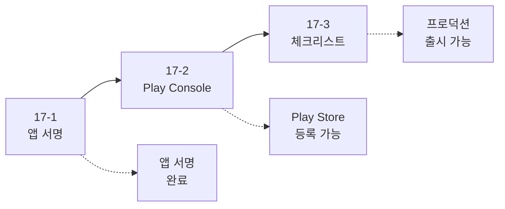

# Android 앱 배포 가이드

> [!NOTE]
> **이 문서는 새로운 종합 가이드 시리즈로 대체되었습니다!**
> 
> 앱 배포를 더 체계적으로 학습할 수 있도록 3개의 상세한 문서로 분할되었습니다:
> 
> 1. **[17-1. Android 앱 서명](./17-1-android-app-signing.md)** - 키스토어 생성, 앱 서명, Play App Signing, 보안
> 2. **[17-2. Android Play Console 가이드](./17-2-android-play-console-guide.md)** - Play Console 상세 가이드
> 3. **[17-3. Android 배포 체크리스트](./17-3-android-deployment-checklist.md)** - 배포 체크리스트 및 베스트 프랙티스
> 
> **총 분량**: 약 2,500줄의 상세한 설명과 주석이 포함된 코드 예제

---

## 📚 새로운 시리즈 구성

### 17-1. Android 앱 서명 (⭐ 시작점)
- **앱 서명이란?**: 목적, 필요성, 프로세스
- **키스토어 생성**: keytool, Android Studio
- **앱 서명 설정**: Gradle, 환경 변수, CI/CD
- **Play App Signing**: Upload Key vs App Signing Key
- **보안 베스트 프랙티스**: 키스토어 보안, 코드 보안

### 17-2. Android Play Console 가이드
- **Play Console 시작하기**: 개발자 계정 생성
- **앱 생성 및 기본 설정**: 앱 이름, 언어, 유형
- **스토어 등록정보**: 아이콘, 스크린샷, 설명
- **앱 콘텐츠**: 콘텐츠 등급, 대상 고객, 개인정보처리방침
- **테스트 및 출시**: 내부/비공개/공개 테스트, 프로덕션 출시
- **출시 후 관리**: 통계, 리뷰, 업데이트, A/B 테스팅

### 17-3. Android 배포 체크리스트
- **배포 전 체크리스트**: 코드 품질, 앱 설정, 리소스 최적화, 보안
- **버전 관리 전략**: 시맨틱 버저닝, versionCode 관리, 출시 노트
- **AAB vs APK**: 장단점 비교, 빌드 방법, 권장 사항
- **ProGuard/R8 설정**: 기본 설정, 규칙 작성, 테스트
- **배포 전략**: 단계적 출시, 롤백 계획, 출시 일정
- **출시 후 모니터링**: 크래시/ANR, 성능 지표, 사용자 피드백

---

## 🎯 학습 로드맵



### 추천 학습 순서

#### 1단계: 앱 서명 (1일)
- **17-1**: 앱 서명 학습 (1일)
  - 키스토어 생성
  - Gradle 서명 설정
  - Play App Signing 이해

#### 2단계: Play Console (1-2일)
- **17-2**: Play Console 가이드 (1-2일)
  - 개발자 계정 생성
  - 앱 등록 및 정보 입력
  - 테스트 트랙 활용

#### 3단계: 배포 준비 (1일)
- **17-3**: 배포 체크리스트 (1일)
  - 배포 전 점검
  - ProGuard 설정
  - 단계적 출시 계획

---

## 💡 새로운 시리즈의 특징

### ✅ 초보자 친화적
- 모든 개념을 처음부터 설명
- 단계별 가이드 제공
- 스크린샷 및 예시 포함

### ✅ 상세한 주석
```kotlin
/**
 * 키스토어 설정 파일 로드
 * 
 * keystore.properties 파일에서 서명 정보를 읽어옵니다.
 * 이렇게 하면 비밀번호를 코드에 직접 작성하지 않아도 됩니다.
 */
val keystorePropertiesFile = rootProject.file("keystore.properties")
val keystoreProperties = Properties()
keystoreProperties.load(FileInputStream(keystorePropertiesFile))
```

### ✅ 실행 가능한 코드
- 모든 예제는 복사-붙여넣기로 실행 가능
- 필요한 설정 파일 포함
- 에러 처리 포함

### ✅ 실전 체크리스트
- 배포 전 체크리스트
- 단계별 출시 계획
- 출시 후 모니터링 가이드

---

## 🚀 빠른 시작

앱 배포를 처음 시작한다면:

1. **[17-1. Android 앱 서명](./17-1-android-app-signing.md)** 로 시작하세요
2. 키스토어를 생성하세요
3. Gradle에 서명 설정을 추가하세요
4. Play App Signing을 활성화하세요

이미 앱 서명을 완료했다면:

1. **[17-2. Android Play Console 가이드](./17-2-android-play-console-guide.md)** 로 바로 이동
2. Play Console에 앱 등록
3. 스토어 등록정보 입력
4. **[17-3. Android 배포 체크리스트](./17-3-android-deployment-checklist.md)** 로 배포 준비

---

## 📊 문서 비교

| 구분 | 기존 문서 | 새로운 시리즈 |
|------|----------|--------------|
| 분량 | 358줄 | 약 2,500줄 |
| 파일 수 | 1개 | 3개 |
| 설명 수준 | 간략 | 매우 상세 |
| 코드 주석 | 기본 | 풍부 |
| 체크리스트 | 간단 | 상세 (단계별) |
| 초보자 친화성 | 보통 | 매우 높음 |

---

## 🎯 지금 바로 시작하세요!

**[👉 17-1. Android 앱 서명으로 이동](./17-1-android-app-signing.md)**

---

**마지막 업데이트**: 2024-12-03  
**작성자**: Antigravity AI Assistant

Happy Deploying! 🚀


---

## 배포 준비

### 체크리스트

- ✅ 모든 기능 테스트 완료
- ✅ 디버그 로그 제거
- ✅ 아이콘 및 리소스 최적화
- ✅ 권한 최소화
- ✅ 개인정보 처리방침 작성
- ✅ 스크린샷 준비

### build.gradle.kts 설정

```kotlin
android {
    namespace = "com.example.myapp"
    compileSdk = 34
    
    defaultConfig {
        applicationId = "com.example.myapp"
        minSdk = 24
        targetSdk = 34
        versionCode = 1
        versionName = "1.0.0"
    }
    
    buildTypes {
        release {
            isMinifyEnabled = true
            isShrinkResources = true
            proguardFiles(
                getDefaultProguardFile("proguard-android-optimize.txt"),
                "proguard-rules.pro"
            )
        }
    }
}
```

---

## APK/AAB 빌드

### AAB (Android App Bundle) - 권장

```bash
# Gradle로 빌드
./gradlew bundleRelease

# 출력 위치
app/build/outputs/bundle/release/app-release.aab
```

### APK 빌드

```bash
# Gradle로 빌드
./gradlew assembleRelease

# 출력 위치
app/build/outputs/apk/release/app-release.apk
```

### Android Studio에서 빌드

1. **Build → Generate Signed Bundle / APK**
2. **Android App Bundle** 선택
3. 키스토어 선택 또는 생성
4. **release** 빌드 타입 선택
5. **Finish**

---

## 앱 서명

### 키스토어 생성

```bash
keytool -genkey -v -keystore my-release-key.jks \
  -keyalg RSA -keysize 2048 -validity 10000 \
  -alias my-key-alias
```

### build.gradle.kts에 서명 설정

```kotlin
android {
    signingConfigs {
        create("release") {
            storeFile = file("my-release-key.jks")
            storePassword = "password"
            keyAlias = "my-key-alias"
            keyPassword = "password"
        }
    }
    
    buildTypes {
        release {
            signingConfig = signingConfigs.getByName("release")
        }
    }
}
```

### 보안: 키스토어 정보 분리

`keystore.properties`:
```properties
storePassword=myStorePassword
keyPassword=myKeyPassword
keyAlias=myKeyAlias
storeFile=my-release-key.jks
```

`build.gradle.kts`:
```kotlin
val keystorePropertiesFile = rootProject.file("keystore.properties")
val keystoreProperties = Properties()
keystoreProperties.load(FileInputStream(keystorePropertiesFile))

android {
    signingConfigs {
        create("release") {
            keyAlias = keystoreProperties["keyAlias"] as String
            keyPassword = keystoreProperties["keyPassword"] as String
            storeFile = file(keystoreProperties["storeFile"] as String)
            storePassword = keystoreProperties["storePassword"] as String
        }
    }
}
```

> [!IMPORTANT]
> `keystore.properties`를 `.gitignore`에 추가하세요!

---

## Google Play Console

### 1. 개발자 계정 생성

1. [Google Play Console](https://play.google.com/console) 접속
2. 개발자 계정 생성 ($25 일회성 등록비)

### 2. 앱 생성

1. **모든 앱 → 앱 만들기**
2. 앱 이름, 기본 언어, 앱 유형 선택
3. 개인정보처리방침 URL 입력

### 3. 앱 정보 입력

#### 스토어 등록정보

- **앱 이름**: 최대 50자
- **간단한 설명**: 최대 80자
- **자세한 설명**: 최대 4000자
- **스크린샷**: 
  - 휴대전화: 최소 2개 (권장 8개)
  - 7인치 태블릿: 선택사항
  - 10인치 태블릿: 선택사항
- **아이콘**: 512x512 PNG
- **기능 그래픽**: 1024x500 JPG/PNG

#### 콘텐츠 등급

1. **콘텐츠 등급 → 설문지 작성**
2. 앱 카테고리 선택
3. 질문에 답변
4. 등급 받기

#### 대상 고객 및 콘텐츠

- 대상 연령층
- 개인정보처리방침
- 광고 포함 여부

### 4. 앱 출시

#### 내부 테스트

1. **테스트 → 내부 테스트**
2. AAB 업로드
3. 테스터 이메일 추가
4. 출시

#### 비공개 테스트

1. **테스트 → 비공개 테스트**
2. 테스터 그룹 생성
3. AAB 업로드
4. 출시

#### 프로덕션 출시

1. **프로덕션 → 새 출시 만들기**
2. AAB 업로드
3. 출시 노트 작성
4. **검토 시작**
5. Google 검토 대기 (보통 1-3일)

---

## 버전 관리

### 버전 코드와 버전 이름

```kotlin
android {
    defaultConfig {
        versionCode = 2      // 정수, 매 업데이트마다 증가
        versionName = "1.1.0" // 사용자에게 표시되는 버전
    }
}
```

### 시맨틱 버저닝

```
MAJOR.MINOR.PATCH

예: 1.2.3
- MAJOR (1): 호환되지 않는 API 변경
- MINOR (2): 하위 호환되는 기능 추가
- PATCH (3): 하위 호환되는 버그 수정
```

### 업데이트 출시

1. `versionCode` 증가
2. `versionName` 업데이트
3. 새 AAB 빌드
4. Play Console에 업로드
5. 출시 노트 작성

---

## ProGuard/R8

### ProGuard 규칙

`proguard-rules.pro`:

```proguard
# Retrofit
-keepattributes Signature
-keepattributes *Annotation*
-keep class retrofit2.** { *; }

# Gson
-keep class com.google.gson.** { *; }
-keep class * implements com.google.gson.TypeAdapter
-keep class * implements com.google.gson.TypeAdapterFactory
-keep class * implements com.google.gson.JsonSerializer
-keep class * implements com.google.gson.JsonDeserializer

# 데이터 클래스 유지
-keep class com.example.myapp.data.** { *; }

# Compose
-keep class androidx.compose.** { *; }

# Coroutines
-keepnames class kotlinx.coroutines.internal.MainDispatcherFactory {}
-keepnames class kotlinx.coroutines.CoroutineExceptionHandler {}
```

### R8 최적화

```kotlin
android {
    buildTypes {
        release {
            isMinifyEnabled = true
            isShrinkResources = true
            proguardFiles(
                getDefaultProguardFile("proguard-android-optimize.txt"),
                "proguard-rules.pro"
            )
        }
    }
}
```

---

## 💡 배포 팁

### 1. 단계적 출시

- **5% → 10% → 20% → 50% → 100%**
- 문제 발생 시 즉시 중단 가능

### 2. 베타 테스트 활용

- 내부 테스트 → 비공개 테스트 → 공개 테스트 → 프로덕션

### 3. 출시 노트 작성

```
버전 1.2.0의 새로운 기능:
• 다크 모드 지원
• 성능 개선
• 버그 수정

버그 수정:
• 로그인 시 발생하던 오류 해결
• 이미지 로딩 속도 개선
```

### 4. 스크린샷 최적화

- 주요 기능 강조
- 깔끔한 UI
- 텍스트 오버레이로 설명 추가

### 5. ASO (App Store Optimization)

- 키워드 최적화
- 매력적인 아이콘
- 좋은 평점 유지

---

## 🎯 축하합니다!

모든 학습 문서를 완료했습니다! 🎉

이제 다음을 할 수 있습니다:

- ✅ Kotlin과 Compose로 앱 개발
- ✅ 네트워킹과 데이터베이스 사용
- ✅ 애니메이션과 Side Effects 구현
- ✅ 테스트 작성
- ✅ 앱 배포

**계속 학습하고 멋진 앱을 만드세요!** 🚀

---

**마지막 업데이트**: 2025-11-30  
**작성자**: Antigravity AI Assistant

Happy Developing! 🎊
