# AR과 ARCore의 역사

## 📚 목차
1. [AR 기술의 발전](#ar-기술의-발전)
2. [모바일 AR의 등장](#모바일-ar의-등장)
3. [ARCore의 탄생](#arcore의-탄생)
4. [ARCore의 철학](#arcore의-철학)

---

## AR 기술의 발전

### 🕰️ AR의 역사

```mermaid
graph LR
    A[1968: 첫 AR 시스템] --> B[2008: AR 앱 등장]
    B --> C[2014: Google Glass]
    C --> D[2016: Pokemon GO]
    D --> E[2017: ARKit/ARCore]
    E --> F[2024: AR 대중화]
```



#### 1968년: Ivan Sutherland의 첫 AR 시스템

**"The Sword of Damocles"** - 최초의 HMD (Head-Mounted Display)

#### 2008년: 스마트폰 AR 앱 등장

**Wikitude** - 첫 모바일 AR 브라우저

#### 2014년: Google Glass

Google의 AR 안경 프로젝트 (실패했지만 중요한 경험)

#### 2016년: Pokemon GO 🎮

**Niantic**의 Pokemon GO가 AR을 대중화!

```
- 전 세계 10억 다운로드
- AR 게임의 가능성 증명
- 위치 기반 AR의 성공
```

---

## 모바일 AR의 등장

### 📱 Google의 AR 여정

#### 2014년: Project Tango

**특별한 하드웨어가 필요한 AR**

```
문제점:
- ❌ 특수 센서 필요
- ❌ 비싼 디바이스
- ❌ 제한적인 보급
- ❌ 2018년 종료
```

**교훈**:
- "특별한 하드웨어 없이 AR을 구현해야 한다"
- "모든 스마트폰에서 동작해야 한다"

---

## ARCore의 탄생

### 🎯 2017년: ARCore 발표

**Google I/O 2017**에서 ARCore 발표!

#### ARKit vs ARCore

**2017년 6월**: Apple이 ARKit 발표  
**2017년 8월**: Google이 ARCore 발표 (2개월 후)

| 특징 | ARKit (Apple) | ARCore (Google) |
|------|---------------|-----------------|
| **플랫폼** | iOS만 | Android + iOS |
| **디바이스** | iPhone 6s 이상 | 다양한 Android |
| **출시** | 2017년 6월 | 2017년 8월 |

#### ARCore의 목표

1. **접근성**: 특별한 하드웨어 불필요
2. **성능**: 네이티브 성능
3. **크로스 플랫폼**: Android + iOS 지원

---

## ARCore의 철학

### 🎨 핵심 원칙

#### 1. **Motion Tracking (모션 추적)**

```kotlin
// 디바이스의 위치와 방향 추적
val frame = session.update()
val camera = frame.camera

if (camera.trackingState == TrackingState.TRACKING) {
    // 카메라 위치 사용
    val pose = camera.pose
}
```

#### 2. **Environmental Understanding (환경 이해)**

```kotlin
// 평면 감지
val planes = frame.getUpdatedTrackables(Plane::class.java)
planes.forEach { plane ->
    when (plane.type) {
        Plane.Type.HORIZONTAL_UPWARD_FACING -> {
            // 바닥, 테이블 등
        }
        Plane.Type.VERTICAL -> {
            // 벽
        }
    }
}
```

#### 3. **Light Estimation (조명 추정)**

```kotlin
// 실제 조명에 맞춰 가상 객체 렌더링
val lightEstimate = frame.lightEstimate
val intensity = lightEstimate.pixelIntensity
```

### 📊 ARCore의 성장

| 연도 | 지원 디바이스 | 주요 기능 |
|------|--------------|----------|
| **2017** | 100M+ | 기본 AR |
| **2018** | 250M+ | Cloud Anchors |
| **2019** | 400M+ | Depth API |
| **2024** | 1B+ | 고급 AR |

---

## 마치며

### 🎉 ARCore의 성공 요인

1. **접근성**: 특별한 하드웨어 불필요
2. **성능**: 빠르고 정확한 추적
3. **크로스 플랫폼**: Android + iOS
4. **지속적 개선**: 새로운 기능 추가

### 🚀 다음 단계

➡️ **다음 문서**: [72-2-android-arcore-guide.md](./72-2-android-arcore-guide.md)

---

**작성일**: 2024-12-02  
**작성자**: Antigravity AI Assistant

**읽기 시간**: 10분  
**난이도**: ⭐⭐
