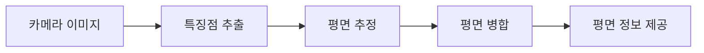

# Android ARCore 기본 가이드

> 📖 **시리즈 구성**
> - **72-1**: [ARCore의 역사](./72-1-arcore-history.md) - AR 기술의 발전과 ARCore 탄생 배경
> - **72-2**: ARCore 기본 가이드 (현재 문서) - 개발 환경 설정부터 첫 AR 앱까지
> - **72-3**: [ARCore 고급 가이드](./72-3-android-arcore-advanced.md) - 이미지 추적, 얼굴 추적, Depth API
> - **72-4**: [ARCore 실전 프로젝트](./72-4-android-arcore-project.md) - 가구 배치, 측정, 명함 앱

---

## 📚 목차

1. [ARCore란?](#arcore란)
2. [개발 환경 설정](#개발-환경-설정)
3. [첫 AR 앱 만들기](#첫-ar-앱-만들기)
4. [평면 감지](#평면-감지)
5. [3D 객체 배치](#3d-객체-배치)
6. [조명 추정](#조명-추정)
7. [문제 해결](#문제-해결)

---

## ARCore란?

### 🎯 AR(증강 현실)의 개념

**증강 현실(Augmented Reality, AR)**은 현실 세계에 가상의 디지털 콘텐츠를 겹쳐서 보여주는 기술입니다.

```
현실 세계 + 디지털 콘텐츠 = 증강 현실

예시:
📱 스마트폰 카메라로 방을 비추면
🛋️ 가상의 소파가 실제 바닥에 놓인 것처럼 보임
```

### 🌟 ARCore 소개

**ARCore**는 Google이 개발한 Android용 증강 현실 플랫폼입니다.

#### 주요 특징

| 특징 | 설명 |
|------|------|
| 🎯 **평면 감지** | 바닥, 벽, 테이블 등 평평한 표면을 자동으로 인식 |
| 📦 **모션 추적** | 기기의 위치와 방향을 실시간으로 추적 |
| 💡 **조명 추정** | 주변 환경의 조명을 분석하여 가상 객체에 적용 |
| 🌐 **Cloud Anchors** | 여러 사용자가 같은 AR 경험 공유 |
| 🖼️ **이미지 추적** | 특정 이미지를 인식하고 추적 |
| 😊 **얼굴 추적** | 얼굴을 인식하고 3D 마스크 적용 |

### 📱 ARCore vs ARKit

| 구분 | ARCore (Android) | ARKit (iOS) |
|------|------------------|-------------|
| **개발사** | Google | Apple |
| **지원 OS** | Android 7.0+ | iOS 11+ |
| **지원 기기** | 다양한 Android 기기 | iPhone 6s 이상 |
| **특별 하드웨어** | 불필요 (일반 카메라 사용) | 불필요 |
| **성능** | 기기에 따라 다름 | 일관된 성능 |

### 🎮 ARCore 활용 사례

#### 1. 쇼핑 & 인테리어
- **IKEA Place**: 가구를 실제 공간에 배치해보기
- **Amazon AR View**: 제품을 집에서 미리 확인

#### 2. 게임
- **Pokemon GO**: 포켓몬을 현실 세계에서 잡기
- **Minecraft Earth**: 현실 세계에 마인크래프트 건축

#### 3. 교육
- **Google Expeditions**: AR로 역사적 장소 탐험
- **해부학 앱**: 3D 인체 모델 학습

#### 4. 유틸리티
- **Google Measure**: AR로 거리와 면적 측정
- **AR 네비게이션**: 실제 거리에 화살표 표시

### 🔧 ARCore 핵심 개념

#### 1. 모션 추적 (Motion Tracking)
```
카메라가 움직일 때:
1. 주변 특징점(feature points) 감지
2. 특징점의 위치 변화 추적
3. 기기의 위치와 방향 계산
```

#### 2. 환경 이해 (Environmental Understanding)
```
평면 감지 과정:
1. 카메라로 주변 스캔
2. 수평/수직 표면 인식
3. 평면의 크기와 위치 계산
4. 가상 객체 배치 가능한 영역 제공
```

#### 3. 조명 추정 (Light Estimation)
```
현실감 향상:
1. 주변 조명의 밝기 측정
2. 색온도 분석
3. 가상 객체에 동일한 조명 적용
→ 가상 객체가 실제처럼 보임
```

---

## 개발 환경 설정

### 📋 사전 요구사항

#### 1. 개발 환경
- **Android Studio**: Arctic Fox (2020.3.1) 이상
- **JDK**: 11 이상
- **Kotlin**: 1.5 이상

#### 2. 테스트 기기
- **Android 버전**: 7.0 (API 24) 이상
- **ARCore 지원**: [지원 기기 목록](https://developers.google.com/ar/devices) 확인
- **카메라**: 필수
- **자이로스코프**: 필수 (모션 추적용)

> [!TIP]
> ARCore 지원 여부는 Google Play Services for AR 설치로 확인할 수 있습니다.

### 🔧 프로젝트 설정

#### 1. 새 프로젝트 생성

Android Studio에서:
1. **File → New → New Project**
2. **Empty Compose Activity** 선택
3. 프로젝트 이름: `MyFirstARApp`
4. Minimum SDK: **API 24 (Android 7.0)**

#### 2. 의존성 추가

**build.gradle.kts (Module: app)**:

```kotlin
dependencies {
    // ARCore - Google의 AR 플랫폼
    implementation("com.google.ar:core:1.41.0")
    
    // Sceneform - 3D 렌더링 라이브러리 (ARCore와 함께 사용)
    // 주의: Sceneform은 더 이상 공식 지원되지 않으므로 대안 고려
    implementation("com.gorisse.thomas.sceneform:sceneform:1.23.0")
    
    // Compose와 통합
    implementation("androidx.compose.ui:ui:1.5.4")
    implementation("androidx.compose.material3:material3:1.1.2")
    
    // 카메라 권한 처리
    implementation("com.google.accompanist:accompanist-permissions:0.32.0")
}
```

> [!NOTE]
> **Sceneform이란?**
> - ARCore와 함께 사용하는 3D 렌더링 라이브러리
> - 복잡한 OpenGL 코드 없이 3D 객체 표시 가능
> - Google이 공식 지원 중단했지만 커뮤니티 버전 사용 가능

#### 3. AndroidManifest.xml 설정

**AndroidManifest.xml**:

```xml
<?xml version="1.0" encoding="utf-8"?>
<manifest xmlns:android="http://schemas.android.com/apk/res/android">
    
    <!-- 카메라 권한 - AR은 카메라가 필수입니다 -->
    <uses-permission android:name="android.permission.CAMERA"/>
    
    <!-- ARCore 기능 선언 -->
    <!-- required="true": ARCore 미지원 기기에서는 앱 설치 불가 -->
    <uses-feature 
        android:name="android.hardware.camera.ar" 
        android:required="true"/>
    
    <application
        android:allowBackup="true"
        android:icon="@mipmap/ic_launcher"
        android:label="@string/app_name"
        android:theme="@style/Theme.MyFirstARApp">
        
        <!-- ARCore 메타데이터 -->
        <!-- required: ARCore가 필수임을 선언 -->
        <!-- optional: ARCore가 선택사항임 (미지원 기기에서도 설치 가능) -->
        <meta-data
            android:name="com.google.ar.core"
            android:value="required"/>
        
        <activity
            android:name=".MainActivity"
            android:exported="true"
            android:theme="@style/Theme.MyFirstARApp">
            <intent-filter>
                <action android:name="android.intent.action.MAIN"/>
                <category android:name="android.intent.category.LAUNCHER"/>
            </intent-filter>
        </activity>
    </application>
</manifest>
```

> [!IMPORTANT]
> **ARCore 메타데이터 옵션**
> - `required`: ARCore 필수 → 미지원 기기에서 Play Store에 앱이 보이지 않음
> - `optional`: ARCore 선택 → 모든 기기에서 설치 가능, 코드에서 지원 여부 확인 필요

### 🔐 권한 요청 구현

#### Compose에서 권한 요청

**MainActivity.kt**:

```kotlin
import android.Manifest
import android.os.Bundle
import androidx.activity.ComponentActivity
import androidx.activity.compose.setContent
import androidx.compose.foundation.layout.*
import androidx.compose.material3.*
import androidx.compose.runtime.*
import androidx.compose.ui.Alignment
import androidx.compose.ui.Modifier
import androidx.compose.ui.unit.dp
import com.google.accompanist.permissions.*

class MainActivity : ComponentActivity() {
    override fun onCreate(savedInstanceState: Bundle?) {
        super.onCreate(savedInstanceState)
        setContent {
            MyFirstARAppTheme {
                // 카메라 권한 요청 화면
                CameraPermissionScreen()
            }
        }
    }
}

/**
 * 카메라 권한을 요청하는 Composable
 * 
 * AR 앱은 카메라가 필수이므로 권한이 없으면
 * 앱을 사용할 수 없습니다.
 */
@OptIn(ExperimentalPermissionsApi::class)
@Composable
fun CameraPermissionScreen() {
    // 카메라 권한 상태 관리
    val cameraPermissionState = rememberPermissionState(
        permission = Manifest.permission.CAMERA
    )
    
    when {
        // 권한이 이미 허용된 경우
        cameraPermissionState.status.isGranted -> {
            // AR 화면으로 이동
            ARScreen()
        }
        
        // 권한이 거부된 경우
        else -> {
            // 권한 요청 UI 표시
            Column(
                modifier = Modifier
                    .fillMaxSize()
                    .padding(16.dp),
                horizontalAlignment = Alignment.CenterHorizontally,
                verticalArrangement = Arrangement.Center
            ) {
                Text(
                    text = "AR 기능을 사용하려면\n카메라 권한이 필요합니다",
                    style = MaterialTheme.typography.titleLarge
                )
                
                Spacer(modifier = Modifier.height(16.dp))
                
                Button(
                    onClick = {
                        // 권한 요청 다이얼로그 표시
                        cameraPermissionState.launchPermissionRequest()
                    }
                ) {
                    Text("카메라 권한 허용")
                }
            }
        }
    }
}

/**
 * AR 화면 (임시)
 */
@Composable
fun ARScreen() {
    Box(
        modifier = Modifier.fillMaxSize(),
        contentAlignment = Alignment.Center
    ) {
        Text("AR 화면 (구현 예정)")
    }
}
```

### ✅ ARCore 지원 확인

ARCore가 설치되어 있고 최신 버전인지 확인하는 코드:

```kotlin
import com.google.ar.core.ArCoreApk
import android.app.Activity
import android.util.Log

/**
 * ARCore 지원 및 설치 상태를 확인하는 헬퍼 클래스
 */
class ARCoreHelper(private val activity: Activity) {
    
    companion object {
        private const val TAG = "ARCoreHelper"
    }
    
    /**
     * ARCore 지원 여부 확인
     * 
     * @return true: ARCore 사용 가능, false: 사용 불가
     */
    fun checkARCoreSupport(): Boolean {
        // ARCore 가용성 확인
        val availability = ArCoreApk.getInstance()
            .checkAvailability(activity)
        
        return when (availability) {
            // ARCore가 설치되어 있고 최신 버전
            ArCoreApk.Availability.SUPPORTED_INSTALLED -> {
                Log.d(TAG, "ARCore가 설치되어 있습니다")
                true
            }
            
            // ARCore가 설치되어 있지만 업데이트 필요
            ArCoreApk.Availability.SUPPORTED_APK_TOO_OLD -> {
                Log.d(TAG, "ARCore 업데이트가 필요합니다")
                requestARCoreInstall()
                false
            }
            
            // ARCore가 설치되어 있지 않음
            ArCoreApk.Availability.SUPPORTED_NOT_INSTALLED -> {
                Log.d(TAG, "ARCore가 설치되어 있지 않습니다")
                requestARCoreInstall()
                false
            }
            
            // 기기가 ARCore를 지원하지 않음
            ArCoreApk.Availability.UNSUPPORTED_DEVICE_NOT_CAPABLE -> {
                Log.e(TAG, "이 기기는 ARCore를 지원하지 않습니다")
                false
            }
            
            // 알 수 없는 상태
            else -> {
                Log.w(TAG, "ARCore 상태를 확인할 수 없습니다")
                false
            }
        }
    }
    
    /**
     * ARCore 설치 또는 업데이트 요청
     * 
     * Google Play Store로 이동하여 ARCore(Google Play Services for AR) 설치
     */
    private fun requestARCoreInstall() {
        try {
            // ARCore 설치 요청
            // userRequestedInstall = true: 사용자가 명시적으로 요청한 경우
            val installStatus = ArCoreApk.getInstance()
                .requestInstall(activity, true)
            
            when (installStatus) {
                // 설치가 완료되었거나 이미 설치됨
                ArCoreApk.InstallStatus.INSTALLED -> {
                    Log.d(TAG, "ARCore 설치 완료")
                }
                
                // 설치 중 (Play Store로 이동)
                ArCoreApk.InstallStatus.INSTALL_REQUESTED -> {
                    Log.d(TAG, "ARCore 설치 요청됨")
                }
            }
        } catch (e: Exception) {
            Log.e(TAG, "ARCore 설치 실패", e)
        }
    }
}
```

**사용 예시**:

```kotlin
class MainActivity : ComponentActivity() {
    private lateinit var arCoreHelper: ARCoreHelper
    
    override fun onCreate(savedInstanceState: Bundle?) {
        super.onCreate(savedInstanceState)
        
        // ARCore 헬퍼 초기화
        arCoreHelper = ARCoreHelper(this)
        
        // ARCore 지원 확인
        if (arCoreHelper.checkARCoreSupport()) {
            // ARCore 사용 가능
            setContent {
                ARScreen()
            }
        } else {
            // ARCore 사용 불가
            setContent {
                Text("ARCore를 사용할 수 없습니다")
            }
        }
    }
}
```

---

## 첫 AR 앱 만들기

이제 실제로 AR 화면을 표시하고 간단한 3D 객체를 띄워보겠습니다.

### 🎬 ARCore 세션 생성

**ARCore Session**은 AR 경험의 핵심입니다. 모든 AR 기능은 Session을 통해 사용됩니다.

```kotlin
import com.google.ar.core.Session
import com.google.ar.core.Config
import android.content.Context

/**
 * ARCore 세션을 관리하는 클래스
 * 
 * Session은 AR 경험의 중심이며 다음을 담당합니다:
 * - 카메라 이미지 처리
 * - 모션 추적
 * - 평면 감지
 * - 조명 추정
 */
class ARSessionManager(private val context: Context) {
    
    private var session: Session? = null
    
    /**
     * ARCore 세션 생성 및 설정
     * 
     * @return Session 객체 또는 실패 시 null
     */
    fun createSession(): Session? {
        return try {
            // Session 생성
            Session(context).also { newSession ->
                
                // Session 설정
                val config = Config(newSession).apply {
                    
                    // 평면 감지 모드 설정
                    // HORIZONTAL: 바닥, 테이블 등 수평면만
                    // VERTICAL: 벽 등 수직면만
                    // HORIZONTAL_AND_VERTICAL: 모든 평면
                    planeFindingMode = Config.PlaneFindingMode.HORIZONTAL_AND_VERTICAL
                    
                    // 조명 추정 모드
                    // DISABLED: 조명 추정 안 함
                    // AMBIENT_INTENSITY: 주변 밝기만 추정
                    // ENVIRONMENTAL_HDR: 고급 조명 추정 (그림자, 반사 등)
                    lightEstimationMode = Config.LightEstimationMode.AMBIENT_INTENSITY
                    
                    // Depth 모드 (깊이 정보)
                    // DISABLED: Depth 사용 안 함
                    // AUTOMATIC: 기기가 지원하면 자동으로 사용
                    depthMode = Config.DepthMode.AUTOMATIC
                    
                    // Cloud Anchors 모드
                    cloudAnchorMode = Config.CloudAnchorMode.DISABLED
                }
                
                // 설정 적용
                newSession.configure(config)
                
                // Session 저장
                session = newSession
                
                Log.d("ARSessionManager", "ARCore 세션 생성 완료")
            }
        } catch (e: Exception) {
            Log.e("ARSessionManager", "ARCore 세션 생성 실패", e)
            null
        }
    }
    
    /**
     * 세션 시작
     * 
     * AR 추적을 시작합니다.
     */
    fun resume() {
        session?.resume()
    }
    
    /**
     * 세션 일시정지
     * 
     * 앱이 백그라운드로 가면 호출해야 합니다.
     */
    fun pause() {
        session?.pause()
    }
    
    /**
     * 세션 종료 및 리소스 해제
     */
    fun destroy() {
        session?.close()
        session = null
    }
    
    /**
     * 현재 세션 반환
     */
    fun getSession(): Session? = session
}
```

### 📸 AR 카메라 뷰 구현

ARCore는 카메라 이미지를 처리하여 AR 경험을 제공합니다. Jetpack Compose에서 카메라 뷰를 표시하는 방법:

```kotlin
import androidx.compose.runtime.*
import androidx.compose.ui.Modifier
import androidx.compose.ui.viewinterop.AndroidView
import android.view.SurfaceView
import com.google.ar.core.Frame

/**
 * AR 카메라 뷰를 표시하는 Composable
 * 
 * ARCore는 OpenGL을 사용하므로 SurfaceView가 필요합니다.
 */
@Composable
fun ARCameraView(
    modifier: Modifier = Modifier,
    sessionManager: ARSessionManager,
    onFrameUpdate: (Frame) -> Unit = {}
) {
    // SurfaceView 생성
    AndroidView(
        modifier = modifier,
        factory = { context ->
            SurfaceView(context).apply {
                // SurfaceView 설정
                holder.addCallback(object : SurfaceHolder.Callback {
                    override fun surfaceCreated(holder: SurfaceHolder) {
                        // Surface가 생성되면 ARCore 세션 시작
                        sessionManager.resume()
                    }
                    
                    override fun surfaceChanged(
                        holder: SurfaceHolder,
                        format: Int,
                        width: Int,
                        height: Int
                    ) {
                        // Surface 크기 변경 시 처리
                    }
                    
                    override fun surfaceDestroyed(holder: SurfaceHolder) {
                        // Surface가 파괴되면 ARCore 세션 일시정지
                        sessionManager.pause()
                    }
                })
            }
        },
        update = { surfaceView ->
            // 프레임 업데이트 처리
            sessionManager.getSession()?.let { session ->
                try {
                    // 최신 프레임 가져오기
                    val frame = session.update()
                    onFrameUpdate(frame)
                } catch (e: Exception) {
                    Log.e("ARCameraView", "프레임 업데이트 실패", e)
                }
            }
        }
    )
}
```

### 🎯 간단한 AR 앱 완성

모든 것을 합쳐서 동작하는 AR 앱을 만들어봅시다:

```kotlin
import androidx.compose.foundation.layout.*
import androidx.compose.material3.*
import androidx.compose.runtime.*
import androidx.compose.ui.Modifier
import androidx.compose.ui.platform.LocalContext

@Composable
fun SimpleARApp() {
    val context = LocalContext.current
    
    // ARCore 세션 관리자
    val sessionManager = remember {
        ARSessionManager(context).apply {
            createSession()
        }
    }
    
    // 생명주기 관리
    DisposableEffect(Unit) {
        onDispose {
            // 화면이 사라질 때 세션 종료
            sessionManager.destroy()
        }
    }
    
    // AR 화면
    Box(modifier = Modifier.fillMaxSize()) {
        // AR 카메라 뷰
        ARCameraView(
            modifier = Modifier.fillMaxSize(),
            sessionManager = sessionManager,
            onFrameUpdate = { frame ->
                // 프레임마다 호출됨
                // 여기서 평면 감지, 객체 배치 등 처리
            }
        )
        
        // UI 오버레이
        Column(
            modifier = Modifier
                .fillMaxSize()
                .padding(16.dp),
            verticalArrangement = Arrangement.Bottom
        ) {
            Text(
                text = "카메라를 천천히 움직여\n주변을 스캔하세요",
                style = MaterialTheme.typography.bodyLarge,
                color = MaterialTheme.colorScheme.onPrimary
            )
        }
    }
}
```

---

## 평면 감지

ARCore의 가장 중요한 기능 중 하나는 **평면 감지**입니다. 바닥, 테이블, 벽 등을 자동으로 인식합니다.

### 🔍 평면 감지 원리



1. **특징점 추출**: 이미지에서 특징적인 점들을 찾음
2. **평면 추정**: 특징점들이 같은 평면에 있는지 계산
3. **평면 병합**: 인접한 평면들을 하나로 합침
4. **평면 정보 제공**: 앱에서 사용할 수 있도록 제공

### 📊 평면 유형

ARCore는 세 가지 유형의 평면을 감지합니다:

```kotlin
import com.google.ar.core.Plane

/**
 * 평면 유형 확인
 */
fun getPlaneTypeName(plane: Plane): String {
    return when (plane.type) {
        // 수평 평면 (위를 향함) - 바닥, 테이블
        Plane.Type.HORIZONTAL_UPWARD_FACING -> "수평 (위)"
        
        // 수평 평면 (아래를 향함) - 천장
        Plane.Type.HORIZONTAL_DOWNWARD_FACING -> "수평 (아래)"
        
        // 수직 평면 - 벽
        Plane.Type.VERTICAL -> "수직"
        
        else -> "알 수 없음"
    }
}
```

### 🎨 평면 감지 구현

```kotlin
import com.google.ar.core.Frame
import com.google.ar.core.Plane
import com.google.ar.core.TrackingState

/**
 * 프레임에서 감지된 평면 정보를 가져오는 함수
 * 
 * @param frame ARCore 프레임
 * @return 감지된 평면 리스트
 */
fun detectPlanes(frame: Frame): List<PlaneInfo> {
    // 업데이트된 평면들 가져오기
    // Plane::class.java: Plane 타입의 Trackable만 가져옴
    val updatedPlanes = frame.getUpdatedTrackables(Plane::class.java)
    
    return updatedPlanes
        // 추적 중인 평면만 필터링
        .filter { it.trackingState == TrackingState.TRACKING }
        // 평면 정보로 변환
        .map { plane ->
            PlaneInfo(
                // 평면 유형
                type = getPlaneTypeName(plane),
                
                // 평면 중심 위치 (3D 좌표)
                centerPose = plane.centerPose,
                
                // 평면 크기 (X축 방향, 미터 단위)
                extentX = plane.extentX,
                
                // 평면 크기 (Z축 방향, 미터 단위)
                extentZ = plane.extentZ,
                
                // 평면 다각형 (경계선)
                polygon = plane.polygon,
                
                // 하위 평면 (이 평면에 병합된 작은 평면들)
                subsumedBy = plane.subsumedBy
            )
        }
}

/**
 * 평면 정보를 담는 데이터 클래스
 */
data class PlaneInfo(
    val type: String,
    val centerPose: Pose,
    val extentX: Float,
    val extentZ: Float,
    val polygon: FloatBuffer,
    val subsumedBy: Plane?
)
```

### 🎯 평면 시각화

감지된 평면을 사용자에게 보여주는 것이 중요합니다:

```kotlin
import androidx.compose.foundation.Canvas
import androidx.compose.foundation.layout.fillMaxSize
import androidx.compose.ui.graphics.Color
import androidx.compose.ui.graphics.Path
import androidx.compose.ui.graphics.drawscope.Stroke

/**
 * 감지된 평면을 화면에 그리는 Composable
 * 
 * 실제로는 OpenGL을 사용하여 3D로 그려야 하지만,
 * 여기서는 개념을 이해하기 위한 2D 예시입니다.
 */
@Composable
fun PlaneVisualization(planes: List<PlaneInfo>) {
    Canvas(modifier = Modifier.fillMaxSize()) {
        planes.forEach { planeInfo ->
            // 평면 경계선 그리기
            val path = Path()
            
            // 평면의 다각형 좌표를 Path로 변환
            // (실제로는 3D → 2D 투영 필요)
            
            // 평면 타입에 따라 다른 색상 사용
            val color = when (planeInfo.type) {
                "수평 (위)" -> Color.Green.copy(alpha = 0.5f)
                "수직" -> Color.Blue.copy(alpha = 0.5f)
                else -> Color.Gray.copy(alpha = 0.5f)
            }
            
            drawPath(
                path = path,
                color = color,
                style = Stroke(width = 2f)
            )
        }
    }
}
```

### 💡 평면 감지 팁

```kotlin
/**
 * 평면 감지를 위한 베스트 프랙티스
 */
object PlaneDetectionTips {
    
    /**
     * 1. 충분한 조명 확보
     * - 어두운 환경에서는 평면 감지가 어려움
     * - 밝은 곳에서 테스트
     */
    
    /**
     * 2. 천천히 움직이기
     * - 카메라를 너무 빠르게 움직이면 추적 실패
     * - 천천히, 부드럽게 이동
     */
    
    /**
     * 3. 텍스처가 있는 표면
     * - 단색 표면은 감지가 어려움
     * - 패턴이나 텍스처가 있는 표면이 좋음
     */
    
    /**
     * 4. 평면 크기 확인
     * - 너무 작은 평면은 객체 배치에 부적합
     */
    fun isPlaneL argeEnough(plane: PlaneInfo): Boolean {
        // 최소 30cm x 30cm 이상
        return plane.extentX >= 0.3f && plane.extentZ >= 0.3f
    }
}
```

---

## 3D 객체 배치

평면을 감지했다면, 이제 그 위에 3D 객체를 배치할 수 있습니다.

### 🎯 Anchor 개념

**Anchor(앵커)**는 AR 공간의 특정 위치를 나타냅니다.

```
Anchor = 3D 공간의 고정점

예시:
📍 바닥의 특정 위치에 Anchor 생성
🛋️ Anchor 위치에 소파 3D 모델 배치
📱 기기를 움직여도 소파는 그 자리에 고정됨
```

### 🔨 Hit Test

사용자가 화면을 터치한 위치에 객체를 배치하려면 **Hit Test**가 필요합니다:

```kotlin
import com.google.ar.core.Frame
import com.google.ar.core.HitResult
import com.google.ar.core.Pose

/**
 * 화면 터치 위치에서 Hit Test 수행
 * 
 * @param frame ARCore 프레임
 * @param x 화면 X 좌표 (픽셀)
 * @param y 화면 Y 좌표 (픽셀)
 * @return Hit된 결과 리스트
 */
fun performHitTest(
    frame: Frame,
    x: Float,
    y: Float
): List<HitResult> {
    // Hit Test 수행
    // 화면의 (x, y) 위치에서 AR 공간으로 Ray를 쏨
    return frame.hitTest(x, y)
        // 평면과 교차하는 결과만 필터링
        .filter { hitResult ->
            val trackable = hitResult.trackable
            
            // Plane과 교차했는지 확인
            trackable is Plane && 
            trackable.isPoseInPolygon(hitResult.hitPose)
        }
}
```

### 📦 객체 배치 구현

```kotlin
import com.google.ar.core.Anchor
import com.google.ar.core.HitResult

/**
 * AR 객체를 관리하는 클래스
 */
class ARObjectManager {
    
    // 배치된 객체들의 Anchor 리스트
    private val anchors = mutableListOf<Anchor>()
    
    /**
     * Hit Test 결과 위치에 객체 배치
     * 
     * @param hitResult Hit Test 결과
     * @return 생성된 Anchor
     */
    fun placeObject(hitResult: HitResult): Anchor? {
        return try {
            // Anchor 생성
            // Anchor는 AR 공간의 특정 위치를 추적함
            val anchor = hitResult.createAnchor()
            
            // Anchor 리스트에 추가
            anchors.add(anchor)
            
            Log.d("ARObjectManager", "객체 배치 완료: ${anchor.pose}")
            anchor
            
        } catch (e: Exception) {
            Log.e("ARObjectManager", "객체 배치 실패", e)
            null
        }
    }
    
    /**
     * 특정 Anchor의 객체 제거
     * 
     * @param anchor 제거할 Anchor
     */
    fun removeObject(anchor: Anchor) {
        // Anchor 분리 (더 이상 추적하지 않음)
        anchor.detach()
        
        // 리스트에서 제거
        anchors.remove(anchor)
        
        Log.d("ARObjectManager", "객체 제거 완료")
    }
    
    /**
     * 모든 객체 제거
     */
    fun removeAllObjects() {
        anchors.forEach { it.detach() }
        anchors.clear()
        
        Log.d("ARObjectManager", "모든 객체 제거 완료")
    }
    
    /**
     * 배치된 모든 Anchor 가져오기
     */
    fun getAllAnchors(): List<Anchor> = anchors.toList()
}
```

### 🎮 터치 이벤트 처리

Compose에서 터치 이벤트를 처리하여 객체 배치:

```kotlin
import androidx.compose.foundation.gestures.detectTapGestures
import androidx.compose.ui.input.pointer.pointerInput

@Composable
fun ARScreenWithPlacement(
    sessionManager: ARSessionManager,
    objectManager: ARObjectManager
) {
    var currentFrame by remember { mutableStateOf<Frame?>(null) }
    
    Box(
        modifier = Modifier
            .fillMaxSize()
            // 터치 이벤트 감지
            .pointerInput(Unit) {
                detectTapGestures { offset ->
                    // 터치한 위치
                    val x = offset.x
                    val y = offset.y
                    
                    // Hit Test 수행
                    currentFrame?.let { frame ->
                        val hitResults = performHitTest(frame, x, y)
                        
                        // 첫 번째 Hit 결과에 객체 배치
                        hitResults.firstOrNull()?.let { hitResult ->
                            objectManager.placeObject(hitResult)
                        }
                    }
                }
            }
    ) {
        // AR 카메라 뷰
        ARCameraView(
            modifier = Modifier.fillMaxSize(),
            sessionManager = sessionManager,
            onFrameUpdate = { frame ->
                currentFrame = frame
            }
        )
        
        // 안내 텍스트
        Text(
            text = "평면을 터치하여 객체를 배치하세요",
            modifier = Modifier
                .align(Alignment.BottomCenter)
                .padding(16.dp),
            style = MaterialTheme.typography.bodyLarge,
            color = Color.White
        )
    }
}
```

---

## 조명 추정

가상 객체가 현실처럼 보이려면 주변 조명에 맞춰야 합니다.

### 💡 조명 추정 원리

ARCore는 카메라 이미지를 분석하여 주변 조명을 추정합니다:

```
1. 카메라 이미지 분석
2. 밝기 측정
3. 색온도 분석
4. 조명 정보 제공
```

### 🌟 조명 정보 가져오기

```kotlin
import com.google.ar.core.Frame
import com.google.ar.core.LightEstimate

/**
 * 프레임에서 조명 정보 추출
 * 
 * @param frame ARCore 프레임
 * @return 조명 정보 또는 null
 */
fun estimateLighting(frame: Frame): LightingInfo? {
    // 조명 추정 정보 가져오기
    val lightEstimate = frame.lightEstimate
    
    // 조명 추정이 유효한지 확인
    return if (lightEstimate.state == LightEstimate.State.VALID) {
        LightingInfo(
            // 픽셀 밝기 (0.0 ~ 1.0)
            // 0.0: 완전히 어두움
            // 1.0: 매우 밝음
            pixelIntensity = lightEstimate.pixelIntensity,
            
            // 색온도 보정 (RGB)
            // 주변 조명의 색상을 반영
            colorCorrection = FloatArray(4).also {
                lightEstimate.getColorCorrection(it, 0)
            }
        )
    } else {
        null
    }
}

/**
 * 조명 정보 데이터 클래스
 */
data class LightingInfo(
    val pixelIntensity: Float,
    val colorCorrection: FloatArray
) {
    /**
     * 밝기 레벨을 문자열로 반환
     */
    fun getBrightnessLevel(): String {
        return when {
            pixelIntensity < 0.3f -> "어두움"
            pixelIntensity < 0.7f -> "보통"
            else -> "밝음"
        }
    }
}
```

### 🎨 조명 적용

조명 정보를 3D 객체에 적용하는 방법 (개념):

```kotlin
/**
 * 3D 객체에 조명 적용 (의사 코드)
 * 
 * 실제로는 OpenGL 셰이더에서 처리
 */
fun apply LightingTo3DObject(
    object3D: Any, // 3D 객체
    lightingInfo: LightingInfo
) {
    // 1. 밝기 적용
    // object3D.brightness = lightingInfo.pixelIntensity
    
    // 2. 색온도 적용
    // object3D.colorFilter = lightingInfo.colorCorrection
    
    // 결과: 가상 객체가 주변 환경과 자연스럽게 어울림
}
```

---

## 문제 해결

### ❌ 자주 발생하는 문제

#### 1. ARCore가 설치되지 않음

**증상**:
```
java.lang.UnsupportedOperationException: ARCore not installed
```

**해결**:
```kotlin
// ARCore 설치 확인 및 요청
val arCoreHelper = ARCoreHelper(activity)
if (!arCoreHelper.checkARCoreSupport()) {
    // 사용자에게 안내 메시지 표시
    Toast.makeText(
        context,
        "ARCore 설치가 필요합니다",
        Toast.LENGTH_LONG
    ).show()
}
```

#### 2. 카메라 권한 거부

**증상**:
```
java.lang.SecurityException: Camera permission not granted
```

**해결**:
```kotlin
// 권한 재요청
@OptIn(ExperimentalPermissionsApi::class)
@Composable
fun RequestCameraPermission() {
    val permissionState = rememberPermissionState(
        Manifest.permission.CAMERA
    )
    
    LaunchedEffect(Unit) {
        if (!permissionState.status.isGranted) {
            permissionState.launchPermissionRequest()
        }
    }
}
```

#### 3. 평면이 감지되지 않음

**원인**:
- 조명이 너무 어두움
- 카메라를 너무 빠르게 움직임
- 단색 표면 (텍스처 없음)

**해결**:
```kotlin
/**
 * 평면 감지 가이드 표시
 */
@Composable
fun PlaneDetectionGuide(planesDetected: Boolean) {
    if (!planesDetected) {
        Column(
            modifier = Modifier
                .fillMaxWidth()
                .padding(16.dp),
            horizontalAlignment = Alignment.CenterHorizontally
        ) {
            Text(
                text = "평면을 찾는 중...",
                style = MaterialTheme.typography.titleMedium
            )
            
            Spacer(modifier = Modifier.height(8.dp))
            
            Text(
                text = """
                    • 카메라를 천천히 움직이세요
                    • 바닥이나 테이블을 비추세요
                    • 밝은 곳에서 시도하세요
                """.trimIndent(),
                style = MaterialTheme.typography.bodySmall
            )
        }
    }
}
```

#### 4. 추적 손실 (Tracking Lost)

**증상**:
```kotlin
if (frame.camera.trackingState == TrackingState.PAUSED) {
    // 추적이 일시정지됨
}
```

**원인**:
- 카메라를 가림
- 너무 빠른 움직임
- 특징점이 없는 환경

**해결**:
```kotlin
/**
 * 추적 상태 모니터링
 */
fun monitorTrackingState(frame: Frame) {
    when (frame.camera.trackingState) {
        TrackingState.TRACKING -> {
            // 정상 추적 중
            Log.d("AR", "추적 중")
        }
        
        TrackingState.PAUSED -> {
            // 추적 일시정지
            Log.w("AR", "추적 손실: 카메라를 천천히 움직이세요")
            // 사용자에게 안내 메시지 표시
        }
        
        TrackingState.STOPPED -> {
            // 추적 중지
            Log.e("AR", "추적 중지: ARCore 세션을 재시작하세요")
        }
    }
}
```

### 🔧 성능 최적화

#### 1. 프레임 레이트 제한

```kotlin
/**
 * 매 프레임마다 처리하지 않고 일정 간격으로 처리
 */
class FrameThrottler(private val intervalMs: Long = 100) {
    private var lastUpdateTime = 0L
    
    fun shouldUpdate(): Boolean {
        val currentTime = System.currentTimeMillis()
        return if (currentTime - lastUpdateTime >= intervalMs) {
            lastUpdateTime = currentTime
            true
        } else {
            false
        }
    }
}

// 사용
val throttler = remember { FrameThrottler(100) } // 100ms마다

ARCameraView(
    onFrameUpdate = { frame ->
        if (throttler.shouldUpdate()) {
            // 평면 감지 등 무거운 작업
            detectPlanes(frame)
        }
    }
)
```

#### 2. 객체 수 제한

```kotlin
/**
 * 배치 가능한 최대 객체 수 제한
 */
class ARObjectManager(private val maxObjects: Int = 10) {
    private val anchors = mutableListOf<Anchor>()
    
    fun placeObject(hitResult: HitResult): Anchor? {
        // 최대 개수 확인
        if (anchors.size >= maxObjects) {
            // 가장 오래된 객체 제거
            anchors.firstOrNull()?.let { removeObject(it) }
        }
        
        return hitResult.createAnchor()?.also {
            anchors.add(it)
        }
    }
}
```

---

## 🎯 다음 단계

기본편을 완료했습니다! 이제 다음 문서로 넘어가세요:

1. **[ARCore 고급 가이드](./72-3-android-arcore-advanced.md)** - 이미지 추적, 얼굴 추적, Depth API
2. **[ARCore 실전 프로젝트](./72-4-android-arcore-project.md)** - 가구 배치 앱, 측정 앱 만들기

---

## 📚 참고 자료

- [ARCore 공식 문서](https://developers.google.com/ar)
- [ARCore 지원 기기](https://developers.google.com/ar/devices)
- [ARCore GitHub 샘플](https://github.com/google-ar/arcore-android-sdk)
- [Sceneform 문서](https://github.com/SceneView/sceneform-android)

---

**마지막 업데이트**: 2024-12-02  
**작성자**: Antigravity AI Assistant

Happy AR Coding! 🚀
