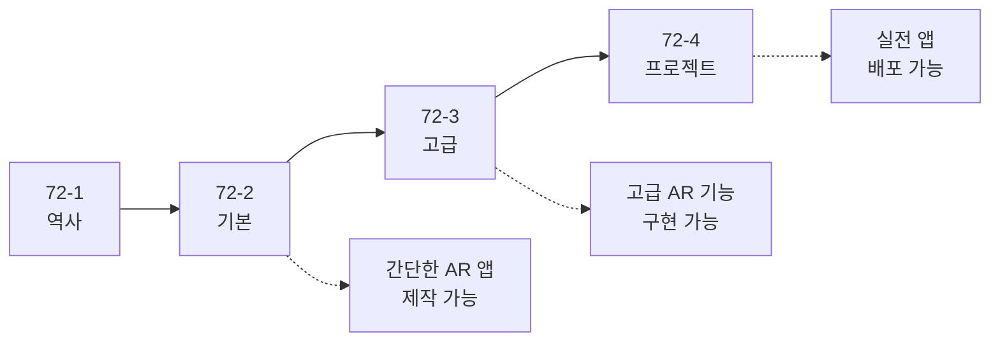

# Android ARCore 가이드

> [!NOTE]
> **이 문서는 새로운 종합 가이드 시리즈로 대체되었습니다!**
> 
> ARCore를 더 체계적으로 학습할 수 있도록 4개의 상세한 문서로 분할되었습니다:
> 
> 1. **[72-1. ARCore의 역사](./72-1-arcore-history.md)** - AR 기술의 발전과 ARCore 탄생 배경
> 2. **[72-2. ARCore 기본 가이드](./72-2-android-arcore-basics.md)** - 개발 환경 설정부터 첫 AR 앱까지 (약 1,000줄)
> 3. **[72-3. ARCore 고급 가이드](./72-3-android-arcore-advanced.md)** - 이미지 추적, 얼굴 추적, Depth API (약 1,000줄)
> 4. **[72-4. ARCore 실전 프로젝트](./72-4-android-arcore-project.md)** - 가구 배치, 측정, 명함 앱 (약 800줄)
> 
> **총 분량**: 약 2,800줄의 상세한 설명과 주석이 포함된 코드 예제

---

## 📚 새로운 시리즈 구성

### 72-1. ARCore의 역사
- AR 기술의 발전
- ARCore의 탄생 배경
- ARCore vs ARKit
- 미래 전망

### 72-2. ARCore 기본 가이드 (⭐ 초보자 시작점)
- **ARCore 소개 및 개념**
- **개발 환경 설정** (단계별 가이드)
- **첫 AR 앱 만들기** (완전한 예제)
- **평면 감지** (상세 설명)
- **3D 객체 배치** (Hit Test, Anchor)
- **조명 추정**
- **문제 해결** (자주 발생하는 오류)

### 72-3. ARCore 고급 가이드
- **이미지 추적** (Augmented Images)
  - 이미지 데이터베이스 생성
  - 이미지 인식 및 추적
  - AR 콘텐츠 오버레이
- **얼굴 추적** (Augmented Faces)
  - 얼굴 메쉬 데이터
  - 3D 마스크 적용
  - 얼굴 필터 구현
- **Depth API**
  - 깊이 정보 활용
  - 오클루전 구현
  - 정확한 거리 측정
- **Cloud Anchors**
  - 멀티플레이어 AR
  - Anchor 호스팅/해결
- **성능 최적화**
- **고급 문제 해결**

### 72-4. ARCore 실전 프로젝트
- **프로젝트 1: AR 가구 배치 앱**
  - IKEA Place 스타일
  - 가구 선택 UI
  - 회전/크기 조절
  - 스크린샷 저장
- **프로젝트 2: AR 측정 앱**
  - Google Measure 스타일
  - 거리 측정
  - 면적 측정
- **프로젝트 3: AR 명함 앱**
  - 명함 이미지 인식
  - 3D 연락처 정보 표시
  - 연락처 저장

---

## 🎯 학습 로드맵



### 추천 학습 순서

#### 1단계: 기초 (1-2일)
- **72-1**: ARCore의 역사 읽기 (30분)
- **72-2**: 기본 가이드 따라하기 (1-2일)
  - 개발 환경 설정
  - 첫 AR 앱 만들기
  - 평면 감지 및 객체 배치

#### 2단계: 고급 (2-3일)
- **72-3**: 고급 가이드 학습 (2-3일)
  - 이미지 추적 구현
  - 얼굴 추적 (선택)
  - Depth API (선택)
  - Cloud Anchors (선택)

#### 3단계: 실전 (3-5일)
- **72-4**: 실전 프로젝트 (3-5일)
  - 프로젝트 1개 이상 완성
  - 자신만의 AR 앱 기획 및 개발

---

## 💡 새로운 시리즈의 특징

### ✅ 초보자 친화적
- 모든 개념을 처음부터 설명
- 전문 용어는 한글 설명 병기
- 단계별 가이드 제공

### ✅ 상세한 주석
```kotlin
/**
 * ARCore 세션을 초기화합니다.
 * 
 * @return Session 객체 또는 실패 시 null
 * @throws UnavailableException ARCore를 사용할 수 없는 경우
 */
fun createSession(): Session? {
    // ARCore 지원 여부 확인
    // ...
}
```

### ✅ 실행 가능한 코드
- 모든 예제는 복사-붙여넣기로 실행 가능
- 필요한 import 문 포함
- 에러 처리 포함

### ✅ 실전 프로젝트
- 완성된 앱 예제 3개
- 실제 배포 가능한 수준
- UI/UX 포함

---

## 🚀 빠른 시작

ARCore를 처음 시작한다면:

1. **[72-2. ARCore 기본 가이드](./72-2-android-arcore-basics.md)** 로 시작하세요
2. 개발 환경을 설정하고
3. 첫 AR 앱을 만들어보세요
4. 평면 감지와 객체 배치를 익히세요

이미 ARCore 기본을 알고 있다면:

1. **[72-3. ARCore 고급 가이드](./72-3-android-arcore-advanced.md)** 로 바로 이동
2. 이미지 추적, 얼굴 추적 등 고급 기능 학습
3. **[72-4. ARCore 실전 프로젝트](./72-4-android-arcore-project.md)** 로 실전 앱 개발

---

## 📊 문서 비교

| 구분 | 기존 문서 | 새로운 시리즈 |
|------|----------|------------|
| 분량 | 250줄 | 약 2,800줄 |
| 파일 수 | 1개 | 4개 |
| 설명 수준 | 간략 | 매우 상세 |
| 코드 주석 | 기본 | 풍부 |
| 실전 예제 | 없음 | 3개 프로젝트 |
| 초보자 친화성 | 보통 | 매우 높음 |

---

## 🎯 지금 바로 시작하세요!

**[👉 72-2. ARCore 기본 가이드로 이동](./72-2-android-arcore-basics.md)**

---

**마지막 업데이트**: 2024-12-02  
**작성자**: Antigravity AI Assistant

### 주요 기능
- 🎯 **평면 감지**: 바닥, 벽, 테이블 등 감지
- 📦 **3D 객체 배치**: 가상 객체 배치 및 상호작용
- 💡 **조명 추정**: 실제 조명에 맞춘 렌더링
- ☁️ **Cloud Anchors**: 여러 기기 간 AR 경험 공유

### 사용 사례
- 🛋️ **가구 배치**: IKEA Place
- 🎮 **AR 게임**: Pokemon GO
- 📏 **측정**: Google Measure
- 🎨 **AR 아트**: 가상 그래피티

---

## 기본 설정

### 의존성 추가

**build.gradle.kts**:
```kotlin
dependencies {
    // ARCore
    implementation("com.google.ar:core:1.41.0")
    
    // Sceneform (3D 렌더링)
    implementation("com.google.ar.sceneform.ux:sceneform-ux:1.17.1")
}
```

### AndroidManifest.xml

```xml
<manifest>
    <!-- ARCore 필수 -->
    <uses-permission android:name="android.permission.CAMERA"/>
    
    <!-- ARCore 기능 선언 -->
    <uses-feature android:name="android.hardware.camera.ar" android:required="true"/>
    
    <application>
        <!-- ARCore 메타데이터 -->
        <meta-data
            android:name="com.google.ar.core"
            android:value="required"/>
    </application>
</manifest>
```

### ARCore 세션 초기화

```kotlin
import com.google.ar.core.ArCoreApk
import com.google.ar.core.Session
import com.google.ar.core.Config

/**
 * ARCore 헬퍼
 */
class ARCoreHelper(private val activity: Activity) {
    
    private var session: Session? = null
    
    /**
     * ARCore 지원 확인
     */
    fun checkARCoreSupport(): Boolean {
        val availability = ArCoreApk.getInstance().checkAvailability(activity)
        
        return when (availability) {
            ArCoreApk.Availability.SUPPORTED_INSTALLED -> true
            ArCoreApk.Availability.SUPPORTED_APK_TOO_OLD,
            ArCoreApk.Availability.SUPPORTED_NOT_INSTALLED -> {
                // ARCore 설치 요청
                requestARCoreInstall()
                false
            }
            else -> false
        }
    }
    
    /**
     * ARCore 설치 요청
     */
    private fun requestARCoreInstall() {
        try {
            ArCoreApk.getInstance().requestInstall(activity, true)
        } catch (e: Exception) {
            Log.e("ARCore", "ARCore 설치 실패", e)
        }
    }
    
    /**
     * 세션 생성
     */
    fun createSession(): Session? {
        return try {
            Session(activity).also { session ->
                // 설정
                val config = Config(session).apply {
                    planeFindingMode = Config.PlaneFindingMode.HORIZONTAL_AND_VERTICAL
                    lightEstimationMode = Config.LightEstimationMode.AMBIENT_INTENSITY
                }
                
                session.configure(config)
                this.session = session
            }
        } catch (e: Exception) {
            Log.e("ARCore", "세션 생성 실패", e)
            null
        }
    }
    
    /**
     * 세션 해제
     */
    fun destroySession() {
        session?.close()
        session = null
    }
}
```

---

## 평면 감지

```kotlin
import com.google.ar.core.Plane
import com.google.ar.core.TrackingState

/**
 * 평면 감지
 */
fun detectPlanes(frame: Frame): List<PlaneInfo> {
    val planes = frame.getUpdatedTrackables(Plane::class.java)
    
    return planes
        .filter { it.trackingState == TrackingState.TRACKING }
        .map { plane ->
            PlaneInfo(
                type = when (plane.type) {
                    Plane.Type.HORIZONTAL_UPWARD_FACING -> "수평 (위)"
                    Plane.Type.HORIZONTAL_DOWNWARD_FACING -> "수평 (아래)"
                    Plane.Type.VERTICAL -> "수직"
                    else -> "알 수 없음"
                },
                centerPose = plane.centerPose,
                extentX = plane.extentX,
                extentZ = plane.extentZ,
                polygon = plane.polygon
            )
        }
}

data class PlaneInfo(
    val type: String,
    val centerPose: Pose,
    val extentX: Float,
    val extentZ: Float,
    val polygon: FloatBuffer
)
```

---

## 3D 객체 배치

```kotlin
/**
 * 3D 객체 배치
 */
class ARObjectPlacer(private val session: Session) {
    
    /**
     * 평면에 객체 배치
     */
    fun placeObject(
        hitResult: HitResult,
        modelUri: Uri,
        onSuccess: (Anchor) -> Unit,
        onFailure: (Exception) -> Unit
    ) {
        try {
            // Anchor 생성
            val anchor = hitResult.createAnchor()
            
            // 3D 모델 로드 및 렌더링
            // (Sceneform 사용)
            
            onSuccess(anchor)
        } catch (e: Exception) {
            Log.e("ARObjectPlacer", "객체 배치 실패", e)
            onFailure(e)
        }
    }
}
```

---

## 조명 추정

```kotlin
/**
 * 조명 추정
 */
fun estimateLighting(frame: Frame): LightEstimate? {
    val lightEstimate = frame.lightEstimate
    
    return if (lightEstimate.state == LightEstimate.State.VALID) {
        LightEstimate(
            pixelIntensity = lightEstimate.pixelIntensity,
            colorCorrection = lightEstimate.colorCorrection
        )
    } else {
        null
    }
}

data class LightEstimate(
    val pixelIntensity: Float,
    val colorCorrection: FloatArray
)
```

---

## 참고 자료

- [ARCore 공식 문서](https://developers.google.com/ar)
- [ARCore Samples](https://github.com/google-ar/arcore-android-sdk)
