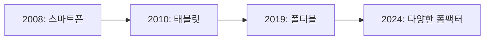

# 폴더블 시대와 Window Manager

## 📚 목차
1. [폴더블/태블릿의 등장](#폴더블태블릿의-등장)
2. [Window Manager의 필요성](#window-manager의-필요성)
3. [적응형 UI의 중요성](#적응형-ui의-중요성)
4. [미래 전망](#미래-전망)

---

## 폴더블/태블릿의 등장

### 📱 새로운 폼 팩터의 시대



#### 2019년: Samsung Galaxy Fold

**세계 최초 상용 폴더블 폰!**

```
특징:
- 📱 접으면: 4.6인치 (스마트폰)
- 📱 펼치면: 7.3인치 (태블릿)
- 🔄 앱이 화면 크기에 적응해야 함!
```

**문제점**:
- ❌ 기존 앱이 제대로 동작하지 않음
- ❌ 화면 전환 시 앱 재시작
- ❌ 레이아웃 깨짐
- ❌ 사용자 경험 저하

---

## Window Manager의 필요성

### 🚨 기존 방식의 한계

#### 화면 크기만 확인하는 방식

```kotlin
// ❌ 나쁜 예: 화면 크기만 확인
val screenWidth = resources.displayMetrics.widthPixels

if (screenWidth > 600) {
    // 태블릿 레이아웃
} else {
    // 폰 레이아웃
}
```

**문제점**:
- ❌ 폴더블 상태 변화 감지 불가
- ❌ 멀티 윈도우 지원 안 됨
- ❌ 힌지 위치 모름

### ✅ Window Manager의 해결책

```kotlin
// ✅ 좋은 예: WindowManager 사용
val windowInfoTracker = WindowInfoTracker.getOrCreate(context)

lifecycleScope.launch {
    windowInfoTracker.windowLayoutInfo(this@MainActivity)
        .collect { layoutInfo ->
            // 폴더블 상태 감지
            val foldingFeature = layoutInfo.displayFeatures
                .filterIsInstance<FoldingFeature>()
                .firstOrNull()
            
            when (foldingFeature?.state) {
                FoldingFeature.State.FLAT -> {
                    // 펼쳐진 상태
                }
                FoldingFeature.State.HALF_OPEN -> {
                    // 반쯤 접힌 상태
                }
            }
        }
}
```

---

## 적응형 UI의 중요성

### 🎨 다양한 화면 크기 대응

```kotlin
// Compose에서 적응형 UI
@Composable
fun AdaptiveLayout() {
    val windowSizeClass = calculateWindowSizeClass(this)
    
    when (windowSizeClass.widthSizeClass) {
        WindowWidthSizeClass.Compact -> {
            // 스마트폰: 단일 패널
            SinglePaneLayout()
        }
        WindowWidthSizeClass.Medium -> {
            // 태블릿 (세로): 단일 패널
            SinglePaneLayout()
        }
        WindowWidthSizeClass.Expanded -> {
            // 태블릿 (가로), 폴더블 (펼침): 듀얼 패널
            DualPaneLayout()
        }
    }
}
```

### 📊 폴더블 시장 성장

| 연도 | 폴더블 출하량 | 성장률 |
|------|--------------|--------|
| **2019** | 0.5M | - |
| **2020** | 2.8M | 460% |
| **2021** | 7.1M | 154% |
| **2024** | 25M+ | 계속 성장 |

---

## 미래 전망

### 🔮 다양한 폼 팩터

1. **폴더블 폰**: 계속 성장
2. **롤러블**: LG, Oppo 등 개발 중
3. **듀얼 스크린**: Surface Duo 등
4. **AR 글래스**: 미래의 폼 팩터

### 💡 개발자의 준비

```kotlin
// 미래를 대비한 적응형 UI
@Composable
fun FutureProofLayout() {
    // Window Manager로 모든 폼 팩터 대응
    val windowInfo = rememberWindowInfo()
    
    AdaptiveLayout(windowInfo)
}
```

---

## 마치며

### 🎉 Window Manager의 중요성

1. **폴더블 대응**: 필수
2. **태블릿 최적화**: 중요
3. **미래 대비**: 새로운 폼 팩터

### 🚀 다음 단계

➡️ **다음 문서**: [73-2-android-window-manager-guide.md](./73-2-android-window-manager-guide.md)

---

**작성일**: 2024-12-02  
**작성자**: Antigravity AI Assistant

**읽기 시간**: 10분  
**난이도**: ⭐⭐
