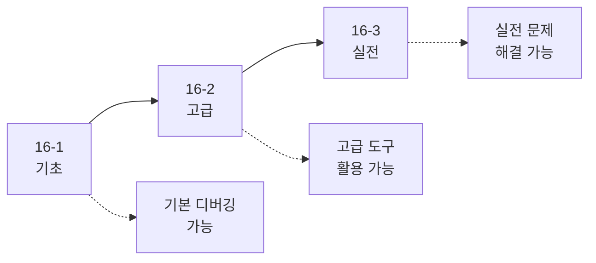

# Android 디버깅 가이드

> [!NOTE]
> **이 문서는 새로운 종합 가이드 시리즈로 대체되었습니다!**
> 
> 디버깅을 더 체계적으로 학습할 수 있도록 3개의 상세한 문서로 분할되었습니다:
> 
> 1. **[16-1. Android 디버깅 기초](./16-1-android-debugging-basics.md)** - Logcat, Breakpoint, Layout Inspector
> 2. **[16-2. Android 디버깅 고급](./16-2-android-debugging-advanced.md)** - Database/Network/Background Inspector, ANR, StrictMode
> 3. **[16-3. Android 디버깅 실전](./16-3-android-debugging-scenarios.md)** - 실전 문제 해결 시나리오
> 
> **총 분량**: 약 3,000줄의 상세한 설명과 주석이 포함된 코드 예제

---

## 📚 새로운 시리즈 구성

### 16-1. Android 디버깅 기초 (⭐ 초보자 시작점)
- **Logcat 사용법**: 로그 레벨, Timber 라이브러리
- **Breakpoint 디버깅**: 조건부 Breakpoint, 로그 Breakpoint, 디버거 단축키
- **Layout Inspector**: UI 계층 구조 확인, 속성 검사
- **Compose Layout Inspector**: Recomposition 카운트, Modifier 검사
- **자주 발생하는 에러**: NPE, IndexOutOfBounds, ConcurrentModification 등

### 16-2. Android 디버깅 고급
- **Database Inspector**: Room 데이터베이스 실시간 조회 및 수정
- **Network Inspector**: HTTP 요청/응답 모니터링, 타이밍 분석
- **Background Task Inspector**: WorkManager 작업 상태 확인
- **ANR 분석**: ANR 발생 원인 및 방지 방법
- **StrictMode**: 메인 스레드 위반 감지, 메모리 누수 감지
- **성능 프로파일링**: CPU/Memory/Network Profiler

### 16-3. Android 디버깅 실전
- **앱 크래시 디버깅**: 스택 트레이스 분석, Crashlytics 통합
- **UI 버그 해결**: 텍스트 잘림, 리스트 스크롤 끊김
- **성능 문제 해결**: 앱 시작 느림, 이미지 로딩 느림
- **네트워크 문제 해결**: API 호출 실패, 타임아웃 에러
- **메모리 누수 해결**: Heap Dump 분석, Activity 누수
- **Compose 특화 디버깅**: State 업데이트 문제, LaunchedEffect 무한 루프

---

## 🎯 학습 로드맵



### 추천 학습 순서

#### 1단계: 기초 (1-2일)
- **16-1**: 디버깅 기초 학습 (1-2일)
  - Logcat 사용법
  - Breakpoint 설정
  - Layout Inspector 활용

#### 2단계: 고급 (2-3일)
- **16-2**: 고급 디버깅 도구 (2-3일)
  - Database/Network Inspector
  - ANR 분석
  - StrictMode 활용

#### 3단계: 실전 (지속적)
- **16-3**: 실전 문제 해결 (지속적)
  - 실제 발생하는 문제 해결
  - 베스트 프랙티스 적용

---

## 💡 새로운 시리즈의 특징

### ✅ 초보자 친화적
- 모든 개념을 처음부터 설명
- 전문 용어는 한글 설명 병기
- 단계별 가이드 제공

### ✅ 상세한 주석
```kotlin
/**
 * Breakpoint 설정 예제
 * 
 * 이 함수에서 Breakpoint를 설정하면
 * 변수 값을 확인할 수 있습니다.
 */
fun processData(data: List<Item>) {
    // Breakpoint 설정 ← 여기
    val filtered = data.filter { it.isValid }
}
```

### ✅ 실행 가능한 코드
- 모든 예제는 복사-붙여넣기로 실행 가능
- 필요한 import 문 포함
- 에러 처리 포함

### ✅ 실전 시나리오
- 실제 발생하는 문제 12가지
- 단계별 해결 과정
- 베스트 프랙티스 포함

---

## 🚀 빠른 시작

디버깅을 처음 시작한다면:

1. **[16-1. Android 디버깅 기초](./16-1-android-debugging-basics.md)** 로 시작하세요
2. Logcat 사용법을 익히세요
3. Breakpoint를 설정하고 변수를 확인하세요
4. Layout Inspector로 UI를 분석하세요

이미 기본 디버깅을 알고 있다면:

1. **[16-2. Android 디버깅 고급](./16-2-android-debugging-advanced.md)** 으로 바로 이동
2. Database/Network Inspector 활용법 학습
3. ANR과 StrictMode로 문제 조기 발견
4. **[16-3. Android 디버깅 실전](./16-3-android-debugging-scenarios.md)** 으로 실전 문제 해결

---

## 📊 문서 비교

| 구분 | 기존 문서 | 새로운 시리즈 |
|------|----------|--------------|
| 분량 | 300줄 | 약 3,000줄 |
| 파일 수 | 1개 | 3개 |
| 설명 수준 | 간략 | 매우 상세 |
| 코드 주석 | 기본 | 풍부 |
| 실전 예제 | 없음 | 12개 시나리오 |
| 초보자 친화성 | 보통 | 매우 높음 |

---

## 🎯 지금 바로 시작하세요!

**[👉 16-1. Android 디버깅 기초로 이동](./16-1-android-debugging-basics.md)**

---

**마지막 업데이트**: 2024-12-03  
**작성자**: Antigravity AI Assistant

Happy Debugging! 🐛

