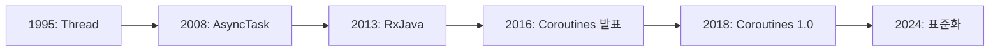

# Kotlin Coroutines의 역사와 철학

## 📚 목차
1. [비동기 프로그래밍의 진화](#비동기-프로그래밍의-진화)
2. [Android 비동기 처리의 암흑기](#android-비동기-처리의-암흑기)
3. [Coroutines의 탄생](#coroutines의-탄생)
4. [Structured Concurrency 철학](#structured-concurrency-철학)
5. [Coroutines의 영향력](#coroutines의-영향력)

---

## 비동기 프로그래밍의 진화

### 🕰️ 비동기 처리의 역사



#### 1995년: Thread - 원시적 방법

**Java Thread**가 유일한 비동기 처리 방법이었습니다.

```java
// Java Thread (1995~)
new Thread(new Runnable() {
    @Override
    public void run() {
        // 백그라운드 작업
        String data = downloadData();
        
        // UI 업데이트는 별도로
        runOnUiThread(new Runnable() {
            @Override
            public void run() {
                textView.setText(data);
            }
        });
    }
}).start();
```

**문제점**:
- ❌ 장황한 코드
- ❌ 에러 처리 어려움
- ❌ 메모리 누수 위험
- ❌ 취소 불가능
- ❌ 스레드 관리 복잡

#### 2008년: AsyncTask - Android의 첫 시도

**Android 1.0**과 함께 등장한 AsyncTask.

```java
// AsyncTask (2008-2018)
class DownloadTask extends AsyncTask<String, Integer, String> {
    
    @Override
    protected void onPreExecute() {
        // UI 스레드: 시작 전
        progressBar.setVisibility(View.VISIBLE);
    }
    
    @Override
    protected String doInBackground(String... urls) {
        // 백그라운드 스레드: 작업 수행
        String result = downloadData(urls[0]);
        publishProgress(50); // 진행률 업데이트
        return result;
    }
    
    @Override
    protected void onProgressUpdate(Integer... progress) {
        // UI 스레드: 진행률 업데이트
        progressBar.setProgress(progress[0]);
    }
    
    @Override
    protected void onPostExecute(String result) {
        // UI 스레드: 완료 후
        textView.setText(result);
        progressBar.setVisibility(View.GONE);
    }
}

// 사용
new DownloadTask().execute("https://api.example.com/data");
```

**개선점**:
- ✅ UI 스레드 자동 전환
- ✅ 진행률 업데이트 지원
- ✅ 생명주기 메서드

**문제점**:
- ❌ 메모리 누수 (Activity 참조)
- ❌ 화면 회전 시 문제
- ❌ 순차 작업 어려움
- ❌ 에러 처리 복잡
- ❌ **2018년 Deprecated!**

#### 2013년: RxJava - 함수형 반응형 프로그래밍

**Netflix**가 만든 RxJava가 Android에 도입되었습니다.

```java
// RxJava (2013~)
Observable.fromCallable(() -> downloadData())
    .subscribeOn(Schedulers.io())        // IO 스레드에서 실행
    .observeOn(AndroidSchedulers.mainThread())  // UI 스레드로 전환
    .subscribe(
        data -> {
            // 성공
            textView.setText(data);
        },
        error -> {
            // 에러
            showError(error.getMessage());
        }
    );
```

**개선점**:
- ✅ 강력한 연산자 (map, filter, flatMap 등)
- ✅ 에러 처리 개선
- ✅ 스레드 전환 쉬움
- ✅ 취소 가능

**문제점**:
- ❌ 학습 곡선이 매우 가파름
- ❌ 복잡한 문법
- ❌ 디버깅 어려움
- ❌ 많은 보일러플레이트

```java
// RxJava의 복잡성 예시
Observable.zip(
    getUserObservable(),
    getPostsObservable(),
    getFriendsObservable(),
    (user, posts, friends) -> new UserProfile(user, posts, friends)
)
.subscribeOn(Schedulers.io())
.observeOn(AndroidSchedulers.mainThread())
.subscribe(
    profile -> updateUI(profile),
    error -> showError(error),
    () -> hideLoading()
);
```

---

## Android 비동기 처리의 암흑기

### 🌑 2015-2017: 혼란의 시기

Android 개발자들은 선택의 기로에 놓였습니다.

#### Callback Hell (콜백 지옥)

```kotlin
// 콜백 지옥의 예
fun loadUserProfile(userId: String) {
    showLoading()
    
    apiService.getUser(userId, object : Callback<User> {
        override fun onSuccess(user: User) {
            // 사용자 정보를 받은 후 게시물 로드
            apiService.getPosts(user.id, object : Callback<List<Post>> {
                override fun onSuccess(posts: List<Post>) {
                    // 게시물을 받은 후 친구 목록 로드
                    apiService.getFriends(user.id, object : Callback<List<Friend>> {
                        override fun onSuccess(friends: List<Friend>) {
                            // 모든 데이터를 받은 후 UI 업데이트
                            hideLoading()
                            updateUI(user, posts, friends)
                        }
                        
                        override fun onFailure(error: Exception) {
                            hideLoading()
                            showError(error)
                        }
                    })
                }
                
                override fun onFailure(error: Exception) {
                    hideLoading()
                    showError(error)
                }
            })
        }
        
        override fun onFailure(error: Exception) {
            hideLoading()
            showError(error)
        }
    })
}
```

**문제점**:
- ❌ 가독성 최악
- ❌ 에러 처리 중복
- ❌ 유지보수 불가능
- ❌ 디버깅 지옥

#### 각 방법의 문제점 요약

| 방법 | 장점 | 치명적 단점 |
|------|------|------------|
| **Thread** | 기본 제공 | 너무 원시적, 위험함 |
| **AsyncTask** | 간단함 | Deprecated, 메모리 누수 |
| **RxJava** | 강력함 | 학습 곡선 가파름, 복잡함 |
| **Callback** | 직관적 | Callback Hell |

### 😫 개발자들의 고통

```kotlin
// 2017년 Android 개발자의 일상
class UserViewModel : ViewModel() {
    
    // RxJava 사용 (복잡함)
    private val compositeDisposable = CompositeDisposable()
    
    fun loadUser() {
        val disposable = userRepository.getUser()
            .subscribeOn(Schedulers.io())
            .observeOn(AndroidSchedulers.mainThread())
            .subscribe(
                { user -> _user.value = user },
                { error -> _error.value = error.message }
            )
        
        compositeDisposable.add(disposable)
    }
    
    override fun onCleared() {
        // 메모리 누수 방지를 위해 수동으로 정리
        compositeDisposable.clear()
    }
}
```

**개발자들의 불만**:
- "왜 이렇게 복잡한가?"
- "간단한 비동기 작업에 왜 이렇게 많은 코드가 필요한가?"
- "다른 언어는 더 쉬운데..."

---

## Coroutines의 탄생

### 💡 JetBrains의 해결책

#### 2016년: Coroutines 발표

**Kotlin 1.1 (2017년 3월)**에서 Coroutines가 실험적 기능으로 추가되었습니다.

```kotlin
// 첫 Coroutines 코드 (2017)
launch {
    val user = async { getUserFromServer() }
    val posts = async { getPostsFromServer() }
    
    updateUI(user.await(), posts.await())
}
```

**개발자들의 반응**:
- 🤩 "이게 가능해?"
- 😍 "드디어!"
- 🎉 "비동기 코드가 동기 코드처럼!"

#### 다른 언어의 영향

##### 1. **Go (2009)**

```go
// Go의 Goroutines
func main() {
    go downloadData()  // 비동기 실행
    go processData()
    
    time.Sleep(time.Second)
}
```

**영향**:
- `launch` 키워드 아이디어
- 가벼운 스레드 개념

##### 2. **Python (2015)**

```python
# Python의 async/await
async def load_data():
    user = await get_user()
    posts = await get_posts()
    return user, posts
```

**영향**:
- `async`/`await` 문법
- `suspend` 키워드

##### 3. **C# (2012)**

```csharp
// C#의 async/await
async Task<User> LoadUserAsync() {
    var user = await GetUserAsync();
    var posts = await GetPostsAsync();
    return user;
}
```

**영향**:
- `suspend` 함수 개념
- Task/Deferred 아이디어

### 🎯 Coroutines의 설계 목표

JetBrains는 다음을 목표로 Coroutines를 설계했습니다:

#### 1. **간결함 (Simplicity)**

```kotlin
// ❌ RxJava (복잡함)
Observable.fromCallable { downloadData() }
    .subscribeOn(Schedulers.io())
    .observeOn(AndroidSchedulers.mainThread())
    .subscribe({ data -> updateUI(data) })

// ✅ Coroutines (간단함)
viewModelScope.launch {
    val data = downloadData()
    updateUI(data)
}
```

#### 2. **순차적 코드 (Sequential Code)**

```kotlin
// 비동기 코드를 동기 코드처럼 작성
suspend fun loadUserProfile(): UserProfile {
    val user = getUserFromServer()      // 1초 대기
    val posts = getPostsFromServer()    // 1초 대기
    val friends = getFriendsFromServer() // 1초 대기
    
    return UserProfile(user, posts, friends)
}
```

#### 3. **구조화된 동시성 (Structured Concurrency)**

```kotlin
// 부모 Coroutine이 취소되면 자식도 자동 취소
viewModelScope.launch {  // 부모
    launch { task1() }   // 자식 1
    launch { task2() }   // 자식 2
    launch { task3() }   // 자식 3
}
// ViewModel이 제거되면 모든 Coroutine 자동 취소!
```

#### 4. **예외 처리 (Exception Handling)**

```kotlin
// try-catch로 간단하게 처리
viewModelScope.launch {
    try {
        val data = downloadData()
        updateUI(data)
    } catch (e: Exception) {
        showError(e.message)
    }
}
```

### 📅 발전 과정

#### 2017년 3월: Kotlin 1.1 - 실험적 기능

```kotlin
// 초기 API (많이 변경됨)
launch(CommonPool) {  // CommonPool은 나중에 Dispatchers로 변경
    val result = async { doWork() }
    println(result.await())
}
```

#### 2018년 10월: Coroutines 1.0 출시

**Production-ready!**

```kotlin
// 안정화된 API
GlobalScope.launch(Dispatchers.IO) {
    val data = downloadData()
    withContext(Dispatchers.Main) {
        updateUI(data)
    }
}
```

**주요 변경사항**:
- ✅ Dispatchers 도입 (IO, Main, Default)
- ✅ Flow 추가
- ✅ Channel 개선
- ✅ 구조화된 동시성 강화

#### 2019년: Android 공식 지원

**Google이 Coroutines를 공식 권장!**

```kotlin
// Android KTX에 Coroutine Scope 추가
class MyViewModel : ViewModel() {
    fun loadData() {
        viewModelScope.launch {  // ViewModel 생명주기 자동 관리
            // 작업 수행
        }
    }
}

class MyActivity : AppCompatActivity() {
    fun loadData() {
        lifecycleScope.launch {  // Activity 생명주기 자동 관리
            // 작업 수행
        }
    }
}
```

#### 2020년: Flow 성숙

```kotlin
// Flow - 비동기 스트림
class UserRepository {
    fun getUsers(): Flow<List<User>> = flow {
        while (true) {
            val users = api.getUsers()
            emit(users)
            delay(5000) // 5초마다 갱신
        }
    }
}
```

---

## Structured Concurrency 철학

### 🏗️ 구조화된 동시성이란?

**Structured Concurrency**는 Coroutines의 핵심 철학입니다.

#### 문제: 메모리 누수

```kotlin
// ❌ 나쁜 예: GlobalScope (메모리 누수 위험)
class MyViewModel : ViewModel() {
    fun loadData() {
        GlobalScope.launch {
            // ViewModel이 제거되어도 계속 실행됨!
            val data = downloadData()  // 메모리 누수!
        }
    }
}
```

#### 해결: Structured Concurrency

```kotlin
// ✅ 좋은 예: viewModelScope (자동 정리)
class MyViewModel : ViewModel() {
    fun loadData() {
        viewModelScope.launch {
            // ViewModel이 제거되면 자동으로 취소됨!
            val data = downloadData()
        }
    }
}
```

### 🌳 Coroutine 계층 구조

```kotlin
// 부모-자식 관계
viewModelScope.launch {  // 부모
    println("부모 시작")
    
    launch {  // 자식 1
        delay(1000)
        println("자식 1 완료")
    }
    
    launch {  // 자식 2
        delay(2000)
        println("자식 2 완료")
    }
    
    println("부모는 자식들을 기다림")
}
// 출력:
// 부모 시작
// 부모는 자식들을 기다림
// 자식 1 완료 (1초 후)
// 자식 2 완료 (2초 후)
```

**원칙**:
1. 부모는 모든 자식이 완료될 때까지 기다린다
2. 부모가 취소되면 모든 자식도 취소된다
3. 자식에서 예외가 발생하면 부모에게 전파된다

### 🎯 Coroutine Scope

```kotlin
// Android에서 제공하는 Scope들
class MyActivity : AppCompatActivity() {
    
    fun example1() {
        // lifecycleScope: Activity 생명주기와 연동
        lifecycleScope.launch {
            // Activity가 종료되면 자동 취소
        }
    }
}

class MyViewModel : ViewModel() {
    
    fun example2() {
        // viewModelScope: ViewModel 생명주기와 연동
        viewModelScope.launch {
            // ViewModel이 제거되면 자동 취소
        }
    }
}

// 커스텀 Scope 만들기
class MyRepository {
    private val scope = CoroutineScope(Dispatchers.IO + SupervisorJob())
    
    fun loadData() {
        scope.launch {
            // 작업 수행
        }
    }
    
    fun cleanup() {
        scope.cancel()  // 모든 Coroutine 취소
    }
}
```

### 🛡️ 예외 처리

```kotlin
// Structured Concurrency의 예외 처리
viewModelScope.launch {
    try {
        val user = getUser()
        val posts = getPosts()
        updateUI(user, posts)
    } catch (e: Exception) {
        // 모든 예외를 한 곳에서 처리
        showError(e.message)
    }
}
```

---

## Coroutines의 영향력

### 📊 채택률

| 연도 | Android 프로젝트 채택률 | 주요 이벤트 |
|------|----------------------|------------|
| **2017** | ~5% | 실험적 기능 |
| **2018** | ~15% | 1.0 출시 |
| **2019** | ~35% | Android 공식 권장 |
| **2020** | ~55% | 주류 진입 |
| **2024** | ~85%+ | 사실상 표준 |

### 🏆 RxJava vs Coroutines

#### 2024년 현재 상황

```kotlin
// RxJava 사용률 감소
2018: 60% → 2024: 20%

// Coroutines 사용률 증가
2018: 15% → 2024: 85%
```

**이유**:
- ✅ Coroutines가 더 간단함
- ✅ Kotlin 네이티브 지원
- ✅ Google 공식 권장
- ✅ 학습 곡선이 낮음

#### 마이그레이션 트렌드

```kotlin
// RxJava → Coroutines 마이그레이션
// Before (RxJava)
fun getUsers(): Observable<List<User>> {
    return Observable.fromCallable { api.getUsers() }
        .subscribeOn(Schedulers.io())
        .observeOn(AndroidSchedulers.mainThread())
}

// After (Coroutines)
suspend fun getUsers(): List<User> {
    return withContext(Dispatchers.IO) {
        api.getUsers()
    }
}
```

### 🌍 다른 플랫폼으로 확장

#### Kotlin Multiplatform

```kotlin
// 공통 코드 (iOS + Android + Web)
class UserRepository {
    suspend fun getUser(id: String): User {
        return api.getUser(id)
    }
}

// 모든 플랫폼에서 동일하게 동작!
```

#### Ktor (서버 사이드)

```kotlin
// Kotlin 서버에서도 Coroutines 사용
fun Application.module() {
    routing {
        get("/users/{id}") {
            val id = call.parameters["id"]!!
            val user = userRepository.getUser(id)  // suspend 함수
            call.respond(user)
        }
    }
}
```

### 📚 교육과 학습

#### Google의 공식 지원

- [Coroutines 공식 가이드](https://kotlinlang.org/docs/coroutines-guide.html)
- [Android Coroutines 코스](https://developer.android.com/kotlin/coroutines)
- [Coroutines Codelab](https://developer.android.com/codelabs/kotlin-coroutines)

#### 커뮤니티

- Kotlin Slack #coroutines 채널
- Stack Overflow
- 수많은 블로그와 튜토리얼

---

## 마치며

### 🎉 Coroutines의 성공 요인

1. **간결함**: 복잡한 비동기 코드를 간단하게
2. **Kotlin 네이티브**: 언어 차원의 지원
3. **Structured Concurrency**: 메모리 누수 방지
4. **Google 지원**: Android 공식 권장
5. **실용성**: 실제 문제 해결

### 💡 배운 점

> [!TIP]
> **좋은 기술은 복잡함을 숨긴다**
> 
> Coroutines는 복잡한 스레드 관리를 숨기고, 개발자가 비즈니스 로직에 집중할 수 있게 해줍니다. AsyncTask, RxJava의 복잡성을 극복한 것이 성공의 비결입니다.

### 🔮 미래 전망

- **Kotlin 2.0**: 더 빠른 컴파일러
- **Flow 개선**: 더 강력한 스트림 처리
- **Multiplatform 확장**: 모든 플랫폼에서 Coroutines
- **새로운 API**: 계속 발전 중

### 🚀 다음 단계

이제 Coroutines의 역사와 배경을 알았으니, 실제 사용법을 배워볼 차례입니다!

➡️ **다음 문서**: [40-2-kotlin-coroutines-flow-guide.md](./40-2-kotlin-coroutines-flow-guide.md)

---

## 참고 자료

### 공식 자료
- [Kotlin Coroutines 공식 문서](https://kotlinlang.org/docs/coroutines-overview.html)
- [Coroutines Guide](https://kotlinlang.org/docs/coroutines-guide.html)
- [Android Coroutines](https://developer.android.com/kotlin/coroutines)

### 역사 관련
- [Coroutines 발표 (KotlinConf 2017)](https://www.youtube.com/watch?v=_hfBv0a09Jc)
- [Structured Concurrency](https://kotlinlang.org/docs/coroutines-basics.html#structured-concurrency)
- [Roman Elizarov의 블로그](https://medium.com/@elizarov)

### 비교 자료
- [RxJava vs Coroutines](https://proandroiddev.com/forget-rxjava-kotlin-coroutines-are-all-you-need-part-1-2-4f62ecc4f99b)
- [AsyncTask to Coroutines](https://developer.android.com/kotlin/coroutines/coroutines-adv)

---

**작성일**: 2024-12-02  
**작성자**: Antigravity AI Assistant

**읽기 시간**: 15-20분  
**난이도**: ⭐⭐

Coroutines의 탄생 스토리를 알고 나니, 왜 이렇게 설계되었는지 이해가 되시나요? 🚀
