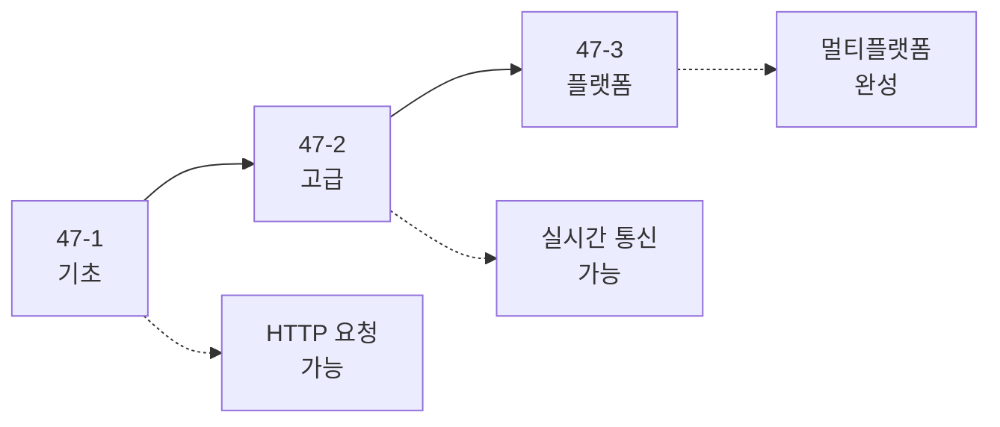

# Compose Multiplatform 네트워킹 가이드

> [!NOTE]
> **이 문서는 새로운 종합 가이드 시리즈로 대체되었습니다!**
> 
> Compose Multiplatform 네트워킹을 더 체계적으로 학습할 수 있도록 3개의 상세한 문서로 분할되었습니다:
> 
> 1. **[47-1. Compose Multiplatform 네트워킹 기초](./47-1-compose-multiplatform-networking-basics.md)** - Ktor Client, HTTP 요청, JSON 직렬화
> 2. **[47-2. Compose Multiplatform 네트워킹 고급](./47-2-compose-multiplatform-networking-advanced.md)** - 인증, 캐싱, WebSocket, 파일 업로드/다운로드
> 3. **[47-3. Compose Multiplatform 네트워킹 플랫폼](./47-3-compose-multiplatform-networking-platform.md)** - Android/iOS/Desktop 플랫폼별 구현

---

## 📚 새로운 시리즈 구성

### 47-1. Compose Multiplatform 네트워킹 기초 (⭐ 시작점)
- **Ktor Client 소개**: 멀티플랫폼 HTTP 클라이언트
- **프로젝트 설정**: 의존성 추가, 클라이언트 생성
- **HTTP 요청**: GET, POST, PUT, DELETE
- **JSON 직렬화**: Kotlinx Serialization, 자동 변환
- **에러 처리**: Result 패턴, 재시도 로직

### 47-2. Compose Multiplatform 네트워킹 고급
- **인증 및 토큰 관리**: Bearer Token, 자동 갱신
- **캐싱 전략**: 메모리 캐시, TTL
- **WebSocket 실시간 통신**: 채팅 구현
- **파일 업로드/다운로드**: 멀티파트, 진행률 표시

### 47-3. Compose Multiplatform 네트워킹 플랫폼
- **플랫폼별 HTTP 엔진**: OkHttp, Darwin, CIO
- **Android 특화 구현**: 네트워크 상태 모니터
- **iOS 특화 구현**: URLSession 활용
- **Desktop 특화 구현**: 순수 Kotlin 구현

---

## 🎯 학습 로드맵



### 추천 학습 순서

#### 1단계: 기초 (1-2일)
- **47-1**: 네트워킹 기초 (1-2일)
  - Ktor Client 설정
  - HTTP 요청 (GET, POST, PUT, DELETE)
  - JSON 직렬화

#### 2단계: 고급 (2-3일)
- **47-2**: 고급 기능 (2-3일)
  - 인증 및 토큰 관리
  - 캐싱 전략
  - WebSocket

#### 3단계: 플랫폼 (1일)
- **47-3**: 플랫폼별 구현 (1일)
  - Android/iOS/Desktop 특화
  - 네트워크 상태 모니터링

---

## 💡 새로운 시리즈의 특징

### ✅ 멀티플랫폼 중심
- Android, iOS, Desktop에서 동일한 코드 사용
- 플랫폼별 최적화 방법 제공

### ✅ 상세한 주석
```kotlin
/**
 * HTTP 클라이언트 생성 함수
 * 
 * 앱 전체에서 재사용할 수 있는 Ktor Client를 생성합니다.
 * 싱글톤 패턴으로 사용하는 것이 좋습니다.
 */
fun createHttpClient(): HttpClient {
    return HttpClient {
        install(ContentNegotiation) {
            json()
        }
    }
}
```

### ✅ 실전 예제
- Repository 패턴
- 에러 처리
- 재시도 로직
- 캐싱 전략

---

## 🚀 빠른 시작

Compose Multiplatform 네트워킹을 처음 시작한다면:

1. **[47-1. Compose Multiplatform 네트워킹 기초](./47-1-compose-multiplatform-networking-basics.md)** 로 시작하세요
2. Ktor Client를 설정하세요
3. HTTP 요청을 보내보세요
4. JSON 직렬화를 익히세요

이미 기본을 알고 있다면:

1. **[47-2. Compose Multiplatform 네트워킹 고급](./47-2-compose-multiplatform-networking-advanced.md)** 으로 바로 이동
2. 인증 및 캐싱 구현
3. WebSocket으로 실시간 통신
4. **[47-3. Compose Multiplatform 네트워킹 플랫폼](./47-3-compose-multiplatform-networking-platform.md)** 으로 플랫폼별 최적화

---

## 🎯 지금 바로 시작하세요!

**[👉 47-1. Compose Multiplatform 네트워킹 기초로 이동](./47-1-compose-multiplatform-networking-basics.md)**

---

**마지막 업데이트**: 2024-12-03  
**작성자**: Antigravity AI Assistant

Happy Coding! 🚀


---

## Ktor Client 소개

**Ktor Client**는 Kotlin Multiplatform을 위한 HTTP 클라이언트 라이브러리입니다.

### 의존성 추가

**build.gradle.kts**:
```kotlin
val ktorVersion = "2.3.7"

commonMain.dependencies {
    // Ktor Core
    implementation("io.ktor:ktor-client-core:$ktorVersion")
    
    // JSON 직렬화
    implementation("io.ktor:ktor-client-content-negotiation:$ktorVersion")
    implementation("io.ktor:ktor-serialization-kotlinx-json:$ktorVersion")
    
    // 로깅
    implementation("io.ktor:ktor-client-logging:$ktorVersion")
    
    // Kotlinx Serialization
    implementation("org.jetbrains.kotlinx:kotlinx-serialization-json:1.6.2")
}

androidMain.dependencies {
    // Android 엔진
    implementation("io.ktor:ktor-client-okhttp:$ktorVersion")
}

iosMain.dependencies {
    // iOS 엔진
    implementation("io.ktor:ktor-client-darwin:$ktorVersion")
}

desktopMain.dependencies {
    // Desktop 엔진
    implementation("io.ktor:ktor-client-okhttp:$ktorVersion")
}
```

### Ktor Client 설정

```kotlin
import io.ktor.client.*
import io.ktor.client.plugins.contentnegotiation.*
import io.ktor.client.plugins.logging.*
import io.ktor.serialization.kotlinx.json.*
import kotlinx.serialization.json.Json

/**
 * Ktor HTTP Client 생성
 */
fun createHttpClient(): HttpClient {
    return HttpClient {
        // JSON 직렬화 설정
        install(ContentNegotiation) {
            json(Json {
                prettyPrint = true
                isLenient = true
                ignoreUnknownKeys = true
            })
        }
        
        // 로깅 설정
        install(Logging) {
            logger = Logger.DEFAULT
            level = LogLevel.INFO
        }
    }
}
```

---

## HTTP 요청

### GET 요청

```kotlin
import io.ktor.client.request.*
import io.ktor.client.statement.*

/**
 * GET 요청 예제
 */
suspend fun fetchData(): String {
    val client = createHttpClient()
    
    return try {
        val response: HttpResponse = client.get("https://api.example.com/data")
        response.bodyAsText()
    } finally {
        client.close()
    }
}
```

### POST 요청

```kotlin
import io.ktor.client.request.*
import io.ktor.http.*

/**
 * POST 요청 예제
 */
suspend fun createUser(user: User): User {
    val client = createHttpClient()
    
    return try {
        client.post("https://api.example.com/users") {
            contentType(ContentType.Application.Json)
            setBody(user)
        }
    } finally {
        client.close()
    }
}
```

---

## JSON 파싱

### 데이터 모델

```kotlin
import kotlinx.serialization.Serializable

@Serializable
data class User(
    val id: Int,
    val name: String,
    val email: String
)

@Serializable
data class Post(
    val id: Int,
    val userId: Int,
    val title: String,
    val body: String
)
```

### API 호출

```kotlin
import io.ktor.client.call.*

suspend fun getUsers(): List<User> {
    val client = createHttpClient()
    
    return try {
        client.get("https://jsonplaceholder.typicode.com/users").body()
    } finally {
        client.close()
    }
}
```

---

## 에러 처리

```kotlin
sealed class Result<out T> {
    data class Success<T>(val data: T) : Result<T>()
    data class Error(val message: String) : Result<Nothing>()
    object Loading : Result<Nothing>()
}

suspend fun fetchUsersWithErrorHandling(): Result<List<User>> {
    return try {
        Result.Loading
        val users = getUsers()
        Result.Success(users)
    } catch (e: Exception) {
        Result.Error(e.message ?: "Unknown error")
    }
}
```

---

## SQLDelight 데이터베이스

### 의존성 추가

```kotlin
plugins {
    id("app.cash.sqldelight") version "2.0.1"
}

sqldelight {
    databases {
        create("AppDatabase") {
            packageName.set("com.example.app.db")
        }
    }
}

commonMain.dependencies {
    implementation("app.cash.sqldelight:runtime:2.0.1")
    implementation("app.cash.sqldelight:coroutines-extensions:2.0.1")
}

androidMain.dependencies {
    implementation("app.cash.sqldelight:android-driver:2.0.1")
}

iosMain.dependencies {
    implementation("app.cash.sqldelight:native-driver:2.0.1")
}

desktopMain.dependencies {
    implementation("app.cash.sqldelight:sqlite-driver:2.0.1")
}
```

### SQL 스키마 정의

**commonMain/sqldelight/com/example/app/db/User.sq**:
```sql
CREATE TABLE User (
    id INTEGER PRIMARY KEY AUTOINCREMENT,
    name TEXT NOT NULL,
    email TEXT NOT NULL UNIQUE,
    createdAt INTEGER NOT NULL
);

-- 모든 사용자 조회
selectAll:
SELECT * FROM User;

-- ID로 사용자 조회
selectById:
SELECT * FROM User WHERE id = ?;

-- 사용자 삽입
insert:
INSERT INTO User(name, email, createdAt)
VALUES (?, ?, ?);

-- 사용자 업데이트
update:
UPDATE User
SET name = ?, email = ?
WHERE id = ?;

-- 사용자 삭제
delete:
DELETE FROM User WHERE id = ?;
```

### 데이터베이스 드라이버 생성

```kotlin
import app.cash.sqldelight.db.SqlDriver

expect class DatabaseDriverFactory {
    fun createDriver(): SqlDriver
}

// Android
actual class DatabaseDriverFactory(private val context: Context) {
    actual fun createDriver(): SqlDriver {
        return AndroidSqliteDriver(
            AppDatabase.Schema,
            context,
            "app.db"
        )
    }
}

// iOS
actual class DatabaseDriverFactory {
    actual fun createDriver(): SqlDriver {
        return NativeSqliteDriver(
            AppDatabase.Schema,
            "app.db"
        )
    }
}

// Desktop
actual class DatabaseDriverFactory {
    actual fun createDriver(): SqlDriver {
        return JdbcSqliteDriver("jdbc:sqlite:app.db")
            .also { AppDatabase.Schema.create(it) }
    }
}
```

---

## 실전 예제: REST API 앱

### Repository 패턴

```kotlin
class UserRepository(
    private val httpClient: HttpClient,
    private val database: AppDatabase
) {
    suspend fun fetchAndCacheUsers(): Result<List<User>> {
        return try {
            // API에서 데이터 가져오기
            val users = httpClient.get("https://api.example.com/users").body<List<User>>()
            
            // 데이터베이스에 저장
            users.forEach { user ->
                database.userQueries.insert(user.name, user.email, System.currentTimeMillis())
            }
            
            Result.Success(users)
        } catch (e: Exception) {
            // 에러 시 캐시된 데이터 반환
            val cachedUsers = database.userQueries.selectAll().executeAsList()
            if (cachedUsers.isNotEmpty()) {
                Result.Success(cachedUsers.map { /* 변환 */ })
            } else {
                Result.Error(e.message ?: "Unknown error")
            }
        }
    }
}
```

---

## 다음 단계

다음 문서에서는:
- **고급 기법**
- **성능 최적화**
- **테스팅**

를 다룹니다.
