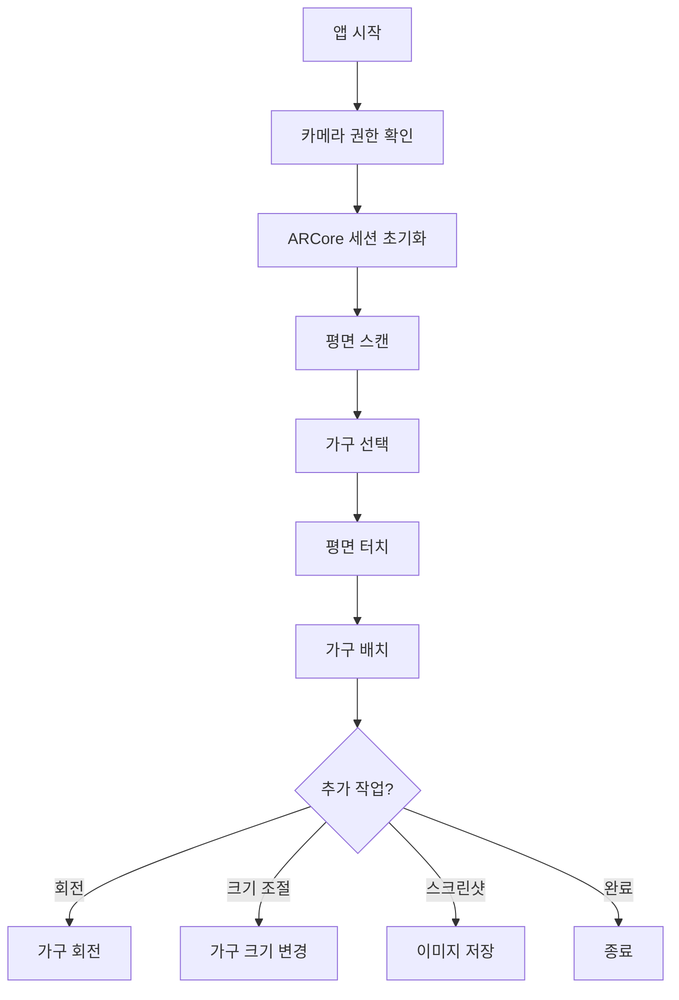

# Android ARCore 실전 프로젝트

> 📖 **시리즈 구성**
> - **72-1**: [ARCore의 역사](./72-1-arcore-history.md) - AR 기술의 발전과 ARCore 탄생 배경
> - **72-2**: [ARCore 기본 가이드](./72-2-android-arcore-basics.md) - 개발 환경 설정부터 첫 AR 앱까지
> - **72-3**: [ARCore 고급 가이드](./72-3-android-arcore-advanced.md) - 이미지 추적, 얼굴 추적, Depth API
> - **72-4**: ARCore 실전 프로젝트 (현재 문서) - 가구 배치, 측정, 명함 앱

---

## 📚 목차

1. [프로젝트 1: AR 가구 배치 앱](#프로젝트-1-ar-가구-배치-앱)
2. [프로젝트 2: AR 측정 앱](#프로젝트-2-ar-측정-앱)
3. [프로젝트 3: AR 명함 앱](#프로젝트-3-ar-명함-앱)

---

## 프로젝트 1: AR 가구 배치 앱

### 🎯 프로젝트 개요

IKEA Place와 같은 가구 배치 앱을 만들어봅시다.

**기능**:
- 평면 감지
- 가구 3D 모델 배치
- 가구 회전/크기 조절
- 스크린샷 저장

### 📐 앱 설계



### 🏗️ 프로젝트 구조

```
FurniturePlacementApp/
├── data/
│   ├── models/
│   │   ├── FurnitureModel.kt
│   │   └── FurnitureRepository.kt
│   └── assets/
│       ├── chair.glb
│       ├── table.glb
│       └── sofa.glb
├── ui/
│   ├── screens/
│   │   ├── ARScreen.kt
│   │   └── FurnitureSelectionScreen.kt
│   ├── components/
│   │   ├── FurnitureGrid.kt
│   │   └── ARControls.kt
│   └── theme/
│       └── Theme.kt
└── ar/
    ├── ARSessionManager.kt
    ├── PlaneDetector.kt
    ├── ObjectPlacer.kt
    └── GestureHandler.kt
```

### 💾 데이터 모델

```kotlin
/**
 * 가구 3D 모델 정보
 */
data class FurnitureModel(
    val id: String,
    val name: String,
    val category: FurnitureCategory,
    val modelPath: String,  // 3D 모델 파일 경로
    val thumbnailPath: String,  // 썸네일 이미지
    val defaultScale: Float = 1.0f,  // 기본 크기
    val price: Int? = null
)

enum class FurnitureCategory {
    CHAIR,      // 의자
    TABLE,      // 테이블
    SOFA,       // 소파
    BED,        // 침대
    CABINET,    // 수납장
    DECORATION  // 장식품
}

/**
 * 배치된 가구 정보
 */
data class PlacedFurniture(
    val model: FurnitureModel,
    val anchor: Anchor,
    var scale: Float = 1.0f,
    var rotationY: Float = 0f  // Y축 회전 (도)
)
```

### 🗄️ 가구 데이터 저장소

```kotlin
/**
 * 가구 모델 저장소
 */
class FurnitureRepository {
    
    /**
     * 사용 가능한 모든 가구 목록
     */
    fun getAllFurniture(): List<FurnitureModel> {
        return listOf(
            FurnitureModel(
                id = "chair_001",
                name = "모던 의자",
                category = FurnitureCategory.CHAIR,
                modelPath = "models/chair.glb",
                thumbnailPath = "thumbnails/chair.png",
                defaultScale = 0.5f,
                price = 89000
            ),
            FurnitureModel(
                id = "table_001",
                name = "원목 테이블",
                category = FurnitureCategory.TABLE,
                modelPath = "models/table.glb",
                thumbnailPath = "thumbnails/table.png",
                defaultScale = 0.8f,
                price = 250000
            ),
            FurnitureModel(
                id = "sofa_001",
                name = "3인용 소파",
                category = FurnitureCategory.SOFA,
                modelPath = "models/sofa.glb",
                thumbnailPath = "thumbnails/sofa.png",
                defaultScale = 1.0f,
                price = 450000
            )
        )
    }
    
    /**
     * 카테고리별 가구 필터링
     */
    fun getFurnitureByCategory(category: FurnitureCategory): List<FurnitureModel> {
        return getAllFurniture().filter { it.category == category }
    }
}
```

### 🎨 가구 선택 UI

```kotlin
/**
 * 가구 선택 화면
 */
@Composable
fun FurnitureSelectionScreen(
    onFurnitureSelected: (FurnitureModel) -> Unit
) {
    val repository = remember { FurnitureRepository() }
    val furniture = remember { repository.getAllFurniture() }
    var selectedCategory by remember { mutableStateOf<FurnitureCategory?>(null) }
    
    Column(modifier = Modifier.fillMaxSize()) {
        // 카테고리 필터
        CategoryFilter(
            selectedCategory = selectedCategory,
            onCategorySelected = { selectedCategory = it }
        )
        
        // 가구 그리드
        LazyVerticalGrid(
            columns = GridCells.Fixed(2),
            contentPadding = PaddingValues(16.dp),
            horizontalArrangement = Arrangement.spacedBy(16.dp),
            verticalArrangement = Arrangement.spacedBy(16.dp)
        ) {
            val filteredFurniture = selectedCategory?.let { category ->
                furniture.filter { it.category == category }
            } ?: furniture
            
            items(filteredFurniture) { item ->
                FurnitureCard(
                    furniture = item,
                    onClick = { onFurnitureSelected(item) }
                )
            }
        }
    }
}

/**
 * 카테고리 필터
 */
@Composable
fun CategoryFilter(
    selectedCategory: FurnitureCategory?,
    onCategorySelected: (FurnitureCategory?) -> Unit
) {
    LazyRow(
        contentPadding = PaddingValues(16.dp),
        horizontalArrangement = Arrangement.spacedBy(8.dp)
    ) {
        // 전체 버튼
        item {
            FilterChip(
                selected = selectedCategory == null,
                onClick = { onCategorySelected(null) },
                label = { Text("전체") }
            )
        }
        
        // 카테고리 버튼들
        items(FurnitureCategory.values()) { category ->
            FilterChip(
                selected = selectedCategory == category,
                onClick = { onCategorySelected(category) },
                label = { Text(getCategoryName(category)) }
            )
        }
    }
}

/**
 * 가구 카드
 */
@Composable
fun FurnitureCard(
    furniture: FurnitureModel,
    onClick: () -> Unit
) {
    Card(
        modifier = Modifier
            .fillMaxWidth()
            .aspectRatio(1f)
            .clickable(onClick = onClick),
        elevation = CardDefaults.cardElevation(defaultElevation = 4.dp)
    ) {
        Column(
            modifier = Modifier.padding(8.dp),
            horizontalAlignment = Alignment.CenterHorizontally
        ) {
            // 썸네일 이미지
            Image(
                painter = painterResource(furniture.thumbnailPath),
                contentDescription = furniture.name,
                modifier = Modifier
                    .weight(1f)
                    .fillMaxWidth(),
                contentScale = ContentScale.Fit
            )
            
            // 가구 이름
            Text(
                text = furniture.name,
                style = MaterialTheme.typography.titleSmall,
                maxLines = 1,
                overflow = TextOverflow.Ellipsis
            )
            
            // 가격
            furniture.price?.let { price ->
                Text(
                    text = "${price.toFormattedPrice()}원",
                    style = MaterialTheme.typography.bodySmall,
                    color = MaterialTheme.colorScheme.primary
                )
            }
        }
    }
}
```

### 🎮 AR 화면 구현

```kotlin
/**
 * AR 가구 배치 화면
 */
@Composable
fun FurniturePlacementARScreen(
    selectedFurniture: FurnitureModel?
) {
    val context = LocalContext.current
    val sessionManager = remember { ARSessionManager(context) }
    val objectPlacer = remember { ObjectPlacer() }
    
    var placedFurniture by remember { mutableStateOf<List<PlacedFurniture>>(emptyList()) }
    var selectedPlacedFurniture by remember { mutableStateOf<PlacedFurniture?>(null) }
    var planesDetected by remember { mutableStateOf(false) }
    
    DisposableEffect(Unit) {
        sessionManager.createSession()
        onDispose {
            sessionManager.destroy()
        }
    }
    
    Box(modifier = Modifier.fillMaxSize()) {
        // AR 카메라 뷰
        ARCameraView(
            modifier = Modifier
                .fillMaxSize()
                // 터치 제스처 처리
                .pointerInput(selectedFurniture) {
                    detectTapGestures { offset ->
                        handleTap(
                            offset = offset,
                            selectedFurniture = selectedFurniture,
                            sessionManager = sessionManager,
                            objectPlacer = objectPlacer,
                            onFurniturePlaced = { placed ->
                                placedFurniture = placedFurniture + placed
                            }
                        )
                    }
                }
                // 회전 제스처
                .pointerInput(selectedPlacedFurniture) {
                    detectRotationGestures { rotation ->
                        selectedPlacedFurniture?.let { furniture ->
                            furniture.rotationY += rotation
                        }
                    }
                }
                // 확대/축소 제스처
                .pointerInput(selectedPlacedFurniture) {
                    detectTransformGestures { _, _, zoom, _ ->
                        selectedPlacedFurniture?.let { furniture ->
                            furniture.scale *= zoom
                            furniture.scale = furniture.scale.coerceIn(0.5f, 2.0f)
                        }
                    }
                },
            sessionManager = sessionManager,
            onFrameUpdate = { frame ->
                // 평면 감지 확인
                val planes = detectPlanes(frame)
                planesDetected = planes.isNotEmpty()
                
                // 배치된 가구 렌더링
                placedFurniture.forEach { furniture ->
                    renderFurniture(furniture)
                }
            }
        )
        
        // 평면 감지 안내
        if (!planesDetected) {
            PlaneDetectionGuide(
                modifier = Modifier.align(Alignment.TopCenter)
            )
        }
        
        // 선택된 가구 정보
        selectedFurniture?.let { furniture ->
            SelectedFurnitureInfo(
                furniture = furniture,
                modifier = Modifier.align(Alignment.BottomStart)
            )
        }
        
        // AR 컨트롤
        ARControls(
            modifier = Modifier.align(Alignment.BottomEnd),
            onScreenshot = { takeScreenshot() },
            onUndo = {
                placedFurniture = placedFurniture.dropLast(1)
            },
            onClear = {
                placedFurniture.forEach { it.anchor.detach() }
                placedFurniture = emptyList()
            }
        )
    }
}

/**
 * 터치 이벤트 처리
 */
private fun handleTap(
    offset: Offset,
    selectedFurniture: FurnitureModel?,
    sessionManager: ARSessionManager,
    objectPlacer: ObjectPlacer,
    onFurniturePlaced: (PlacedFurniture) -> Unit
) {
    // 가구가 선택되지 않았으면 무시
    if (selectedFurniture == null) return
    
    // Hit Test 수행
    sessionManager.getSession()?.let { session ->
        val frame = session.update()
        val hitResults = performHitTest(frame, offset.x, offset.y)
        
        // 첫 번째 평면과의 교차점에 가구 배치
        hitResults.firstOrNull()?.let { hitResult ->
            val anchor = hitResult.createAnchor()
            
            val placedFurniture = PlacedFurniture(
                model = selectedFurniture,
                anchor = anchor,
                scale = selectedFurniture.defaultScale
            )
            
            onFurniturePlaced(placedFurniture)
            
            Log.d("AR", "가구 배치: ${selectedFurniture.name}")
        }
    }
}

/**
 * 가구 렌더링 (의사 코드)
 */
private fun renderFurniture(furniture: PlacedFurniture) {
    // 실제로는 Sceneform 또는 OpenGL로 렌더링
    
    // 1. 3D 모델 로드
    // val model = load3DModel(furniture.model.modelPath)
    
    // 2. Anchor 위치에 배치
    // model.position = furniture.anchor.pose.translation
    
    // 3. 회전 적용
    // model.rotationY = furniture.rotationY
    
    // 4. 크기 적용
    // model.scale = furniture.scale
    
    // 5. 렌더링
    // render(model)
}
```

### 🎮 AR 컨트롤 UI

```kotlin
/**
 * AR 컨트롤 버튼들
 */
@Composable
fun ARControls(
    modifier: Modifier = Modifier,
    onScreenshot: () -> Unit,
    onUndo: () -> Unit,
    onClear: () -> Unit
) {
    Column(
        modifier = modifier.padding(16.dp),
        verticalArrangement = Arrangement.spacedBy(8.dp)
    ) {
        // 스크린샷 버튼
        FloatingActionButton(
            onClick = onScreenshot,
            containerColor = MaterialTheme.colorScheme.primary
        ) {
            Icon(Icons.Default.CameraAlt, "스크린샷")
        }
        
        // 실행 취소 버튼
        FloatingActionButton(
            onClick = onUndo,
            containerColor = MaterialTheme.colorScheme.secondary
        ) {
            Icon(Icons.Default.Undo, "실행 취소")
        }
        
        // 전체 삭제 버튼
        FloatingActionButton(
            onClick = onClear,
            containerColor = MaterialTheme.colorScheme.error
        ) {
            Icon(Icons.Default.Delete, "전체 삭제")
        }
    }
}
```

### 📸 스크린샷 저장

```kotlin
import android.graphics.Bitmap
import android.view.PixelCopy
import android.view.SurfaceView

/**
 * AR 화면 스크린샷 저장
 */
class ScreenshotManager(private val context: Context) {
    
    /**
     * SurfaceView의 스크린샷 캡처
     * 
     * @param surfaceView AR 카메라 뷰
     * @param onSuccess 성공 콜백 (파일 경로)
     * @param onError 실패 콜백
     */
    fun captureScreenshot(
        surfaceView: SurfaceView,
        onSuccess: (String) -> Unit,
        onError: (Exception) -> Unit
    ) {
        // 비트맵 생성
        val bitmap = Bitmap.createBitmap(
            surfaceView.width,
            surfaceView.height,
            Bitmap.Config.ARGB_8888
        )
        
        // SurfaceView의 픽셀 복사
        PixelCopy.request(
            surfaceView,
            bitmap,
            { copyResult ->
                if (copyResult == PixelCopy.SUCCESS) {
                    // 파일로 저장
                    saveBitmapToFile(bitmap, onSuccess, onError)
                } else {
                    onError(Exception("픽셀 복사 실패: $copyResult"))
                }
            },
            Handler(Looper.getMainLooper())
        )
    }
    
    /**
     * 비트맵을 파일로 저장
     */
    private fun saveBitmapToFile(
        bitmap: Bitmap,
        onSuccess: (String) -> Unit,
        onError: (Exception) -> Unit
    ) {
        try {
            // 파일 이름 생성 (타임스탬프)
            val timestamp = SimpleDateFormat("yyyyMMdd_HHmmss", Locale.getDefault())
                .format(Date())
            val filename = "AR_Furniture_$timestamp.jpg"
            
            // Pictures 폴더에 저장
            val picturesDir = Environment.getExternalStoragePublicDirectory(
                Environment.DIRECTORY_PICTURES
            )
            val file = File(picturesDir, filename)
            
            // 비트맵을 JPEG로 저장
            FileOutputStream(file).use { out ->
                bitmap.compress(Bitmap.CompressFormat.JPEG, 90, out)
            }
            
            // 미디어 스캔 (갤러리에 표시되도록)
            MediaScannerConnection.scanFile(
                context,
                arrayOf(file.absolutePath),
                arrayOf("image/jpeg"),
                null
            )
            
            Log.d("Screenshot", "저장 완료: ${file.absolutePath}")
            onSuccess(file.absolutePath)
            
        } catch (e: Exception) {
            Log.e("Screenshot", "저장 실패", e)
            onError(e)
        }
    }
}
```

---

## 프로젝트 2: AR 측정 앱

### 🎯 프로젝트 개요

Google Measure와 같은 AR 측정 앱을 만들어봅시다.

**기능**:
- 두 점 사이의 거리 측정
- 면적 측정
- 높이 측정
- 측정 결과 저장

### 📐 측정 로직

```kotlin
/**
 * AR 측정 관리자
 */
class ARMeasurementManager {
    
    // 측정 포인트들
    private val measurementPoints = mutableListOf<MeasurementPoint>()
    
    /**
     * 측정 포인트 추가
     * 
     * @param hitResult Hit Test 결과
     * @return 추가된 포인트
     */
    fun addPoint(hitResult: HitResult): MeasurementPoint {
        val anchor = hitResult.createAnchor()
        val point = MeasurementPoint(
            anchor = anchor,
            position = hitResult.hitPose.translation.toVector3()
        )
        
        measurementPoints.add(point)
        return point
    }
    
    /**
     * 두 점 사이의 거리 계산
     * 
     * @return 거리 (미터)
     */
    fun calculateDistance(): Float? {
        if (measurementPoints.size < 2) return null
        
        val point1 = measurementPoints[measurementPoints.size - 2]
        val point2 = measurementPoints.last()
        
        return point1.position.distanceTo(point2.position)
    }
    
    /**
     * 다각형 면적 계산
     * 
     * @return 면적 (제곱미터)
     */
    fun calculateArea(): Float? {
        if (measurementPoints.size < 3) return null
        
        // 신발끈 공식 (Shoelace formula) 사용
        var area = 0f
        val n = measurementPoints.size
        
        for (i in 0 until n) {
            val j = (i + 1) % n
            val pi = measurementPoints[i].position
            val pj = measurementPoints[j].position
            
            area += pi.x * pj.z - pj.x * pi.z
        }
        
        return abs(area) / 2f
    }
    
    /**
     * 모든 포인트 제거
     */
    fun clear() {
        measurementPoints.forEach { it.anchor.detach() }
        measurementPoints.clear()
    }
}

/**
 * 측정 포인트
 */
data class MeasurementPoint(
    val anchor: Anchor,
    val position: Vector3
)

/**
 * 3D 벡터
 */
data class Vector3(val x: Float, val y: Float, val z: Float) {
    
    /**
     * 다른 벡터까지의 거리
     */
    fun distanceTo(other: Vector3): Float {
        val dx = x - other.x
        val dy = y - other.y
        val dz = z - other.z
        return sqrt(dx*dx + dy*dy + dz*dz)
    }
}
```

### 🎨 측정 UI

```kotlin
/**
 * AR 측정 화면
 */
@Composable
fun ARMeasurementScreen() {
    val measurementManager = remember { ARMeasurementManager() }
    var measurementMode by remember { mutableStateOf(MeasurementMode.DISTANCE) }
    var currentMeasurement by remember { mutableStateOf<Float?>(null) }
    
    Box(modifier = Modifier.fillMaxSize()) {
        // AR 카메라 뷰
        ARCameraView(
            modifier = Modifier
                .fillMaxSize()
                .pointerInput(Unit) {
                    detectTapGestures { offset ->
                        // 포인트 추가
                        // val point = measurementManager.addPoint(hitResult)
                        
                        // 측정 계산
                        currentMeasurement = when (measurementMode) {
                            MeasurementMode.DISTANCE -> measurementManager.calculateDistance()
                            MeasurementMode.AREA -> measurementManager.calculateArea()
                        }
                    }
                },
            onFrameUpdate = { frame ->
                // 측정 포인트 렌더링
                renderMeasurementPoints(measurementManager.getPoints())
                
                // 측정 선 렌더링
                renderMeasurementLines(measurementManager.getPoints())
            }
        )
        
        // 측정 모드 선택
        MeasurementModeSelector(
            selectedMode = measurementMode,
            onModeSelected = { 
                measurementMode = it
                measurementManager.clear()
                currentMeasurement = null
            },
            modifier = Modifier.align(Alignment.TopCenter)
        )
        
        // 측정 결과 표시
        currentMeasurement?.let { measurement ->
            MeasurementResult(
                value = measurement,
                mode = measurementMode,
                modifier = Modifier.align(Alignment.Center)
            )
        }
        
        // 컨트롤 버튼
        Column(
            modifier = Modifier
                .align(Alignment.BottomEnd)
                .padding(16.dp),
            verticalArrangement = Arrangement.spacedBy(8.dp)
        ) {
            // 실행 취소
            FloatingActionButton(onClick = { measurementManager.removeLastPoint() }) {
                Icon(Icons.Default.Undo, "실행 취소")
            }
            
            // 초기화
            FloatingActionButton(onClick = { 
                measurementManager.clear()
                currentMeasurement = null
            }) {
                Icon(Icons.Default.Refresh, "초기화")
            }
        }
    }
}

enum class MeasurementMode {
    DISTANCE,  // 거리 측정
    AREA       // 면적 측정
}

/**
 * 측정 결과 표시
 */
@Composable
fun MeasurementResult(
    value: Float,
    mode: MeasurementMode,
    modifier: Modifier = Modifier
) {
    Card(
        modifier = modifier,
        colors = CardDefaults.cardColors(
            containerColor = MaterialTheme.colorScheme.primaryContainer
        )
    ) {
        Column(
            modifier = Modifier.padding(16.dp),
            horizontalAlignment = Alignment.CenterHorizontally
        ) {
            Text(
                text = when (mode) {
                    MeasurementMode.DISTANCE -> "거리"
                    MeasurementMode.AREA -> "면적"
                },
                style = MaterialTheme.typography.labelMedium
            )
            
            Text(
                text = when (mode) {
                    MeasurementMode.DISTANCE -> "${(value * 100).toInt()} cm"
                    MeasurementMode.AREA -> "%.2f m²".format(value)
                },
                style = MaterialTheme.typography.headlineLarge,
                fontWeight = FontWeight.Bold
            )
        }
    }
}
```

---

## 프로젝트 3: AR 명함 앱

### 🎯 프로젝트 개요

명함을 스캔하면 3D로 연락처 정보가 표시되는 앱입니다.

**기능**:
- 명함 이미지 인식
- 3D 연락처 정보 표시
- 연락처 저장
- 애니메이션 효과

### 📇 명함 데이터

```kotlin
/**
 * 명함 정보
 */
data class BusinessCard(
    val name: String,
    val title: String,
    val company: String,
    val phone: String,
    val email: String,
    val website: String?,
    val address: String?
)

/**
 * 명함 저장소
 */
class BusinessCardRepository {
    
    /**
     * 명함 이미지 이름으로 정보 가져오기
     */
    fun getCardInfo(imageName: String): BusinessCard? {
        return when (imageName) {
            "business_card_john" -> BusinessCard(
                name = "John Doe",
                title = "CEO",
                company = "Tech Company",
                phone = "010-1234-5678",
                email = "john@techcompany.com",
                website = "www.techcompany.com",
                address = "서울시 강남구"
            )
            // 더 많은 명함 정보...
            else -> null
        }
    }
}
```

### 🎨 AR 명함 화면

```kotlin
/**
 * AR 명함 스캔 화면
 */
@Composable
fun ARBusinessCardScreen() {
    val repository = remember { BusinessCardRepository() }
    var scannedCard by remember { mutableStateOf<BusinessCard?>(null) }
    var cardAnimation by remember { mutableStateOf(0f) }
    
    // 애니메이션
    LaunchedEffect(scannedCard) {
        if (scannedCard != null) {
            animate(
                initialValue = 0f,
                targetValue = 1f,
                animationSpec = tween(durationMillis = 1000)
            ) { value, _ ->
                cardAnimation = value
            }
        }
    }
    
    Box(modifier = Modifier.fillMaxSize()) {
        // AR 카메라 뷰
        ARCameraView(
            onFrameUpdate = { frame ->
                // 이미지 추적
                val trackedImages = getTrackedImages(frame)
                
                trackedImages.firstOrNull()?.let { imageInfo ->
                    // 명함 정보 가져오기
                    val cardInfo = repository.getCardInfo(imageInfo.name)
                    if (cardInfo != scannedCard) {
                        scannedCard = cardInfo
                    }
                    
                    // 3D 정보 렌더링
                    cardInfo?.let { card ->
                        render3DCardInfo(
                            card = card,
                            anchor = imageInfo.anchor,
                            animation = cardAnimation
                        )
                    }
                }
            }
        )
        
        // 스캔된 명함 정보 UI
        scannedCard?.let { card ->
            BusinessCardInfoPanel(
                card = card,
                modifier = Modifier.align(Alignment.BottomCenter),
                onSaveContact = { saveToContacts(card) }
            )
        }
    }
}

/**
 * 명함 정보 패널
 */
@Composable
fun BusinessCardInfoPanel(
    card: BusinessCard,
    modifier: Modifier = Modifier,
    onSaveContact: () -> Unit
) {
    Card(
        modifier = modifier
            .fillMaxWidth()
            .padding(16.dp)
    ) {
        Column(modifier = Modifier.padding(16.dp)) {
            Text(
                text = card.name,
                style = MaterialTheme.typography.headlineSmall,
                fontWeight = FontWeight.Bold
            )
            
            Text(
                text = "${card.title} at ${card.company}",
                style = MaterialTheme.typography.bodyMedium,
                color = MaterialTheme.colorScheme.onSurfaceVariant
            )
            
            Spacer(modifier = Modifier.height(16.dp))
            
            // 연락처 정보
            ContactInfoRow(Icons.Default.Phone, card.phone)
            ContactInfoRow(Icons.Default.Email, card.email)
            card.website?.let { ContactInfoRow(Icons.Default.Language, it) }
            
            Spacer(modifier = Modifier.height(16.dp))
            
            // 저장 버튼
            Button(
                onClick = onSaveContact,
                modifier = Modifier.fillMaxWidth()
            ) {
                Icon(Icons.Default.PersonAdd, null)
                Spacer(modifier = Modifier.width(8.dp))
                Text("연락처에 저장")
            }
        }
    }
}

@Composable
fun ContactInfoRow(icon: ImageVector, text: String) {
    Row(
        modifier = Modifier.padding(vertical = 4.dp),
        verticalAlignment = Alignment.CenterVertically
    ) {
        Icon(
            imageVector = icon,
            contentDescription = null,
            modifier = Modifier.size(20.dp),
            tint = MaterialTheme.colorScheme.primary
        )
        Spacer(modifier = Modifier.width(8.dp))
        Text(text, style = MaterialTheme.typography.bodyMedium)
    }
}
```

### 📱 연락처 저장

```kotlin
/**
 * 연락처 저장
 */
fun saveToContacts(context: Context, card: BusinessCard) {
    val intent = Intent(Intent.ACTION_INSERT).apply {
        type = ContactsContract.Contacts.CONTENT_TYPE
        
        // 이름
        putExtra(ContactsContract.Intents.Insert.NAME, card.name)
        
        // 회사
        putExtra(ContactsContract.Intents.Insert.COMPANY, card.company)
        putExtra(ContactsContract.Intents.Insert.JOB_TITLE, card.title)
        
        // 전화번호
        putExtra(ContactsContract.Intents.Insert.PHONE, card.phone)
        putExtra(ContactsContract.Intents.Insert.PHONE_TYPE, 
            ContactsContract.CommonDataKinds.Phone.TYPE_WORK)
        
        // 이메일
        putExtra(ContactsContract.Intents.Insert.EMAIL, card.email)
        putExtra(ContactsContract.Intents.Insert.EMAIL_TYPE,
            ContactsContract.CommonDataKinds.Email.TYPE_WORK)
        
        // 웹사이트
        card.website?.let {
            putExtra(ContactsContract.Intents.Insert.NOTES, "Website: $it")
        }
    }
    
    context.startActivity(intent)
}
```

---

## 🎯 마무리

세 가지 실전 프로젝트를 완료했습니다!

### 배운 내용
- ✅ 평면 감지 및 객체 배치
- ✅ 제스처 처리 (터치, 회전, 확대/축소)
- ✅ 이미지 추적
- ✅ 3D 모델 렌더링
- ✅ 측정 알고리즘
- ✅ 스크린샷 저장
- ✅ 연락처 통합

### 다음 단계
1. 실제 3D 모델 추가 (Sceneform 또는 Filament 사용)
2. 서버 연동 (가구 목록, 사용자 데이터)
3. 소셜 공유 기능
4. Google Play 배포

---

**마지막 업데이트**: 2024-12-02  
**작성자**: Antigravity AI Assistant

Happy AR Project Building! 🚀
