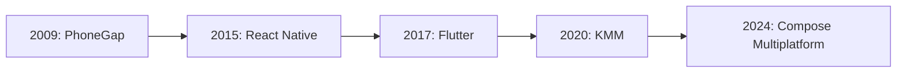

# 크로스 플랫폼과 KMM의 역사

## 📚 목차
1. [크로스 플랫폼의 역사](#크로스-플랫폼의-역사)
2. [KMM의 탄생](#kmm의-탄생)
3. [KMM의 철학](#kmm의-철학)
4. [KMM의 미래](#kmm의-미래)

---

## 크로스 플랫폼의 역사

### 🕰️ 크로스 플랫폼 기술의 진화



#### 2009년: PhoneGap/Cordova

**웹 기술로 모바일 앱 개발**

```javascript
// PhoneGap - HTML/CSS/JavaScript
<div id="app">
    <h1>Hello World</h1>
    <button onclick="takePhoto()">Take Photo</button>
</div>
```

**장점**:
- ✅ 웹 개발자도 앱 개발 가능
- ✅ 코드 재사용

**단점**:
- ❌ 성능 낮음
- ❌ 네이티브 느낌 없음
- ❌ 제한적인 기능

#### 2015년: React Native

**Facebook의 React Native**

```javascript
// React Native - JavaScript
const App = () => {
  return (
    <View>
      <Text>Hello World</Text>
      <Button title="Click Me" onPress={() => {}} />
    </View>
  );
};
```

**장점**:
- ✅ 네이티브 성능 개선
- ✅ Hot Reload
- ✅ 큰 커뮤니티

**단점**:
- ❌ JavaScript 브리지 오버헤드
- ❌ 네이티브 모듈 필요 시 복잡
- ❌ 플랫폼별 코드 여전히 필요

#### 2017년: Flutter

**Google의 Flutter**

```dart
// Flutter - Dart
class MyApp extends StatelessWidget {
  @override
  Widget build(BuildContext context) {
    return MaterialApp(
      home: Scaffold(
        body: Center(
          child: Text('Hello World'),
        ),
      ),
    );
  }
}
```

**장점**:
- ✅ 빠른 성능
- ✅ 아름다운 UI
- ✅ Hot Reload

**단점**:
- ❌ Dart 언어 (새로 배워야 함)
- ❌ 앱 크기 큼
- ❌ 플랫폼 특화 기능 제한적

---

## KMM의 탄생

### 💡 JetBrains의 다른 접근

#### 2020년: Kotlin Multiplatform Mobile (KMM) Alpha

**"로직만 공유하고, UI는 네이티브로"**

```kotlin
// 공통 코드 (Common)
class UserRepository {
    suspend fun getUser(id: String): User {
        return api.getUser(id)
    }
}

// Android에서 사용
val repository = UserRepository()
val user = repository.getUser("123")

// iOS에서도 동일하게 사용!
let repository = UserRepository()
let user = await repository.getUser(id: "123")
```

**차별점**:
- ✅ 비즈니스 로직만 공유
- ✅ UI는 각 플랫폼 네이티브
- ✅ 점진적 도입 가능
- ✅ 100% 네이티브 성능

---

## KMM의 철학

### 🎯 핵심 원칙

#### 1. **점진적 도입 (Gradual Adoption)**

```kotlin
// 기존 Android 프로젝트에 KMM 추가
// 1. 작은 모듈부터 시작
// 2. 점진적으로 확장
// 3. 리스크 최소화
```

#### 2. **플랫폼 특화 코드 허용**

```kotlin
// 공통 코드
expect fun getPlatformName(): String

// Android 구현
actual fun getPlatformName(): String = "Android"

// iOS 구현
actual fun getPlatformName(): String = "iOS"
```

#### 3. **100% 네이티브**

```kotlin
// Android
@Composable
fun UserScreen() {
    // Jetpack Compose
}

// iOS
struct UserScreen: View {
    // SwiftUI
}
```

---

## KMM의 미래

### 🚀 Compose Multiplatform (2024)

**UI도 공유 가능!**

```kotlin
// 공통 Compose 코드
@Composable
fun App() {
    MaterialTheme {
        Column {
            Text("Hello from Compose!")
            Button(onClick = {}) {
                Text("Click Me")
            }
        }
    }
}

// Android, iOS, Desktop, Web 모두에서 동작!
```

### 📊 KMM 채택률

| 연도 | 상태 | 주요 기업 |
|------|------|----------|
| **2020** | Alpha | 실험적 |
| **2021** | Beta | Netflix, VMware |
| **2022** | Stable | Philips, Baidu |
| **2024** | 성숙 | 계속 증가 |

---

## 마치며

### 🎉 KMM의 장점

1. **점진적 도입**: 리스크 낮음
2. **네이티브 성능**: 100% 네이티브
3. **Kotlin 활용**: 새로운 언어 불필요
4. **유연성**: 플랫폼 특화 가능

### 🚀 다음 단계

➡️ **다음 문서**: [74-2-kotlin-multiplatform-mobile-guide.md](./74-2-kotlin-multiplatform-mobile-guide.md)

---

**작성일**: 2024-12-02  
**작성자**: Antigravity AI Assistant

**읽기 시간**: 10분  
**난이도**: ⭐⭐
