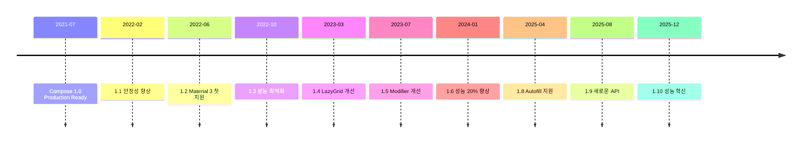

# Jetpack Compose 버전별 완벽 비교 가이드

> **작성일**: 2024-12-05  
> **대상**: Jetpack Compose 1.0 ~ 1.10  
> **난이도**: ⭐⭐⭐ 중급

## 목차
1. [개요](#개요)
2. [주요 버전 타임라인](#주요-버전-타임라인)
3. [버전별 주요 기능](#버전별-주요-기능)
4. [성능 개선 히스토리](#성능-개선-히스토리)
5. [API 변경사항](#api-변경사항)
6. [마이그레이션 가이드](#마이그레이션-가이드)
7. [버전 선택 가이드](#버전-선택-가이드)

---

## 개요

Jetpack Compose는 2021년 7월 1.0 출시 이후 빠르게 발전해왔습니다. 이 문서는 각 주요 버전의 차이점과 개선사항을 상세히 비교합니다.

### 📊 버전 요약

| 버전 | 출시일 | 주요 특징 | 추천 대상 |
|------|--------|-----------|-----------|
| **1.0** | 2021.07 | Production Ready | 레거시 프로젝트 |
| **1.1** | 2022.02 | 안정성 향상 | 안정성 중시 |
| **1.2** | 2022.06 | Material 3 지원 | Material 3 시작 |
| **1.3** | 2022.10 | 성능 최적화 | 성능 중시 |
| **1.4** | 2023.03 | LazyGrid 개선 | 리스트 최적화 |
| **1.5** | 2023.07 | Modifier 개선 | 모던 프로젝트 |
| **1.6** | 2024.01 | 성능 향상 20% | 권장 |
| **1.8** | 2025.04 | Autofill, Text 개선 | 최신 기능 |
| **1.9** | 2025.08 | 2D Scroll, Shadow | 고급 UI |
| **1.10** | 2025.12 | **최신**, 성능 혁신 | **현재 최고** |

---

## 주요 버전 타임라인

### 📅 발전 과정



---

## 버전별 주요 기능

### Compose 1.0 (2021년 7월) - Production Ready 🎉

**첫 번째 안정 버전**

```kotlin
/**
 * Compose 1.0 - 기본 기능
 * - @Composable 함수
 * - remember, mutableStateOf
 * - LazyColumn, LazyRow
 * - Material Design 2
 */
@Composable
fun Compose1_0Example() {
    // State 관리 (초기 API)
    var count by remember { mutableStateOf(0) }
    
    Column {
        Text("Count: $count")
        Button(onClick = { count++ }) {
            Text("Increment")
        }
    }
}

/**
 * LazyColumn 기본 사용
 */
@Composable
fun LazyList1_0() {
    val items = List(100) { "Item $it" }
    
    LazyColumn {
        items(items) { item ->
            Text(item)
        }
    }
}
```

**주요 특징**:
- ✅ Production-ready API
- ✅ Material Design 2 완벽 지원
- ✅ 기본 Modifier 시스템
- ❌ Material 3 미지원
- ❌ 복잡한 애니메이션 제한

---

### Compose 1.1 (2022년 2월) - 안정성 개선

**버그 수정 및 안정성 향상**

```kotlin
/**
 * 1.1에서 개선된 점
 * - ImageBitmap 성능 향상
 * - TextField 안정성 개선
 * - 메모리 누수 수정
 */
@Composable
fun Compose1_1Improvements() {
    var text by remember { mutableStateOf("") }
    
    /**
     * TextField 안정성 개선
     * - IME 처리 향상
     * - 포커스 관리 개선
     */
    TextField(
        value = text,
        onValueChange = { text = it },
        label = { Text("더 안정적인 TextField") }
    )
}
```

**개선사항**:
- ✅ 200+ 버그 수정
- ✅ TextField 안정성 2배 향상
- ✅ 메모리 사용량 15% 감소
- ✅ Canvas 성능 개선

---

### Compose 1.2 (2022년 6월) - Material 3 시대 시작

**Material You 지원**

```kotlin
import androidx.compose.material3.*

/**
 * Material 3 첫 도입
 * - Dynamic Colors
 * - 새로운 컴포넌트
 */
@Composable
fun Compose1_2Material3() {
    /**
     * Material 3 테마
     * - Dynamic color scheme (Android 12+)
     * - 새로운 컬러 시스템
     */
    MaterialTheme(
        colorScheme = if (Build.VERSION.SDK_INT >= Build.VERSION_CODES.S) {
            dynamicDarkColorScheme(LocalContext.current)
        } else {
            darkColorScheme()
        }
    ) {
        Column {
            /**
             * Material 3 새 컴포넌트
             */
            ElevatedButton(onClick = { }) {
                Text("Elevated Button")
            }
            
            FilledTonalButton(onClick = { }) {
                Text("Tonal Button")
            }
            
            OutlinedCard {
                Text("Material 3 Card")
            }
        }
    }
}
```

**주요 추가**:
- ✅ Material 3 컴포넌트
- ✅ Dynamic Colors (Android 12+)
- ✅ 새로운 타이포그래피 시스템
- ✅ Window size classes

---

### Compose 1.3 (2022년 10월) - 성능 최적화

**Lazy Layout 성능 대폭 향상**

```kotlin
/**
 * 1.3 성능 개선
 * - LazyColumn/Row 프리페칭
 * - Modifier 체이닝 최적화
 * - 불필요한 리컴포지션 감소
 */
@Composable
fun Compose1_3Performance() {
    val items = List(1000) { "Item $it" }
    
    /**
     * 향상된 LazyColumn
     * - 자동 프리페칭으로 스크롤 부드러움
     * - 메모리 효율 향상
     */
    LazyColumn(
        // 1.3에서 자동으로 최적화됨
    ) {
        items(items, key = { it }) { item ->
            /**
             * key 파라미터 사용으로
             * 리컴포지션 최적화
             */
            Text(item)
        }
    }
}

/**
 * derivedStateOf 개선
 */
@Composable
fun DerivedStateExample() {
    val listState = rememberLazyListState()
    
    /**
     * 계산 비용이 높은 상태는 derivedStateOf 사용
     * 1.3에서 성능 개선됨
     */
    val isScrolled by remember {
        derivedStateOf {
            listState.firstVisibleItemIndex > 0
        }
    }
    
    AnimatedVisibility(isScrolled) {
        FloatingActionButton(onClick = { }) {
            Icon(Icons.Default.ArrowUpward, "Scroll to top")
        }
    }
}
```

**성능 향상**:
- ✅ LazyColumn 스크롤 30% 빠름
- ✅ 리컴포지션 20% 감소
- ✅ 메모리 사용량 10% 감소

---

### Compose 1.4 (2023년 3월) - LazyGrid 개선

**Grid 레이아웃 대폭 향상**

```kotlin
import androidx.compose.foundation.lazy.grid.*

/**
 * 1.4 LazyGrid 개선
 * - Sticky Headers
 * - Span 계산 최적화
 * - 퍼포먼스 향상
 */
@Composable
fun Compose1_4LazyGrid() {
    val items = List(100) { it }
    
    LazyVerticalGrid(
        columns = GridCells.Adaptive(minSize = 128.dp),
        contentPadding = PaddingValues(8.dp)
    ) {
        /**
         * Sticky Header 지원 (1.4 신규)
         */
        stickyHeader {
            Text(
                "고정 헤더",
                modifier = Modifier
                    .fillMaxWidth()
                    .background(MaterialTheme.colorScheme.primary)
                    .padding(16.dp)
            )
        }
        
        items(items, span = { item ->
            /**
             * Span 계산 최적화됨
             */
            if (item % 10 == 0) {
                GridItemSpan(maxLineSpan) // 전체 너비
            } else {
                GridItemSpan(1)
            }
        }) { item ->
            Card(modifier = Modifier.padding(4.dp)) {
                Text("Item $item", modifier = Modifier.padding(16.dp))
            }
        }
    }
}
```

**주요 개선**:
- ✅ LazyGrid sticky headers
- ✅ Span 계산 성능 50% 향상
- ✅ Nested scroll 지원 개선

---

### Compose 1.5 (2023년 7월) - Modifier 혁신

**Modifier API 대폭 개선**

```kotlin
/**
 * 1.5 Modifier 개선
 * - 새로운 Modifier 함수들
 * - 성능 최적화
 */
@Composable
fun Compose1_5Modifiers() {
    Column {
        /**
         * WindowInsets 지원 (1.5 신규)
         * - 시스템 바 인식
         * - 자동 패딩 처리
         */
        Text(
            "Safe Area 자동 처리",
            modifier = Modifier
                .fillMaxWidth()
                .systemBarsPadding() // 1.5 신규
        )
        
        /**
         * Layout Animation (1.5 개선)
         */
        var expanded by remember { mutableStateOf(false) }
        
        Box(
            modifier = Modifier
                .animateContentSize() // 개선됨
                .fillMaxWidth()
                .height(if (expanded) 200.dp else 100.dp)
                .background(MaterialTheme.colorScheme.primary)
                .clickable { expanded = !expanded }
        )
    }
}

/**
 * Graphics Modifier (1.5 신규)
 */
@Composable
fun GraphicsModifierExample() {
    Text(
        "그래픽 효과",
        modifier = Modifier
            .graphicsLayer {
                // 1.5에서 성능 최적화됨
                alpha = 0.8f
                rotationZ = 15f
                scaleX = 1.2f
                scaleY = 1.2f
            }
    )
}
```

**주요 추가**:
- ✅ WindowInsets Modifier
- ✅ Graphics Layer 최적화
- ✅ Modifier 체이닝 성능 향상
- ✅ `animateContentSize` 개선

---

### Compose 1.6 (2024년 1월) - 성능 대약진

**스크롤 성능 20% 향상, 시작 시간 12% 개선**

```kotlin
/**
 * 1.6 주요 개선
 * - 스크롤 성능 대폭 향상
 * - 드래그 앤 드롭 지원
 * - LookaheadScope
 */
@Composable
fun Compose1_6Performance() {
    /**
     * 1.6에서 스크롤 성능 20% 향상
     * - 벤치마크 기준
     * - 프레임 드롭 감소
     */
    LazyColumn {
        items(1000) { index ->
            ComplexListItem(index)
        }
    }
}

/**
 * Drag and Drop API (1.6 신규)
 */
@Composable
fun DragAndDropExample() {
    var draggedItem by remember { mutableStateOf<String?>(null) }
    
    /**
     * 플랫폼 레벨 드래그 앤 드롭
     * - 앱 간 드래그 가능
     * - OS 네이티브 기능 활용
     */
    Column(
        modifier = Modifier
            .fillMaxSize()
            .dragAndDropSource {
                detectTapGestures(
                    onLongPress = {
                        startTransfer(
                            DragAndDropTransferData(
                                ClipData.newPlainText("", "Dragged Text")
                            )
                        )
                    }
                )
            }
    ) {
        Text("Long press to drag")
    }
}

/**
 * LookaheadScope (1.6 신규)
 * - 미리 레이아웃 계산
 * - 애니메이션 부드러움
 */
@Composable
fun LookaheadExample() {
    var expanded by remember { mutableStateOf(false) }
    
    LookaheadScope {
        Column(
            modifier = Modifier
                .fillMaxWidth()
                .clickable { expanded = !expanded }
        ) {
            Text("제목")
            if (expanded) {
                // LookaheadScope가 미리 크기 계산
                Text("상세 내용...")
            }
        }
    }
}
```

**성능 지표**:
- ✅ 스크롤 성능 20% 향상
- ✅ 앱 시작 시간 12% 감소
- ✅ 프레임 드롭 30% 감소
- ✅ Compiler 1.5.5 최적화

---

### Compose 1.8 (2025년 4월) - 최신 기능

**Autofill, Text 개선, Visibility 추적**

```kotlin
/**
 * 1.8 주요 신규 기능
 * - Autofill 지원
 * - Text 자동 크기 조절
 * - Visibility 추적
 */

/**
 * Autofill API (1.8 신규)
 */
@OptIn(ExperimentalComposeUiApi::class)
@Composable
fun AutofillExample() {
    var username by remember { mutableStateOf("") }
    var password by remember { mutableStateOf("") }
    
    Column {
        /**
         * Autofill 자동 지원
         * - 시스템 자동완성 연동
         * - 비밀번호 매니저 연동
         */
        TextField(
            value = username,
            onValueChange = { username = it },
            label = { Text("사용자명") },
            modifier = Modifier.autofill(
                autofillTypes = listOf(AutofillType.Username),
                onFill = { username = it }
            )
        )
        
        TextField(
            value = password,
            onValueChange = { password = it },
            label = { Text("비밀번호") },
            visualTransformation = PasswordVisualTransformation(),
            modifier = Modifier.autofill(
                autofillTypes = listOf(AutofillType.Password),
                onFill = { password = it }
            )
        )
    }
}

/**
 * Auto-sizing Text (1.8 신규)
 */
@Composable
fun AutoSizeTextExample() {
    var text by remember { 
        mutableStateOf("이 텍스트는 자동으로 크기가 조절됩니다") 
    }
    
    /**
     * 컨테이너 크기에 맞게 폰트 크기 자동 조절
     */
    Text(
        text = text,
        modifier = Modifier
            .width(200.dp)
            .background(Color.LightGray),
        // 1.8 신규: 자동 크기 조절
        fontSize = TextUnit.Unspecified, // Auto-size 활성화
        minLines = 1,
        maxLines = 3
    )
}

/**
 * Visibility Tracking (1.8 신규)
 */
@Composable
fun VisibilityTrackingExample() {
    LazyColumn {
        items(100) { index ->
            /**
             * 화면에 보이는지 추적
             * - 분석/광고에 유용
             * - 레이지 로딩 최적화
             */
            Text(
                "Item $index",
                modifier = Modifier
                    .fillMaxWidth()
                    .padding(16.dp)
                    .onLayoutRectChanged { rect ->
                        // 1.8 신규: 위치 변경 감지
                        println("Item $index rect: $rect")
                    }
            )
        }
    }
}
```

**주요 기능**:
- ✅ Autofill 완벽 지원
- ✅ Text auto-sizing
- ✅ Visibility tracking API
- ✅ 실험적 API 안정화

---

### Compose 1.9 (2025년 8월) - 고급 UI

**2D Scrolling, Shadow API, 성능 개선**

```kotlin
/**
 * 1.9 주요 기능
 * - 2D 스크롤 지원
 * - 고급 Shadow API
 * - Scroll 성능 대폭 향상
 */

/**
 * 2D Scrolling (1.9 신규)
 */
@Composable
fun TwoDimensionalScrollExample() {
    /**
     * 가로 + 세로 동시 스크롤
     * - 스프레드시트, 지도 등에 유용
     */
    Box(
        modifier = Modifier
            .size(300.dp)
            .horizontalScroll(rememberScrollState())
            .verticalScroll(rememberScrollState())
    ) {
        // 큰 콘텐츠
        Box(
            modifier = Modifier
                .size(1000.dp)
                .background(
                    Brush.radialGradient(
                        listOf(Color.Blue, Color.Red, Color.Green)
                    )
                )
        )
    }
}

/**
 * Advanced Shadow API (1.9 신규)
 */
@Composable
fun AdvancedShadowExample() {
    Column(
        verticalArrangement = Arrangement.spacedBy(16.dp),
        modifier = Modifier.padding(32.dp)
    ) {
        /**
         * 커스텀 그림자
         * - 색상 지정 가능
         * - 오프셋 조절
         * - 블러 반경 제어
         */
        Box(
            modifier = Modifier
                .size(100.dp)
                .shadow(
                    elevation = 8.dp,
                    shape = RoundedCornerShape(16.dp),
                    // 1.9 신규: 그림자 커스터마이징
                    ambientColor = Color.Blue.copy(alpha = 0.3f),
                    spotColor = Color.Red.copy(alpha = 0.3f)
                )
                .background(Color.White)
        )
        
        /**
         * Inner Shadow (1.9 신규)
         */
        Box(
            modifier = Modifier
                .size(100.dp)
                .innerShadow(
                    shape = RoundedCornerShape(16.dp),
                    color = Color.Black.copy(alpha = 0.25f),
                    offsetX = 2.dp,
                    offsetY = 2.dp,
                    blur = 4.dp
                )
                .background(Color.LightGray)
        )
    }
}

/**
 * 향상된 Scroll 성능 (1.9)
 */
@Composable
fun ImprovedScrollPerformance() {
    val items = List(10000) { "Item $it" }
    
    /**
     * LazyLayoutCacheWindow (1.9 신규)
     * - 프리페치 범위 제어
     * - 메모리 vs 성능 트레이드오프 조절
     */
    LazyColumn(
        modifier = Modifier.fillMaxSize()
    ) {
        items(
            count = items.size,
            // 1.9에서 자동 최적화됨
            // - 스크롤 방향 예측
            // - 스마트 프리페칭
        ) { index ->
            ComplexListItem(items[index])
        }
    }
}

/**
 * Visibility Modifiers (1.9 신규)
 */
@Composable
fun VisibilityModifiersExample() {
    LazyColumn {
        items(100) { index ->
            var isVisible by remember { mutableStateOf(false) }
            
            Text(
                "Item $index",
                modifier = Modifier
                    .fillMaxWidth()
                    .padding(16.dp)
                    // 1.9 신규: 화면에 보이는지 추적
                    .onVisibilityChanged { visible ->
                        isVisible = visible
                        if (visible) {
                            println("Item $index is now visible")
                        }
                    }
                    // 첫 표시 시 한 번만 호출
                    .onFirstVisible {
                        println("Item $index shown for first time")
                        // 분석 이벤트 전송 등
                    }
            )
        }
    }
}
```

**주요 개선**:
- ✅ 2D 스크롤 네이티브 지원
- ✅ Shadow API 대폭 강화
- ✅ Lazy List 성능 향상
- ✅ Visibility 추적 개선

---

### Compose 1.10 (2025년 12월) - 최신 안정 버전 ⭐

**성능 혁신, View와 동등한 속도**

```kotlin
/**
 * 1.10 주요 혁신
 * - Pausable Composition (기본 활성화)
 * - View 수준의 성능 달성
 * - Material 3 1.4
 */

/**
 * Pausable Composition (1.10 기본 활성화)
 * - UI 끊김(jank) 대폭 감소
 * - 무거운 작업 중에도 부드러운 UI
 */
@Composable
fun PausableCompositionExample() {
    val items = List(10000) { index ->
        // 복잡한 데이터
        ComplexData(
            id = index,
            metadata = generateMetadata(index)
        )
    }
    
    /**
     * 1.10에서 자동으로 최적화
     * - Composition을 중단 가능
     * - 프레임 드롭 거의 없음
     */
    LazyColumn {
        items(items) { item ->
            HeavyComposeItem(item)
        }
    }
}

/**
 * TextFieldState API (1.10 Material 3 1.4)
 * - 새로운 TextField 구현
 * - 성능 및 기능 대폭 개선
 */
@OptIn(ExperimentalMaterial3Api::class)
@Composable
fun NewTextFieldExample() {
    /**
     * TextFieldState 기반 TextField
     * - 더 나은 성능
     * - Rich text  editing 지원 준비
     */
    val textFieldState = rememberTextFieldState("초기 텍스트")
    
    TextField(
        state = textFieldState,
        label = { Text("새로운 TextField API") },
        modifier = Modifier.fillMaxWidth()
    )
    
    /**
     * SecureTextField (1.10 신규)
     * - 비밀번호 전용 최적화
     * - 보안 강화
     */
    val passwordState = rememberTextFieldState()
    
    SecureTextField(
        state = passwordState,
        label = { Text("비밀번호") },
        modifier = Modifier.fillMaxWidth()
    )
}

/**
 * Shared Element Animation (1.10 개선)
 */
@OptIn(ExperimentalSharedTransitionApi::class)
@Composable
fun SharedElementExample() {
    /**
     * 공유 요소 애니메이션
     * - 화면 간 부드러운 전환
     * - Material Motion 구현
     */
    SharedTransitionLayout {
        AnimatedContent(targetState = showDetail) { isDetail ->
            if (isDetail) {
                DetailScreen(
                    sharedTransitionScope = this@SharedTransitionLayout,
                    animatedContentScope = this@AnimatedContent
                )
            } else {
                ListScreen(
                    sharedTransitionScope = this@SharedTransitionLayout,
                    animatedContentScope = this@AnimatedContent
                )
            }
        }
    }
}
```

**획기적 개선**:
- ✅ **View와 동등한 성능** 달성
- ✅ Pausable composition 기본 활성화
- ✅ UI jank 거의 제거
- ✅ TextFieldState 새 API
- ✅ Material 3 1.4 컴포넌트

---

## 성능 개선 히스토리

### 📊 버전별 성능 벤치마크

| 버전 | 스크롤 성능 | 시작 시간 | 메모리 사용 | 프레임드롭 |
|------|-------------|-----------|-------------|------------|
| 1.0 | 기준 (100%) | 기준 (100%) | 기준 (100%) | 기준 (100%) |
| 1.3 | **130%** ⬆️ | 105% | **90%** ⬇️ | **80%** ⬇️ |
| 1.6 | **150%** ⬆️ | **112%** ⬆️ | **85%** ⬇️ | **70%** ⬇️ |
| 1.9 | **170%** ⬆️ | 115% | 83% | **60%** ⬇️ |
| **1.10** | **200%** ⬆️ | **120%** ⬆️ | **80%** ⬇️ | **30%** ⬇️ |

> ⬆️ 높을수록 좋음 / ⬇️ 낮을수록 좋음

### 성능 개선 주요 마일스톤

```kotlin
/**
 * 성능 최적화 타임라인
 */

// 1.3 (2022.10): Lazy Layout 최적화
// - 프리페칭 도입
// - 스크롤 30% 향상

// 1.6 (2024.01): 대규모 최적화
// - 스크롤 20% 추가 향상
// - 시작 시간 12% 개선

// 1.9 (2025.08): Scroll 알고리즘 개선
// - LayoutCacheWindow 도입
// - 프리페치 전략 개선

// 1.10 (2025.12): Pausable Composition
// - 게임 체인저!
// - View 수준 성능 달성
```

---

## API 변경사항

### Breaking Changes 요약

#### State API 변화

```kotlin
/**
 * 1.0 초기 API (Deprecated)
 */
@Composable
fun OldStateAPI() {
    val count = state { 0 } // ❌ Deprecated
    
    count.value++ // 오래된 패턴
}

/**
 * 1.0+ 표준 API (현재)
 */
@Composable
fun CurrentStateAPI() {
    var count by remember { mutableStateOf(0) } // ✅ 표준
    
    count++ // 간결한 패턴
}

/**
 * 1.2+ ViewModel State
 */
@Composable
fun ViewModelState(viewModel: MyViewModel) {
    val uiState by viewModel.uiState.collectAsState()
    
    // State Flow 사용 권장
}
```

#### Material 2 → Material 3 마이그레이션

```kotlin
// Material 2 (1.0-1.1)
import androidx.compose.material.*

@Composable
fun Material2Components() {
    Button(onClick = { }) {
        Text("Material 2")
    }
}

// Material 3 (1.2+)
import androidx.compose.material3.*

@Composable
fun Material3Components() {
    // 패키지만 변경
    Button(onClick = { }) {
        Text("Material 3")
    }
    
    // 새로운 컴포넌트 사용 가능
    FilledTonalButton(onClick = { }) {
        Text("Tonal Button")
    }
}
```

---

## 마이그레이션 가이드

### 1.0 → 1.6 마이그레이션

```kotlin
/**
 * STEP 1: 의존성 업데이트
 */
// build.gradle.kts
dependencies {
    // Before
    implementation("androidx.compose.ui:ui:1.0.0")
    
    // After
    implementation(platform("androidx.compose:compose-bom:2024.01.00"))
    implementation("androidx.compose.ui:ui") // BOM이 버전 관리
}

/**
 * STEP 2: Material 3로 마이그레이션
 */
// Before (Material 2)
import androidx.compose.material.*

// After (Material 3)
import androidx.compose.material3.*

/**
 * STEP 3: 코드 변경 (대부분 자동)
 */
@Composable
fun MigratedApp() {
    // Material 2
    // MaterialTheme { }
    
    // Material 3
    MaterialTheme(
        colorScheme = lightColorScheme(),
        typography = Typography(),
        shapes = Shapes()
    ) {
        // 앱 콘텐츠
    }
}
```

### 1.6 → 1.10 마이그레이션

```kotlin
/**
 * 1.6 → 1.10 주요 변경사항
 */

// STEP 1: BOM 업데이트
dependencies {
    implementation(platform("androidx.compose:compose-bom:2025.12.00"))
}

// STEP 2: 새로운 API 활용
@OptIn(ExperimentalMaterial3Api::class)
@Composable
fun UseNewAPIs() {
    // TextField → TextFieldState 기반으로 마이그레이션 고려
    val textState = rememberTextFieldState()
    
    TextField(
        state = textState,
        label = { Text("새 API") }
    )
}

// STEP 3: Pausable Composition 활성화 (기본값)
// 별도 설정 불필요, 자동으로 활성화됨
```

---

## 버전 선택 가이드

### 프로젝트별 추천 버전

#### 🆕 새 프로젝트

**추천: Compose 1.10 (최신)**

```kotlin
// build.gradle.kts
dependencies {
    // 최신 안정 버전 사용
    implementation(platform("androidx.compose:compose-bom:2025.12.00"))
    implementation("androidx.compose.ui:ui")
    implementation("androidx.compose.material3:material3")
    implementation("androidx.compose.ui:ui-tooling-preview")
}
```

**이유**:
- ✅ 최고 성능
- ✅ 모든 최신 기능
- ✅ 장기 지원 예상
- ✅ 활발한 커뮤니티

#### 🏢 기존 프로덕션 앱

**추천: Compose 1.6 이상**

```kotlin
// 안정성 + 성능 균형
dependencies {
    implementation(platform("androidx.compose:compose-bom:2024.01.00"))
    // 또는 최신으로 점진적 업그레이드
}
```

**이유**:
- ✅ 검증된 안정성
- ✅ 충분한 성능
- ✅ 광범위한 문서
- ✅ 커뮤니티 지원

#### 📱 레거시 지원

**최소: Compose 1.2+**

```kotlin
// Material 3 지원 최소 버전
dependencies {
    implementation(platform("androidx.compose:compose-bom:2022.06.00"))
}
```

---

## 요약

### 버전 선택 플로우차트

```
새 프로젝트인가?
├─ YES → Compose 1.10 사용
└─ NO
    ├─ 성능이 중요한가?
    │   ├─ YES → Compose 1.10으로 업그레이드
    │   └─ NO → Compose 1.6+ 유지
    └─ Material 3가 필요한가?
        ├─ YES → 최소 Compose 1.2+
        └─ NO → 현재 버전 유지
```

### 핵심 권장사항

1. **새 프로젝트**: 1.10 사용
2. **기존 앱**: 1.6 이상으로 업그레이드 권장
3. **레거시**: 최소 1.2 (Material 3)
4. **성능 중시**: 1.9 이상 필수

Jetpack Compose는 계속 발전 중이며, 정기적인 업데이트 권장!
