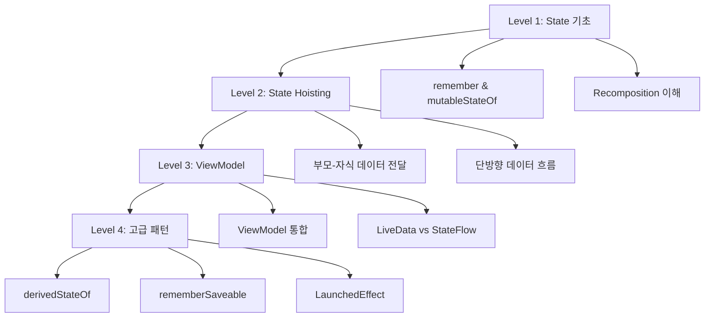

# Jetpack Compose State 완벽 가이드

## 📚 목차
1. [State란 무엇인가?](#state란-무엇인가)
2. [학습 로드맵](#학습-로드맵)
3. [Level 1: State 기초](#level-1-state-기초)
4. [Level 2: State Hoisting](#level-2-state-hoisting)
5. [Level 3: ViewModel과 State](#level-3-viewmodel과-state)
6. [Level 4: 고급 State 패턴](#level-4-고급-state-패턴)
7. [실습 프로젝트](#실습-프로젝트)
8. [Best Practices](#best-practices)

---

## State란 무엇인가?

### 정의
**State(상태)**는 시간에 따라 변할 수 있는 값입니다. Compose에서 State가 변경되면 UI가 자동으로 다시 그려집니다(Recomposition).

### 핵심 개념

```
State 변경 → Recomposition → UI 업데이트
```

#### 예시: 카운터 앱
```kotlin
var count = 0  // ❌ 일반 변수 - UI가 업데이트되지 않음
var count by remember { mutableStateOf(0) }  // ✅ State - UI가 자동 업데이트
```

### State가 필요한 이유

| 시나리오 | State 없이 | State 사용 |
|---------|-----------|-----------|
| 버튼 클릭 카운트 | 값은 증가하지만 화면에 반영 안됨 | 값 증가 시 자동으로 화면 업데이트 |
| 텍스트 입력 | 입력한 내용이 사라짐 | 입력 내용이 유지되고 표시됨 |
| 체크박스 선택 | 선택 상태가 보이지 않음 | 선택 상태가 시각적으로 표시됨 |

---

## 학습 로드맵

### 단계별 학습 계획



### 학습 시간 예상

| Level | 주제 | 예상 시간 | 난이도 |
|-------|------|----------|--------|
| 1 | State 기초 | 1-2시간 | ⭐ |
| 2 | State Hoisting | 2-3시간 | ⭐⭐ |
| 3 | ViewModel | 3-4시간 | ⭐⭐⭐ |
| 4 | 고급 패턴 | 4-6시간 | ⭐⭐⭐⭐ |

---

## Level 1: State 기초

### 학습 목표
- [ ] `remember`와 `mutableStateOf`의 역할 이해
- [ ] Recomposition 개념 이해
- [ ] 간단한 카운터 앱 만들기
- [ ] TextField와 State 연동

### 1.1 remember와 mutableStateOf

#### remember의 역할
```kotlin
@Composable
fun Counter() {
    // ❌ 잘못된 예: Recomposition 시마다 0으로 초기화됨
    var count = 0
    
    // ✅ 올바른 예: Recomposition 시에도 값 유지
    var count by remember { mutableStateOf(0) }
}
```

#### 구성 요소 분석

```kotlin
var count by remember { mutableStateOf(0) }
│   │     │  │         │              │
│   │     │  │         │              └─ 초기값
│   │     │  │         └─ 변경 가능한 State 생성
│   │     │  └─ Recomposition 시 값 유지
│   │     └─ 프로퍼티 위임 (by 키워드)
│   └─ 변수명
└─ var (변경 가능)
```

### 1.2 실습 1: 카운터 앱

**목표**: 버튼을 누르면 숫자가 증가하는 앱 만들기

```kotlin
@Composable
fun CounterApp() {
    // State 선언
    var count by remember { mutableStateOf(0) }
    
    Column(
        modifier = Modifier.fillMaxSize(),
        verticalArrangement = Arrangement.Center,
        horizontalAlignment = Alignment.CenterHorizontally
    ) {
        // State 표시
        Text(
            text = "카운트: $count",
            fontSize = 32.sp
        )
        
        Spacer(modifier = Modifier.height(16.dp))
        
        // State 변경
        Button(onClick = { count++ }) {
            Text("증가")
        }
        
        Spacer(modifier = Modifier.height(8.dp))
        
        Button(onClick = { count-- }) {
            Text("감소")
        }
        
        Spacer(modifier = Modifier.height(8.dp))
        
        Button(onClick = { count = 0 }) {
            Text("초기화")
        }
    }
}
```

**학습 포인트**:
- `count++` 실행 → State 변경 → Recomposition → UI 업데이트
- `Text(text = "카운트: $count")`가 자동으로 새로운 값 표시

### 1.3 실습 2: TextField와 State

**목표**: 입력한 텍스트를 실시간으로 표시

```kotlin
@Composable
fun TextInputApp() {
    var text by remember { mutableStateOf("") }
    
    Column(
        modifier = Modifier
            .fillMaxSize()
            .padding(16.dp)
    ) {
        // 입력 필드
        OutlinedTextField(
            value = text,
            onValueChange = { newText -> text = newText },
            label = { Text("이름을 입력하세요") },
            modifier = Modifier.fillMaxWidth()
        )
        
        Spacer(modifier = Modifier.height(16.dp))
        
        // 실시간 표시
        Text(
            text = if (text.isEmpty()) {
                "아직 입력하지 않았습니다"
            } else {
                "안녕하세요, ${text}님!"
            },
            fontSize = 20.sp
        )
        
        Spacer(modifier = Modifier.height(16.dp))
        
        // 글자 수 표시
        Text(
            text = "글자 수: ${text.length}",
            fontSize = 16.sp,
            color = Color.Gray
        )
    }
}
```

**학습 포인트**:
- `onValueChange`에서 State 업데이트
- State 변경 시 모든 관련 UI가 자동 업데이트

### 1.4 Recomposition 이해하기

#### Recomposition이란?
State가 변경되면 Compose가 UI를 다시 그리는 과정

```kotlin
@Composable
fun RecompositionDemo() {
    var count by remember { mutableStateOf(0) }
    
    Column {
        // ✅ count가 변경되면 이 부분만 Recomposition
        Text("카운트: $count")
        
        // ✅ count와 무관하므로 Recomposition 안됨 (최적화)
        Text("고정된 텍스트")
        
        Button(onClick = { count++ }) {
            Text("증가")
        }
    }
}
```

> [!TIP]
> **Compose의 스마트 Recomposition**
> - State가 변경되면 전체 UI가 아닌 **필요한 부분만** 다시 그려집니다
> - 성능 최적화가 자동으로 이루어집니다

### 1.5 Level 1 체크리스트

완료한 항목에 체크하세요:

- [ ] `remember`의 역할을 이해했다
- [ ] `mutableStateOf`로 State를 생성할 수 있다
- [ ] `by` 키워드의 의미를 안다
- [ ] Recomposition 개념을 이해했다
- [ ] 카운터 앱을 직접 만들어봤다
- [ ] TextField와 State를 연동해봤다

---

## Level 2: State Hoisting

### 학습 목표
- [ ] State Hoisting 개념 이해
- [ ] Stateless vs Stateful Composable 구분
- [ ] 단방향 데이터 흐름 이해
- [ ] 부모-자식 간 State 공유

### 2.1 State Hoisting이란?

**정의**: State를 사용하는 Composable에서 State를 관리하는 상위 Composable로 State를 "끌어올리는" 패턴

#### Before: State를 내부에서 관리
```kotlin
@Composable
fun Counter() {
    var count by remember { mutableStateOf(0) }  // State가 내부에 있음
    
    Button(onClick = { count++ }) {
        Text("카운트: $count")
    }
}
```

**문제점**: 외부에서 count 값을 알 수 없고 제어할 수 없음

#### After: State Hoisting 적용
```kotlin
// Stateless Composable - State를 받아서 사용만 함
@Composable
fun Counter(
    count: Int,
    onIncrement: () -> Unit
) {
    Button(onClick = onIncrement) {
        Text("카운트: $count")
    }
}

// Stateful Composable - State를 관리
@Composable
fun CounterScreen() {
    var count by remember { mutableStateOf(0) }
    
    Counter(
        count = count,
        onIncrement = { count++ }
    )
}
```

**장점**:
- ✅ 재사용 가능
- ✅ 테스트 용이
- ✅ 여러 Composable에서 같은 State 공유 가능

### 2.2 단방향 데이터 흐름 (Unidirectional Data Flow)

```
부모 Composable
    │
    ├─→ State (데이터) ──→ 자식 Composable
    │                           │
    └─← Event (콜백) ←──────────┘
```

#### 원칙
1. **State는 아래로 흐른다** (부모 → 자식)
2. **Event는 위로 흐른다** (자식 → 부모)

### 2.3 실습 3: Todo 리스트 (State Hoisting)

**목표**: 할 일 추가/삭제 기능 구현

```kotlin
// 데이터 클래스
data class TodoItem(
    val id: Int,
    val text: String,
    val isDone: Boolean = false
)

// Stateless: 개별 Todo 아이템
@Composable
fun TodoItemView(
    todo: TodoItem,
    onToggle: (Int) -> Unit,
    onDelete: (Int) -> Unit
) {
    Row(
        modifier = Modifier
            .fillMaxWidth()
            .padding(8.dp),
        verticalAlignment = Alignment.CenterVertically
    ) {
        Checkbox(
            checked = todo.isDone,
            onCheckedChange = { onToggle(todo.id) }
        )
        
        Text(
            text = todo.text,
            modifier = Modifier.weight(1f),
            textDecoration = if (todo.isDone) {
                TextDecoration.LineThrough
            } else {
                TextDecoration.None
            }
        )
        
        IconButton(onClick = { onDelete(todo.id) }) {
            Icon(Icons.Default.Delete, "삭제")
        }
    }
}

// Stateful: Todo 리스트 전체 관리
@Composable
fun TodoListScreen() {
    var todos by remember { mutableStateOf(listOf<TodoItem>()) }
    var newTodoText by remember { mutableStateOf("") }
    var nextId by remember { mutableStateOf(1) }
    
    Column(
        modifier = Modifier
            .fillMaxSize()
            .padding(16.dp)
    ) {
        // 입력 영역
        Row(modifier = Modifier.fillMaxWidth()) {
            OutlinedTextField(
                value = newTodoText,
                onValueChange = { newTodoText = it },
                label = { Text("할 일") },
                modifier = Modifier.weight(1f)
            )
            
            Spacer(modifier = Modifier.width(8.dp))
            
            Button(
                onClick = {
                    if (newTodoText.isNotBlank()) {
                        todos = todos + TodoItem(nextId, newTodoText)
                        nextId++
                        newTodoText = ""
                    }
                }
            ) {
                Text("추가")
            }
        }
        
        Spacer(modifier = Modifier.height(16.dp))
        
        // Todo 리스트
        LazyColumn {
            items(todos) { todo ->
                TodoItemView(
                    todo = todo,
                    onToggle = { id ->
                        todos = todos.map {
                            if (it.id == id) it.copy(isDone = !it.isDone)
                            else it
                        }
                    },
                    onDelete = { id ->
                        todos = todos.filter { it.id != id }
                    }
                )
            }
        }
        
        // 통계
        Spacer(modifier = Modifier.height(16.dp))
        Text(
            text = "전체: ${todos.size} | 완료: ${todos.count { it.isDone }}",
            fontSize = 14.sp,
            color = Color.Gray
        )
    }
}
```

**학습 포인트**:
- `TodoListScreen`이 State를 관리 (Stateful)
- `TodoItemView`는 State를 받아서 표시만 함 (Stateless)
- Event는 콜백으로 위로 전달 (`onToggle`, `onDelete`)

### 2.4 Stateless vs Stateful 비교

| 특성 | Stateless | Stateful |
|------|-----------|----------|
| State 소유 | ❌ 없음 | ✅ 있음 |
| 재사용성 | ✅ 높음 | ⚠️ 낮음 |
| 테스트 | ✅ 쉬움 | ⚠️ 어려움 |
| 책임 | UI 표시만 | State 관리 + UI |
| 예시 | `TodoItemView` | `TodoListScreen` |

### 2.5 Level 2 체크리스트

- [ ] State Hoisting 개념을 이해했다
- [ ] Stateless Composable을 만들 수 있다
- [ ] 단방향 데이터 흐름을 이해했다
- [ ] 부모-자식 간 State를 공유할 수 있다
- [ ] Todo 리스트를 직접 만들어봤다

---

## Level 3: ViewModel과 State

### 학습 목표
- [ ] ViewModel의 역할 이해
- [ ] ViewModel에서 State 관리
- [ ] StateFlow vs LiveData 이해
- [ ] 화면 회전 시 State 유지

### 3.1 ViewModel이 필요한 이유

#### remember의 한계
```kotlin
@Composable
fun CounterScreen() {
    var count by remember { mutableStateOf(0) }
    // ❌ 문제: 화면 회전 시 count가 0으로 초기화됨
    // ❌ 문제: 비즈니스 로직과 UI가 섞임
}
```

#### ViewModel의 장점
- ✅ 화면 회전 시에도 데이터 유지
- ✅ 비즈니스 로직 분리
- ✅ 테스트 용이
- ✅ 생명주기 관리

### 3.2 ViewModel 설정

#### 1. 의존성 추가 (build.gradle.kts)
```kotlin
dependencies {
    implementation("androidx.lifecycle:lifecycle-viewmodel-compose:2.7.0")
}
```

#### 2. ViewModel 클래스 생성
```kotlin
import androidx.lifecycle.ViewModel
import kotlinx.coroutines.flow.MutableStateFlow
import kotlinx.coroutines.flow.StateFlow
import kotlinx.coroutines.flow.asStateFlow

class CounterViewModel : ViewModel() {
    // Private MutableStateFlow
    private val _count = MutableStateFlow(0)
    
    // Public StateFlow (읽기 전용)
    val count: StateFlow<Int> = _count.asStateFlow()
    
    // 비즈니스 로직
    fun increment() {
        _count.value++
    }
    
    fun decrement() {
        _count.value--
    }
    
    fun reset() {
        _count.value = 0
    }
}
```

#### 3. Composable에서 사용
```kotlin
@Composable
fun CounterScreen(
    viewModel: CounterViewModel = viewModel()
) {
    // StateFlow를 Compose State로 변환
    val count by viewModel.count.collectAsState()
    
    Column(
        modifier = Modifier.fillMaxSize(),
        verticalArrangement = Arrangement.Center,
        horizontalAlignment = Alignment.CenterHorizontally
    ) {
        Text("카운트: $count", fontSize = 32.sp)
        
        Spacer(modifier = Modifier.height(16.dp))
        
        Row {
            Button(onClick = { viewModel.decrement() }) {
                Text("-")
            }
            
            Spacer(modifier = Modifier.width(8.dp))
            
            Button(onClick = { viewModel.increment() }) {
                Text("+")
            }
        }
        
        Spacer(modifier = Modifier.height(8.dp))
        
        Button(onClick = { viewModel.reset() }) {
            Text("초기화")
        }
    }
}
```

### 3.3 StateFlow vs LiveData

| 특성 | StateFlow | LiveData |
|------|-----------|----------|
| 초기값 | ✅ 필수 | ❌ 선택 |
| Coroutine | ✅ 네이티브 지원 | ⚠️ 추가 라이브러리 필요 |
| Compose 통합 | ✅ `collectAsState()` | ⚠️ `observeAsState()` |
| 권장 사항 | ✅ **새 프로젝트 권장** | ⚠️ 레거시 지원 |

> [!IMPORTANT]
> **Jetpack Compose에서는 StateFlow 사용을 권장합니다**

### 3.4 실습 4: Todo 앱 with ViewModel

```kotlin
// ViewModel
class TodoViewModel : ViewModel() {
    private val _todos = MutableStateFlow<List<TodoItem>>(emptyList())
    val todos: StateFlow<List<TodoItem>> = _todos.asStateFlow()
    
    private var nextId = 1
    
    fun addTodo(text: String) {
        if (text.isBlank()) return
        
        val newTodo = TodoItem(nextId++, text)
        _todos.value = _todos.value + newTodo
    }
    
    fun toggleTodo(id: Int) {
        _todos.value = _todos.value.map {
            if (it.id == id) it.copy(isDone = !it.isDone)
            else it
        }
    }
    
    fun deleteTodo(id: Int) {
        _todos.value = _todos.value.filter { it.id != id }
    }
    
    fun getCompletedCount(): Int {
        return _todos.value.count { it.isDone }
    }
}

// Composable
@Composable
fun TodoScreen(
    viewModel: TodoViewModel = viewModel()
) {
    val todos by viewModel.todos.collectAsState()
    var newTodoText by remember { mutableStateOf("") }
    
    Column(
        modifier = Modifier
            .fillMaxSize()
            .padding(16.dp)
    ) {
        // 입력 영역
        Row {
            OutlinedTextField(
                value = newTodoText,
                onValueChange = { newTodoText = it },
                label = { Text("할 일") },
                modifier = Modifier.weight(1f)
            )
            
            Button(
                onClick = {
                    viewModel.addTodo(newTodoText)
                    newTodoText = ""
                }
            ) {
                Text("추가")
            }
        }
        
        // 리스트
        LazyColumn {
            items(todos) { todo ->
                TodoItemView(
                    todo = todo,
                    onToggle = { viewModel.toggleTodo(it) },
                    onDelete = { viewModel.deleteTodo(it) }
                )
            }
        }
        
        // 통계
        Text(
            text = "전체: ${todos.size} | 완료: ${viewModel.getCompletedCount()}",
            color = Color.Gray
        )
    }
}
```

### 3.5 Level 3 체크리스트

- [ ] ViewModel의 필요성을 이해했다
- [ ] StateFlow를 사용할 수 있다
- [ ] `collectAsState()`로 State를 수집할 수 있다
- [ ] ViewModel에서 비즈니스 로직을 관리할 수 있다
- [ ] 화면 회전 시 데이터가 유지되는 것을 확인했다

---

## Level 4: 고급 State 패턴

### 학습 목표
- [ ] `derivedStateOf` 사용
- [ ] `rememberSaveable` 이해
- [ ] `LaunchedEffect`와 Side Effect
- [ ] State 최적화 기법

### 4.1 derivedStateOf

**용도**: 다른 State로부터 계산된 State를 만들 때 사용

```kotlin
@Composable
fun SearchScreen() {
    var searchText by remember { mutableStateOf("") }
    val items = remember { listOf("Apple", "Banana", "Cherry", "Date") }
    
    // ✅ derivedStateOf: searchText가 변경될 때만 재계산
    val filteredItems by remember {
        derivedStateOf {
            items.filter { it.contains(searchText, ignoreCase = true) }
        }
    }
    
    Column {
        OutlinedTextField(
            value = searchText,
            onValueChange = { searchText = it },
            label = { Text("검색") }
        )
        
        LazyColumn {
            items(filteredItems) { item ->
                Text(item)
            }
        }
    }
}
```

### 4.2 rememberSaveable

**용도**: 프로세스 종료 후에도 State 유지 (화면 회전, 백그라운드 등)

```kotlin
@Composable
fun FormScreen() {
    // ❌ remember: 프로세스 종료 시 사라짐
    var name by remember { mutableStateOf("") }
    
    // ✅ rememberSaveable: 프로세스 종료 후에도 유지
    var email by rememberSaveable { mutableStateOf("") }
    
    Column {
        OutlinedTextField(
            value = email,
            onValueChange = { email = it },
            label = { Text("이메일 (유지됨)") }
        )
    }
}
```

### 4.3 LaunchedEffect와 Side Effect

**용도**: Composable의 생명주기에 맞춰 비동기 작업 실행

```kotlin
@Composable
fun TimerScreen() {
    var seconds by remember { mutableStateOf(0) }
    
    // LaunchedEffect: Composable이 처음 나타날 때 실행
    LaunchedEffect(Unit) {
        while (true) {
            delay(1000)
            seconds++
        }
    }
    
    Text("경과 시간: ${seconds}초")
}
```

### 4.4 Level 4 체크리스트

- [ ] `derivedStateOf`를 사용할 수 있다
- [ ] `rememberSaveable`의 용도를 안다
- [ ] `LaunchedEffect`로 비동기 작업을 할 수 있다

---

## 실습 프로젝트

### 프로젝트 1: 계산기 앱
**난이도**: ⭐⭐  
**학습 내용**: State 기초, State Hoisting

**요구사항**:
- 숫자 버튼 (0-9)
- 연산자 버튼 (+, -, ×, ÷)
- 결과 표시
- 초기화 버튼

### 프로젝트 2: 메모 앱
**난이도**: ⭐⭐⭐  
**학습 내용**: ViewModel, StateFlow, CRUD

**요구사항**:
- 메모 추가/수정/삭제
- 메모 목록 표시
- 검색 기능
- 화면 회전 시 데이터 유지

### 프로젝트 3: 타이머 앱
**난이도**: ⭐⭐⭐⭐  
**학습 내용**: LaunchedEffect, 고급 State

**요구사항**:
- 시간 설정
- 시작/일시정지/초기화
- 백그라운드에서도 동작
- 알림 기능

---

## Best Practices

### 1. State는 가능한 한 낮은 레벨에서 관리
```kotlin
// ✅ 좋은 예: State가 필요한 곳에서만 관리
@Composable
fun ParentScreen() {
    ChildScreen()  // State를 전달하지 않음
}

@Composable
fun ChildScreen() {
    var text by remember { mutableStateOf("") }
    TextField(value = text, onValueChange = { text = it })
}
```

### 2. Stateless Composable 선호
```kotlin
// ✅ 재사용 가능한 Stateless Composable
@Composable
fun Counter(count: Int, onIncrement: () -> Unit) {
    Button(onClick = onIncrement) {
        Text("$count")
    }
}
```

### 3. ViewModel에서 UI State 관리
```kotlin
// ✅ ViewModel에서 비즈니스 로직 처리
class MyViewModel : ViewModel() {
    private val _uiState = MutableStateFlow(UiState())
    val uiState = _uiState.asStateFlow()
    
    fun updateData() {
        // 비즈니스 로직
    }
}
```

### 4. 불필요한 Recomposition 방지
```kotlin
// ✅ derivedStateOf로 최적화
val expensiveValue by remember {
    derivedStateOf {
        // 비용이 큰 계산
    }
}
```

---

## 다음 단계

1. **Compose 공식 문서** 읽기
2. **실습 프로젝트** 직접 만들어보기
3. **오픈소스 프로젝트** 코드 분석
4. **자신만의 앱** 개발 시작

---

## 참고 자료

### 공식 문서
- [State and Jetpack Compose](https://developer.android.com/jetpack/compose/state)
- [ViewModel Overview](https://developer.android.com/topic/libraries/architecture/viewmodel)
- [StateFlow and SharedFlow](https://developer.android.com/kotlin/flow/stateflow-and-sharedflow)

### 추천 영상
- Android Developers YouTube 채널
- Philipp Lackner Compose 튜토리얼

### 커뮤니티
- Stack Overflow - `android-jetpack-compose` 태그
- Reddit - r/androiddev
- Kotlin Slack - #compose 채널

---

**마지막 업데이트**: 2025-11-30  
**작성자**: Antigravity AI Assistant

Happy Learning! 🚀
